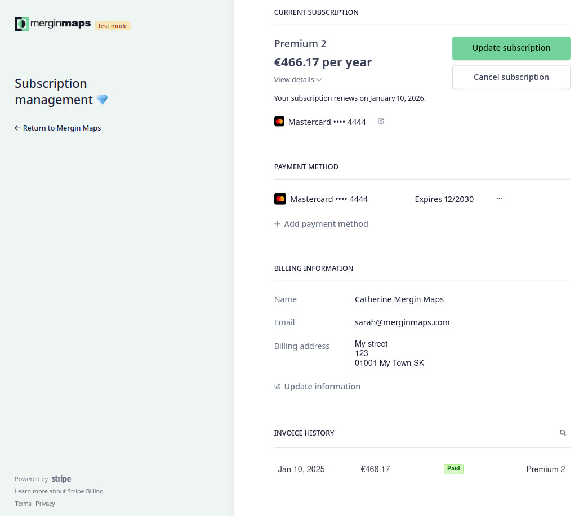
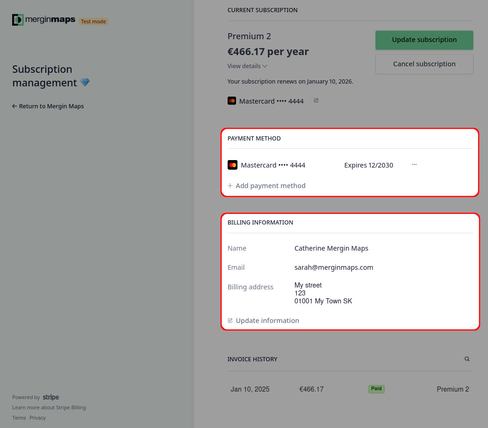
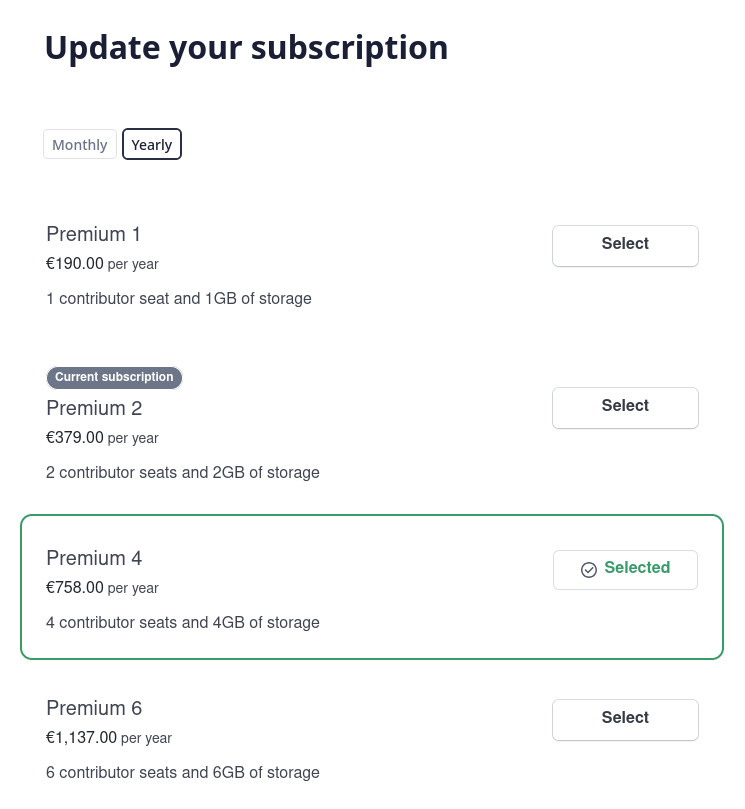
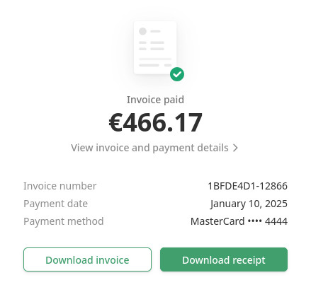

# Subscriptions and Invoicing
[[toc]]

## Subscriptions

::: tip
For details about different subscription plans visit our <MainDomainNameLink id="pricing" desc="pricing page"/>.
:::

After signing up to <MainPlatformNameLink />, you can use your workspace for free during the **28 day trial**. After the trial, you can choose from our <MainDomainNameLink id="pricing" desc="subscription plans"/> depending on the storage size, size of your team, support level and other features that you need for your [workspace](../../manage/workspaces/). 

There are three paid plans: *Individual*, *Professional*, and *Team* plan. Students and educators can use our free *Academia* plan and there is also a *Non-profit* plan available to charities and non-profit organisations. 

:::tip
If you are interested in <MainDomainNameLink id="pricing-for-ce-and-ee" desc="On-Premise deployment"/>  or looking for other options, please <MerginMapsEmail id="sales" desc="contact us" /> directly.
:::

Subscriptions can be managed, changed or cancelled through [billing and subscription page](https://payments.merginmaps.com). Subscriptions are automatically billed monthly or annually. 

When logged in, you can review your current plan, see upcoming payments as well as change your billing details or payment method. The subscription plan can be easily [updated](#how-to-change-a-subscription) or [cancelled](#how-to-cancel-a-subscription).
<!-- placeholder image - TODO: update when possible -->

## Billing information and payment method
When logged in to the [billing and subscription page](https://payments.merginmaps.com), you can fill out or change your billing information and payment method. 

Notes:
- If a VAT number is entered, this must be associated with the address you enter below.
- The address you enter must match the address registered with your payment method (e.g. credit card)
- The address entered needs to match the VAT registered address

### Adding and removing the payment method
When purchasing a subscription plan, you will be asked to fill out your card information.

If you want to change your payment method, e.g. when [transferring ownership and billing for a workspace](#how-to-transfer-ownership-and-billing-for-workspaces), you have to add a new card first (any active subscription requires a payment method).

To add a new card, click on **Add payment method** and fill out the details.

To remove a card from your profile, click on the button next to the card and **Delete** it.

## How to change a subscription
Information about the current subscription can be found in <AppDomainNameLink />.

1. Log into <AppDomainNameLink />
2. Navigate to **Subscriptions**
   <!-- placeholder image - TODO: update when possible -->
   

3. Here, you will find a link to the [billing and subscription page](https://payments.merginmaps.com), where you find the details of your current subscription plan

4. Click on **Update plan**
   

5. Choose if you want to pay **Monthly** or **Yearly** and **Select** your new plan. Click on **Continue**
   
   
4. Review the details of your updates and click on **Confirm**.
   

### How to request Academia or Non-profit plan
We support students, educators and registered non-profit organisations.

Visit <MainDomainNameLink id="pricing" desc="Mergin Maps pricing page"/>, where you can request free *Academia* plan or *Non-profit* plan.

Click on the **Sign Up Now** button and fill out the form. We will review your application and if you meet our conditions, your workspace will get the Academia or Non-profit plan.

## How to cancel a subscription
1. Log into <AppDomainNameLink /> and go to [billing and subscription page](https://payments.merginmaps.com)
2. Click on **Cancel plan**
   
   
3. Review the details of your subscription plan and confirm that you want to cancel the plan by clicking **Cancel plan** again
   

## How to transfer ownership and billing for workspaces
Ownership of a workspace can be transferred to another [workspace member](../permissions/#workspace-member-roles). Users with the **owner** member role have access to the **Subscriptions** in <AppDomainNameLink />. Every workspace has to have at least one owner, however, there can be multiple owners of one workspace.

To transfer the ownership of a workspace to a user that is not yet a member of your workspace, follow the steps in [How to add users to a workspace](../project-advanced/#add-users-to-a-workspace) and select the **Owner** as the the **member role**. The new owner has to accept the invitation.

To transfer the ownership of a workspace to a user that is already a member of your workspace, you have to change their member role to **Owner**:
1. Log in to <AppDomainNameLink />
2. Navigate to the **Members** tab. Here, you will see the list of current workspace members and their roles. 
   

3. Change the **member role** of the user who should become the new owner
   
   
4. Now the member role of the original owner can be changed (if needed) or they can be removed from the workspace completely.

:::warning
Be careful when downgrading your own member role! 

Only owners and admins can manage user roles so if you assign yourself the writer or reader role, you will not be able to change it back.
:::

## Invoices and payment history
Our [billing and subscription page](https://payments.merginmaps.com) provides also the overview of payment history and invoices.

When logged in, the invoice history is displayed at the bottom of the page.

Click on a payment to download your invoice or receipt.

