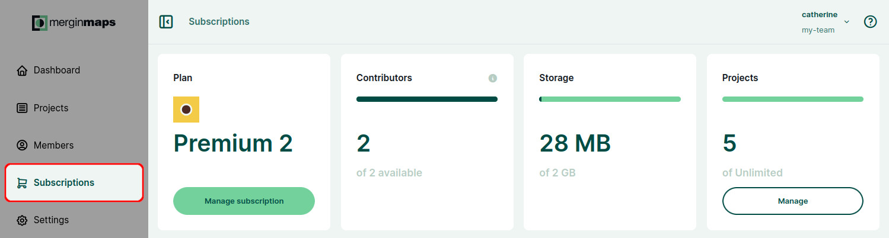
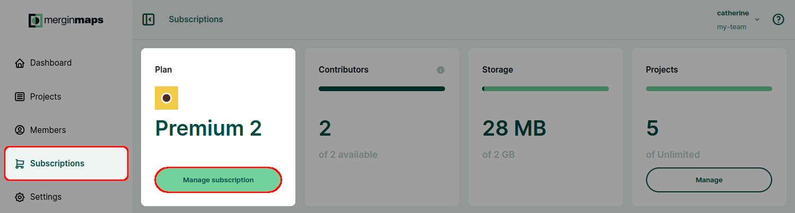
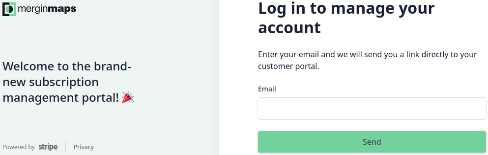
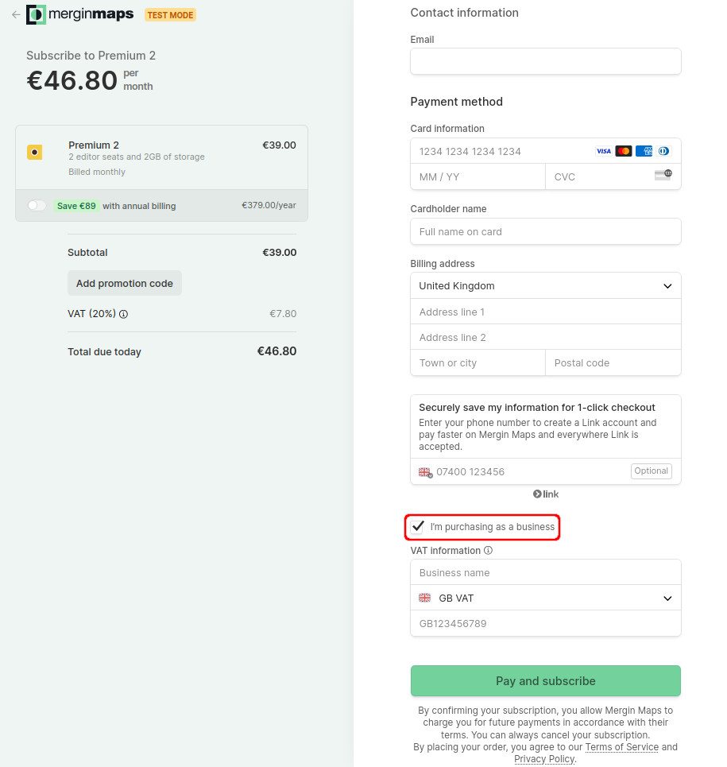
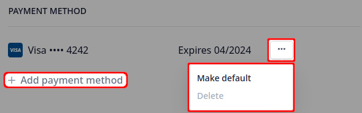

# Subscriptions and Invoicing
[[toc]]

::: tip Pricing, features, free trial
Subscription details and pricing are summarised on our <MainDomainNameLink id="pricing" desc="pricing page"/>. After signing up to <MainPlatformNameLink />, you can use your workspace for free during the **14 day trial**. After the trial, you can [choose a premium plan](#how-to-upgrade-a-subscription-from-the-trial-plan).

The current *Premium* subscription system is explained in more detail in our blog <MainDomainNameLink id="blog/unlocking-premium-features-of-mergin-maps-for-all" desc="Unlocking premium features of Mergin Maps for all"/>.
:::

::: details Legacy subscription plans: Individual, Professional and Team plan
The subscription plans of <MainPlatformName /> may change over time as the platform evolves. You can decide to switch to a new plan anytime in the subscription management page.

Even if you still use a plan that is no longer offered, features included in this plan stay unaltered. For instance, previously-used *Individual* or *Professional* subscriptions did not include features such as [webmaps](../dashboard-maps/) or developer tools ([Python and C++ integrations](../../dev/integration/), [DB Sync](../../dev/dbsync/), [Media Sync](../../dev/media-sync/), [Work Packages](../../dev/work-packages/)). To use these features, you will have to switch to a *Premium* subscription.
:::

## Contributors

Subscriptions are based on the number of *contributors* on the workspace. Per each contributor seat, you get 1 GB of storage. Storage is shared across the whole workspace. You can get even more storage, just reach out to our <MerginMapsEmail id="sales" desc="sales team" /> and we will help you set it up.

*Contributors* are workspace members or guests who have Writer, Editor, Admin or Owner [access rights](../permissions/). The number of read-only users is unlimited: they do not count towards your workspace contributors. 

[Owners](../permissions/#workspace-member-roles-and-project-permissions) of the workspace can find the overview of the subscription plan, such as storage usage, number of projects and number of contributors in the workspace in the [**Subscription**](../dashboard/#subscriptions) tab on the <DashboardShortLink />. 

The overview of workspace users and their member type (contributor/read-only) can be found in the [**Members**](../dashboard/#members) tab on the <DashboardShortLink />. It is available to [owners and admins](../permissions/#workspace-member-roles-and-project-permissions) of a workspace.

## Subscriptions management portal
Subscriptions, payments and billing information are managed in our subscription management portal. 

**There are two ways to access the portal**:
- from [Mergin Maps dashboard](#accessing-subscription-management-portal-from-mergin-maps-dashboard) by owners of a workspace
- [using a link](#accessing-subscription-management-portal-directly-without-mergin-maps-account) by a person that has access to the email used in billing information

When logged into the portal, you can [update](#how-to-change-a-subscription) or [cancel](#how-to-cancel-a-subscription) your subscription, see upcoming charges, review your [billing and payment information](#billing-information-and-payment-method) and access [payment history and invoices](#invoices-and-payment-history).

### Accessing subscription management portal from Mergin Maps dashboard
If you are the owner of a workspace, you can access the subscription management portal from the <DashboardShortLink />.

To access the portal, navigate to the **Subscription** tab and click on **Manage Subscription**.

You will be redirected to the subscription management portal.

### Accessing subscription management portal directly (without Mergin Maps account)
The subscription management portal can also accessed directly, without going through the <DashboardShortLink /> or having a <MainPlatformName /> account. This option may be useful if the person taking care of the payments does not need access to the projects and data, such as someone from the accounting department of your organisation. 

Note that the owner of the workspace needs to set up the appropriate email in the [billing information](#billing-information-and-payment-method). This email can then be used to access the portal.

To access the portal directly:
1. Navigate to the [**subscription management portal**](https://payments.merginmaps.com/p/login/14keYH711d32dz2144)

2. Enter the **email** that is used in your [billing information](#billing-information-and-payment-method) and click on **Send**
   

3. You will get an email with a login link. Click on the link in the email and you will be redirected to the portal.

## How to upgrade a subscription from the trial plan
1. Log into <AppDomainNameLink />

2. Navigate to the **Subscription** tab. 

   Choose your *Premium* plan by using the slider. You can also specify if you want to be billed yearly or monthly.
   
   Click on the **Sign up now** button to confirm your new plan.
   

3. You will be redirected to a checkout page. Here, fill out the billing information.

   The email you enter here will receive all billing-related information such as invoices or failed payments notifications.

   If you are a business, check the **I'm purchasing as a business** :heavy_check_mark: option and fill out your business name and VAT number.
   - the VAT number has to be associated with the entered (VAT registered) address
   - the address you enter has to match the address registered with your payment method
   
   
  
4. Click on **Pay and subscribe**
   
After the payment goes through, you will be redirected back to <DashboardLink /> where you can review the details of your new subscription

### How to request Academia or Non-profit plan
We support students, educators and registered non-profit organisations.

Visit <MainDomainNameLink id="pricing" desc="Mergin Maps pricing page"/>, where you can request free *Academia* plan or *Non-profit* plan.

Click on the **Sign Up Now** button and fill out the form. We will review your application and if you meet our conditions, your workspace will get the Academia or Non-profit plan.

## How to change a subscription
1. Navigate to the [subscription management portal](#subscriptions-management-portal)

2. In the *Current subscription* section, click on the **Update subscription** button
   
   
3. Choose a *Monthly* or *Yearly* billing, **Select** your new plan and **Continue**
   
   
4. Confirm your updates and proceed by clicking on the **Subscribe and pay** button

## How to cancel a subscription
1. Navigate to the [subscription management portal](#subscriptions-management-portal)

2. In the *Current subscription* section, click on **Cancel subscription**
   
   
3. Review the details and confirm that you want to cancel the plan by clicking **Cancel subscription**.

   Your subscription will be available to the end of your billing period.

## Billing information and payment method
1. Navigate to the [subscription management portal](#subscriptions-management-portal)

2. Here, you can see current billing information and payment method
   

:::warning
All billing-related information such as invoices or failed payments notifications will be sent to the email that is entered in the billing information.

Billing information will be displayed in invoices or receipts, so make sure they are entered correctly.
:::

### Updating billing information
The billing details associated with your subscription can be changed through the subscription management platform. You might need to do this e.g. when [transferring ownership of a workspace](../permissions/#how-to-transfer-ownership-of-a-workspace).

1. Navigate to the [subscription management portal](#subscriptions-management-portal)

2. Here, you can see your current billing details. 
   
   Click on **Update information** to change it.
   

:::warning
All billing-related information such as invoices or failed payments notifications will be sent to the email that is entered in the billing information.

Billing information will be displayed in invoices or receipts, so make sure they are entered correctly.
:::

### Adding and removing a payment method
When purchasing a subscription plan, you were asked to fill out your card information. 

You might want to change it later, e.g. to use a different card or when [transferring the ownership of a workspace](../permissions/#how-to-transfer-ownership-of-a-workspace). To add or remove a payment method associated with your <MainPlatformNameLink /> subscription:

1. Navigate to the [subscription management portal](#subscriptions-management-portal)

2. Here, you can see your current [payment methods](#billing-information-and-payment-method). 
   - to add a new card, click on **Add payment method** and fill out the details
   - to remove a card from your profile, click on the button next to the card and click **Delete**
   

:::warning
Any active subscription requires a payment method. 

A card can be deleted only if there is another payment method available. To replace a card, you have to add a new card before removing the old one.
:::

## Invoices and payment history
1. Navigate to the [subscription management portal](#subscriptions-management-portal)

2. Here you can find the overview of payment history and invoices at the bottom of the page
   

4. Click on a payment to download your invoice or receipt.
   

