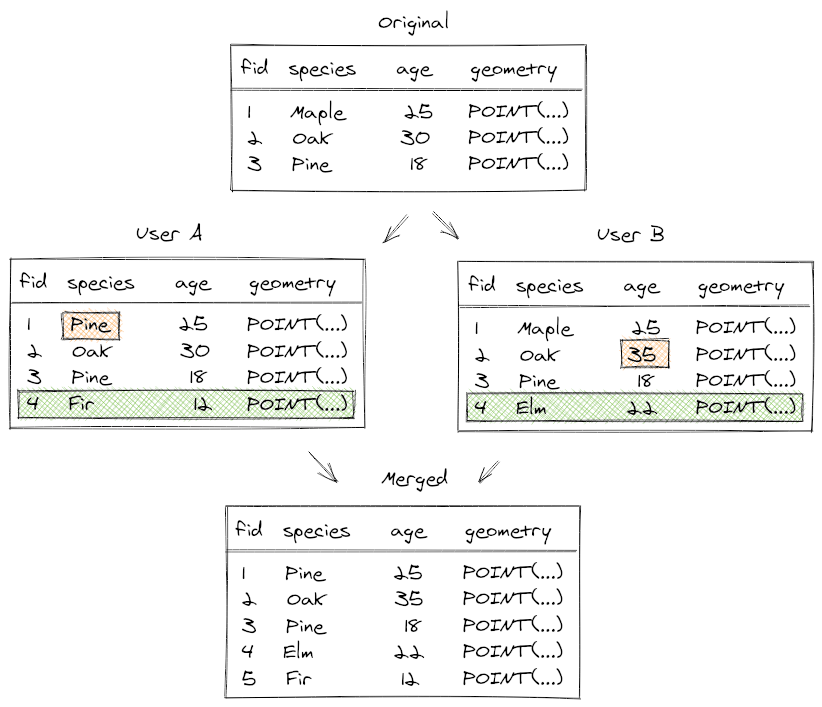

# Behind Data Synchronisation
<!-- concept / reference -->
[[toc]]

## Geodiff in Mergin Maps
Mergin Maps uses a library called **geodiff** to synchronise changes made by individual team members. You can find this library at <GitHubRepo id="lutraconsulting/geodiff" /> .

How does it work? Geodiff is able to compare two datasets with the same structure of tables. This comparison will create a "diff" file containing entries that were inserted, updated, or deleted between the two datasets. A diff file can be applied to an existing dataset (e.g. a GeoPackage) and the dataset will be updated accordingly by applying the differences one by one. In a way, Geodiff is meant to be an equivalent of UNIX tools `diff` and `patch` for spatial data.

Geodiff also makes possible to merge changes from multiple sources. During field surveys, individual team members can change the same row of a table or add a new row with the same ID. Generally, it is not easy to merge such changes automatically. The geodiff library has functionality to "rebase" a diff file on top of another diff file resolving any conflicts, so that all the changes can be applied cleanly. 

There still may be conflicts that can't be resolved automatically (e.g., if the same value is modified in different copies). These rare cases are written to a separate conflict file that can be addressed later.

## Conflict files

Sometimes Mergin users may see conflict files appearing in their projects. This page explains when conflicts can happen, how to deal with them and how to prevent them.

Conflicts can happen when two users edit some files in a shared project at once. The technology behind Mergin service makes effort to merge changes from individual users automatically and therefore conflicts do not happen normally, even if multiple people edit a single data source (e.g. a GeoPackage). However, there are still some occasions when Mergin is unable to automatically resolve conflicts and it will create conflict files in projects.

There are two types of conflicts:
- edit conflicts
- conflicted copies

::: tip
Make your work easier and avoid unnecessary conflict files by following [these tips](../layer/best-practice/).
:::

### Edit conflicts

Let's think of a survey of benches in a park conducted by Jack and Jill. They start with a vector layer of points with benches and they need to asses conditions of the benches by filling in a couple of attributes. They split the work into two halves and do the survey. By mistake, Jack also surveys a bench assigned to Jill - they both end up editing attributes of the same point, with slightly different values. How will Mergin handle that?

<!-- TODO: illustration of edits - diamond shape - base, Jack, Jill, result -->

If Jack is the first one to sync his changes and then Jill syncs her changes, at the time of Jill's sync Mergin knows they have a conflict in edits for that one bench. The editor who syncs last "wins", so in this case Jill's changes would be kept and Jack's changes would be overwritten (of course, all his non-conflicting edits to other benches would be kept). Mergin keeps a record about this, in case a project admin would want to investigate the edit conflict: if the survey is stored e.g. in data.gpkg, then a JSON file named data (edit conflict, jack v123).json would be created, containing list of conflicts. For each conflicting attribute value, the file lists the original value and the two different modified versions.

<!--TODO: input wasn't creating edit conflicts at all - fixed in 1.3 release - lutraconsulting/input#1738

TODO: plugin not doing this naming yet - lutraconsulting/mergin-py-client#62 -->

### Conflicted copy
Input does not support changing of the data schema. So, if you delete or add columns to your survey layer or change the data type of a field, Input cannot detect the change. Therefore, it is always recommended to stick with the same attribute table structure once you have set up your survey layer.

If you need to change the data schema, [see how to deploy a revised project properly](./deploy-new-project/).
 
<!-- TODO: example when that happens (change of database schema) -->
