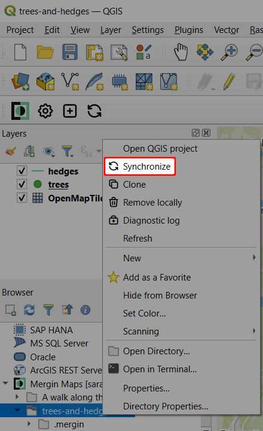
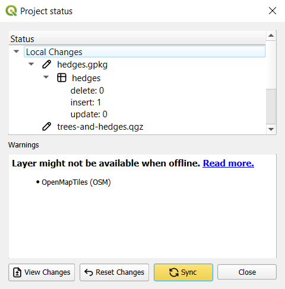
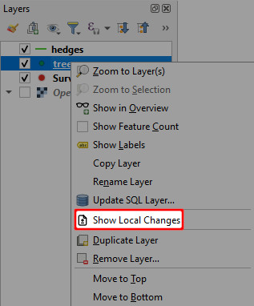
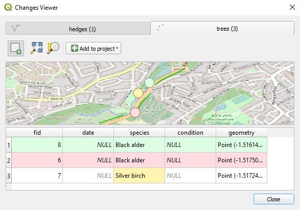
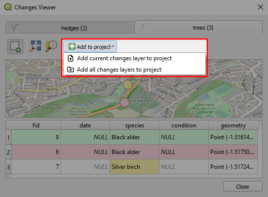
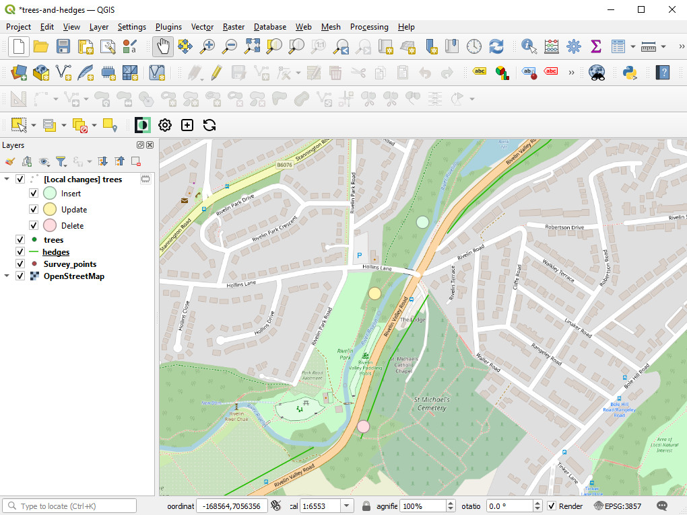
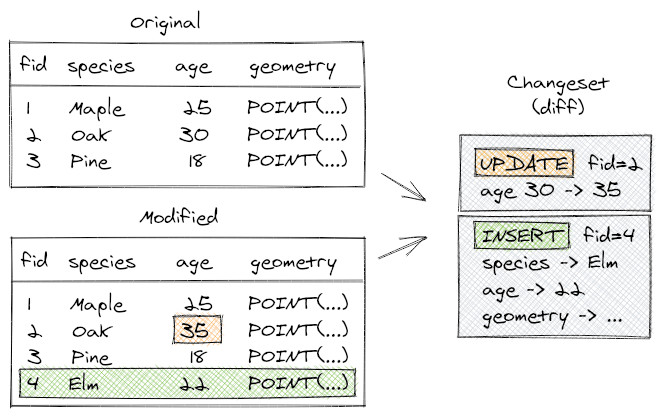
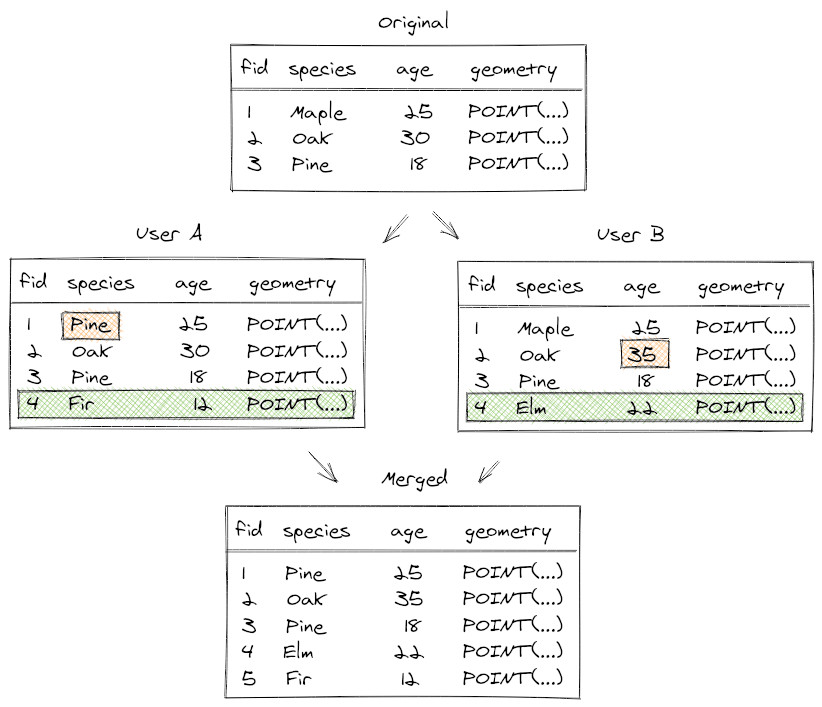

# Synchronisation
[[toc]]

## Mergin Maps workflow
Synchronisation is a key process that makes effective collaboration possible: you and your team members can contribute to the same project simultaneously, see each other's edits and also smoothly transfer data between mobile devices and computers.

Let's look at a typical workflow in <MainPlatformNameLink />:
1. First, you [create](../create-project/#create-a-project-in-qgis) and [prepare](../../gis/features/) a <MainPlatformName /> project in QGIS. This includes loading background and survey layers, setting up the forms, styling layers, setting up map themes and defining the layers to be used in a survey. The <MainPlatformName /> project consists of the project file (*.qgz) and data referenced in the project, such as GeoPackage layers, shapefiles, rasters or attachments. At this point, they are all saved in a project folder in your computer.
2. The <MainPlatformName /> project is uploaded to <ServerCloudName /> using [<QGISPluginName />](../plugin/). The project and data are now stored in the cloud.
3. Now you can work collaboratively! The project and data can be downloaded to a mobile device to do [the fieldwork using <MobileAppName /> ](../../tutorials/mobile/) or to another computer with QGIS. Every collaborator works with their own local version of the project.
4. After finishing their work, the individual contributors synchronise their changes [to <ServerCloudName />](../../tutorials/mobile/#saving-data-to-the-cloud), where they are put together.

As you can see, <ServerCloudName /> acts as a link between individual contributors and also between PCs and mobile devices, synchronising the changes. When you make changes and upload them to the cloud, <MainPlatformNameLink /> will compare the content of GeoPackage layers and merge them, while copying attachments (such as photos), rasters and shapefiles as they are. That is why we recommend using GeoPackage format for your survey layer.

## How to synchronise changes in Mergin Maps
You and your team can use various devices to collect and edit data. Once you are happy with the changes to be uploaded, you can synchronise your project and data back to the cloud:
- when using QGIS, follow the steps [below](#synchronising-changes-in-qgis) 
- in the <MobileAppNameShort />, you can use manual or automatic synchronisation. Go to [Synchronisation in Mergin Maps Mobile App](../../field/autosync/) for more details.

### Synchronising changes in QGIS

1. Click on the **Synchronise Mergin Maps project** icon from the <QGISPluginName /> toolbar or right-click on the project in the Browser panel and select **Synchronise**
   
   

2. This will show the project status: a list of pending changes, warnings, and validation results of your project.

   Here, you have the option to [**View changes**](#local-changes) to inspect the pending changes in more detail.
   
   You can also use **Reset changes** to revert the local changes.
  

   Warnings are related to restructuring of a GeoPackage layer (adding/removing a field, adding/removing a layer in a GeoPackage database). Validations can point out missing layers or availability of a layer when working offline.

4. If you want to proceed with the synchronisation, click on the **Sync** button to synchronise your project and data.
  
::: warning
Project and data synchronisation works in both ways.

All your changes will be uploaded to the server and any pending changes from the server edition of your files will be downloaded and appended to your local files.
:::

When the synchronisation process is completed, your local files and the copy of files on the server will be identical.

### Local changes

The changes that you make in the project can be synchronised to the cloud and shared with your coworkers. Now these changes can also be visualised which is helpful when reviewing local changes to see what was actually modified and also to avoid unwanted edits.

:::tip
Visit our blog [View and track changes in QGIS](https://www.lutraconsulting.co.uk/blog/2022/11/08/mergin-maps-local-changes/) to read more about local changes.
:::

To see local changes:
1. Right-click on a layer and select **Show Local Changes** 
   

2. **Changes Viewer** opens. The colour-coded changes are listed in the table and shown in the map. Inserts are green, edits orange and deletions red.

   If you want to zoom to specific changes, select them in the table and use **Zoom to Selection**.
   

3. Changes can be added to the QGIS project as a new layer. Click **Add to project** and choose one of the options:
   
   
4. A temporary layer will be added to the **Layers** panel with colour-coded symbology
   
   
:::tip
Unless you want to use these layers in your <MainPlatformName /> project, remove them from the project before synchronisation.
:::

## Behind Data Synchronisation
How does it work? When you use GeoPackage, <MainPlatformNameLink /> compares two datasets with the same data schema using [Geodiff library](#geodiff-library) to create a list of entries that were inserted, updated, or deleted between the two datasets. 

During field surveys, individual team members can change the same row of a table or add a new row with the same `ID`. If it is possible to solve these conflicts automatically, <MainPlatformName /> will do so:

There may be conflicts that can't be resolved automatically, e.g. if the same value is modified in different copies. These rare cases are written to a conflict file that can be [resolved later](../missing-data/#there-are-conflict-files-in-the-folder).

## Conflict files
Conflicts can happen when two users edit some files in a shared project at once. The technology behind <MainPlatformNameLink /> service makes an effort to merge changes from individual users automatically and therefore conflicts do not happen normally, even if multiple people edit a single data source (e.g. a GeoPackage). However, there are still some occasions when it is not possible to automatically resolve conflicts and <MainPlatformName /> will create conflict files in projects.

::: tip
Make your work easier and avoid unnecessary conflict files by following [these tips](../../layer/best-practice/).
:::

There are two types of conflicts:
- edit conflicts
- conflicted copies

### Edit conflicts
Let's think of a survey of benches in a park conducted by Jack and Jill. They start with a vector layer of points with benches and they need to assess conditions of the benches by filling in a couple of attributes. They split the work into two halves and do the survey. By mistake, Jack also surveys a bench assigned to Jill - they both end up editing attributes of the same point, with slightly different values. How will <MainPlatformName /> handle that?

<!-- TODO: illustration of edits - diamond shape - base, Jack, Jill, result -->

If Jack is the first one to sync his changes and then Jill syncs her changes, at the time of Jill's sync <MainPlatformName /> knows they have a conflict in edits for that one bench. The editor who syncs last "wins", so in this case Jill's changes would be kept and Jack's changes would be overwritten (of course, all his non-conflicting edits to other benches would be kept). <MainPlatformName /> keeps a record about this, in case a project admin would want to investigate the edit conflict: if the survey is stored e.g. in `data.gpkg`, then a JSON file named data `(edit conflict, jack v123).json` would be created, containing list of conflicts. For each conflicting attribute value, the file lists the original value and the two different modified versions.

### Conflicted copy
If you change the data schema, such as deleting or adding columns to your survey layer or changing the data type of a field, <MainPlatformName /> cannot detect changes. If you try to synchronise a layer with modified data schema, you will get a conflict file.

If you need to change the data schema, [see how to deploy a revised project properly](../deploy-new-project/).
 
<!-- TODO: example when that happens (change of database schema) -->

## Geodiff library
A library called **Geodiff** is used by <MainPlatformNameLink /> to synchronise changes made by individual team members. You can find this library at <GitHubRepo id="MerginMaps/geodiff" /> .
