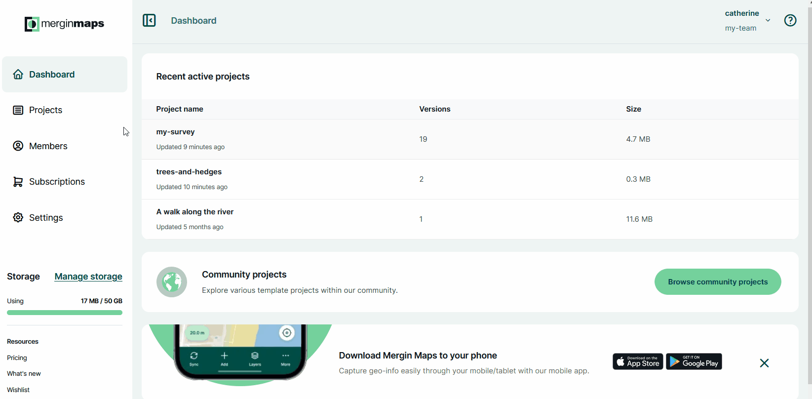
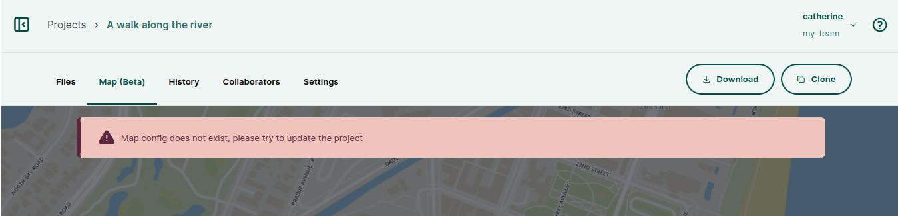

# Map Overviews
[[toc]]

**Map overviews** can be displayed in the **Map** tab of a project on the <DashboardShortLink />.

:::tip Usage details
Map Overviews can be used with *Team*, *Academia* and *Non-profit* <MainDomainNameLink id="pricing" desc="subscription plans"/>, as well as in [<CommunityPlatformName />](../../server/) and [<EnterprisePlatformName />](../../server/).

It is not available in *Individual* or *Professional* subscriptions.

You can try the Map Overview feature for free during the trial period.
:::

## Map overviews content

In the map overview, you will see your survey layers or raster layers that are [packaged](../project/#packaging-qgis-project) with the project. Other layers, such as online [background maps](../../gis/settingup_background_map/#background-maps) are not displayed.

The background map that is used for all map overviews is [<MainPlatformName /> vector tile service](../../gis/settingup_background_map/#mergin-maps-vector-tile-service).

The content of the map overview as well as the **Layers** panel are refreshed after every update. This means that you should always see here your current spatial data.

The **Layers** panel lists all layers displayed on the map. The check button :white_check_mark: controls the visibility of layers.

### Extent of map overviews
The extent of map overviews is defined by the [extent set in the QGIS project](../../gis/features/#project-extent) and the extent of the data that are included in the current version of the project.

## Map overviews troubleshooting

### Map config does not exist
The **Map** tab of a project on the <DashboardShortLink /> may display this error message:
`Map config does not exist, please try update the project`

This usually happens when the map overview was not initiated. All you need to do is to update the project: the map overview is refreshed after every synchronization, so your update will activate the map content.

