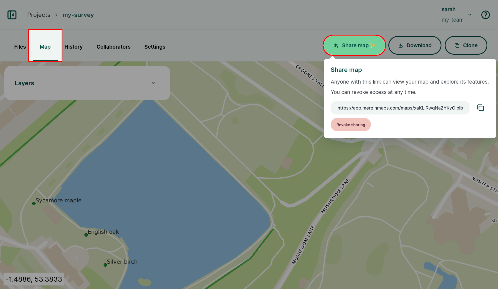

---
description: Mergin Maps webmaps can be shared using a URL link. You can also embed them directly on your website with a simple HTML code for seamless integration.
---

# Sharing and Embedding Webmaps <Badge text="early access" type="warning"/>
[[toc]]

::: warning Early access feature
Map sharing is in early access. If you would like to try it out, fill in [this form](https://wishlist.merginmaps.com/f/share-maps-via-url) to gain access to this feature.
:::

The spatial data of your project can be displayed and explored in the **Map** tab of the project on the <DashboardShortLink />. As an early access feature, they can also be [shared via URL](#sharing-maps-via-url).

:::tip Usage details
Webmaps are available for <MainPlatformNameLink /> cloud and <EnterprisePlatformNameLink /> users.

Webmaps are **not** available for <CommunityPlatformNameLink />.
:::

## Sharing maps via URL 

Webmaps can be shared via URL. [Admins or owners](../permissions/) can enable map sharing for a project, so that anyone with the link can display and explore your project in a web browser, without the need to log into  <MainPlatformNameLink /> or making the project [public](../project-advanced/#make-your-project-public-private).

1. Navigate to your project on the <DashboardShortLink />.
2. In the **Map** tab, click on the **Share map** button to generate a shareable link
3. Send the link to anyone to share your project

To see how this works, you can try a link to our [sample project](https://app.merginmaps.com/maps/grDTleg8yCdSracIxs-hmFIGdDs).

To disable the map sharing, click on the **Revoke sharing** button.

::: tip Blog about shared maps
You can read about this functionality in our blog post <MainDomainNameLink id="blog/a-final-surprise-for-the-year---shared-maps-via-url" desc="A final surprise for the year - shared maps via URL"/>.
:::

## Embedding webmaps using iframe

Webmaps that are shared can be also embedded on a website using HTML element `iframe` by using the [URL link](#sharing-maps-via-url) of the webmap.

For example, this code

`<iframe src="https://app.merginmaps.com/maps/grDTleg8yCdSracIxs-hmFIGdDs" height="500" width="700" title="Mergin Maps Webmas Iframe Example"></iframe>`

produces this map:

<iframe src="https://app.merginmaps.com/maps/grDTleg8yCdSracIxs-hmFIGdDs" height="500" width="700" title="Mergin Maps Webmas Iframe Example"></iframe>
