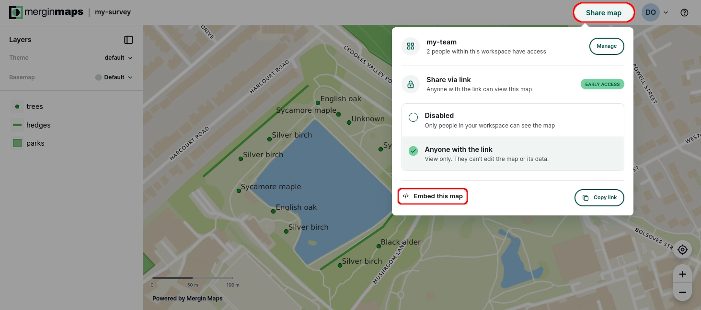
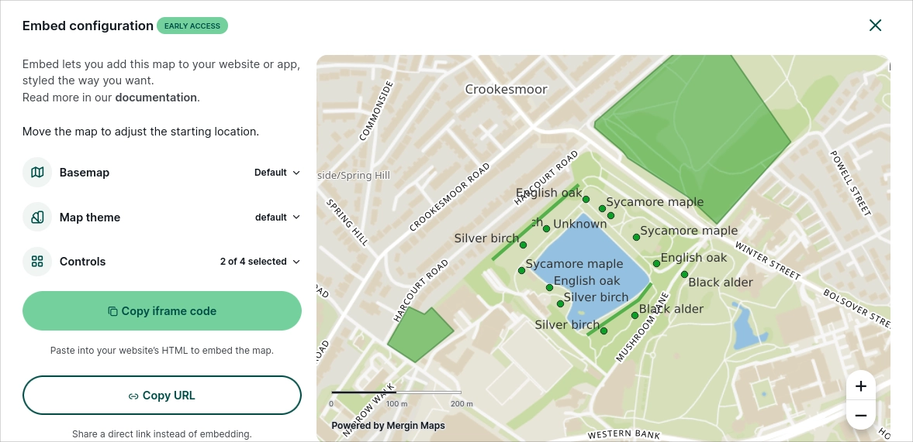

---
description: Mergin Maps webmaps can be shared using a URL link. You can also embed them directly on your website with a simple HTML code for seamless integration.

outline: deep
---

# Sharing and Embedding Webmaps <Badge text="Early access" type="warning"/>

::: warning Early access feature
Map sharing is currently available as an early access feature. If you would like to try it out, ask your workspace admin or owner to enable the map sharing early access program in your [workspace settings](https://app.merginmaps.com/settings). The availability of this feature may change in the future.
:::

## Sharing maps via URL 

You can share webmaps via a direct URL. [Admins or owners](../permissions/) can enable map sharing for a project, allowing anyone with the link to display and explore it in a web browser without the need to log in to <MainPlatformNameLink /> or make the project [public](../project-advanced/#make-your-project-public-private).

1. Navigate to your project on the <DashboardShortLink />.

2. Click the **Open map** button to open the [webmap](../dashboard-maps/).

3. Click the **Share map** button to display the sharing options.

   Set the *Share via link* option to **Anyone with the link**.
   
   

4. **Copy the link** using the button and share it to provide access to your webmap.

To disable map sharing, change the *Share via link* option to **Disabled**.

::: tip Sample webmap link
To see this feature in action, try the link to our [sample webmap](https://app.merginmaps.com/maps/grDTleg8yCdSracIxs-hmFIGdDs).
:::

### Regenerate webmap URL
If needed, you can invalidate existing access and create a new URL for your webmap.

1. Open your project on the <DashboardShortLink />

2. Navigate to the **Settings & API** tab and click the **Regenerate map URL** button. 

The current URL will stop working immediately. Your webmap will be accessible only through the new URL.

## Embedding webmaps using HTML

Shared webmaps can also be embedded on a website using the HTML `iframe` element.

1. Navigate to your project on the <DashboardShortLink />.
2. Click the **Open map** button to open the [webmap](../dashboard-maps/).
3. Click the **Share map** button to display the sharing options, then select **Embed this map**.
   
   

4. The **Embed configuration** will open. Here, you can define:
   - The default location and zoom level of the map
   - The basemap style (default, light, dark)
   - The map theme (if [map themes](../../gis/setup_themes/) are defined for your project)
   - The controls for the embedded map (zoom buttons, scale bar, geolocation, layers)
   
   

5. **Copy the iframe code** and use it on your website.

   If you want to share a direct link instead, use the **Copy URL**  button.
