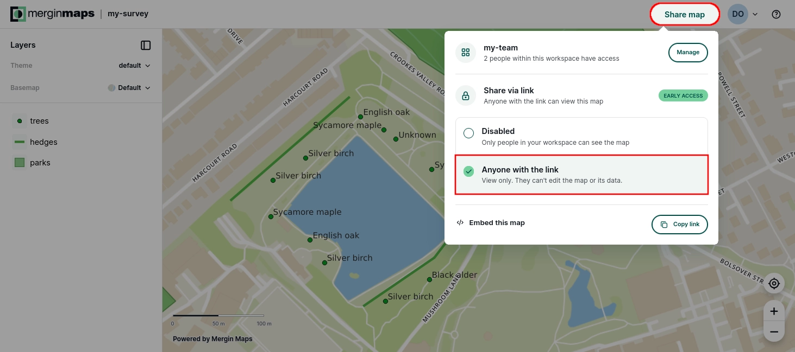
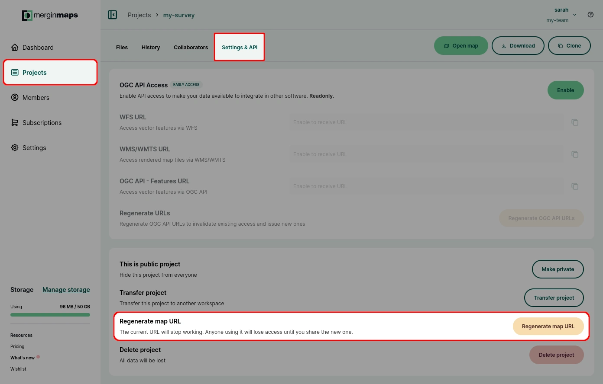

---
description: Mergin Maps webmaps can be shared using a URL link. You can also embed them directly on your website with a simple HTML code for seamless integration.

outline: deep
---

# Sharing and Embedding Webmaps <Badge text="Early access" type="warning"/>

::: warning Early access feature
Map sharing is currently available as an early access feature. If you would like to try it out, ask your workspace admin or owner to enable map sharing early access program in your [workspace settings](https://app.merginmaps.com/settings). The availability of the feature might change in the future.
:::

## Sharing maps via URL 

You can share webmaps via a direct URL. [Admins or owners](../permissions/) can enable map sharing for a project, allowing anyone with the link can display and explore it in a web browser, without the need to log in to <MainPlatformNameLink /> or make the project [public](../project-advanced/#make-your-project-public-private).

1. Navigate to your project on the <DashboardShortLink />
2. Click the **Open map** button to open the [webmap](../dashboard-maps/)
3. Click the **Share map** button to display the public map link
4. Copy and share the link to provide access to your webmap



To see this feature in action, you can try a link to our [sample webmap](https://app.merginmaps.com/maps/grDTleg8yCdSracIxs-hmFIGdDs).

To disable the map sharing, click the **Stop sharing** button.

### Regenerate webmap URL
If needed, you can invalidate existing access and create a new URL for your webmap.

1. Open your project on the <DashboardShortLink />

2. Navigate to the **Settings & API** tab and click the **Regenerate map URL** button. 



The current URL will stop working immediately. Your webmap will be accessible only through the new URL.

## Embedding webmaps using HTML

Webmaps that are shared can also be embedded on a website using the HTML `iframe` element with the [URL link](#sharing-maps-via-url) of the webmap.

For example, this code

```
<iframe src="https://app.merginmaps.com/maps/grDTleg8yCdSracIxs-hmFIGdDs" height="500" width="700" title="Mergin Maps Webmaps Iframe Example"></iframe>
```

produces this map:

<iframe src="https://app.merginmaps.com/maps/grDTleg8yCdSracIxs-hmFIGdDs" height="500" width="700" title="Mergin Maps Webmaps Iframe Example"></iframe>
