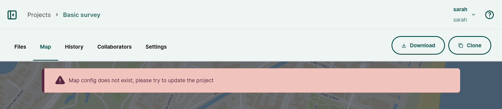

---
description: Troubleshooting tips for Mergin Maps dashboard maps.
---

# Troubleshooting webmaps

## Map config does not exist
The **Map** tab of a project on the <DashboardShortLink /> may display this error message:
`Map config does not exist, please try update the project`

This usually happens when the map was not initiated. All you need to do is to create a new version of the project: synchronisation of the project will activate the map content.

