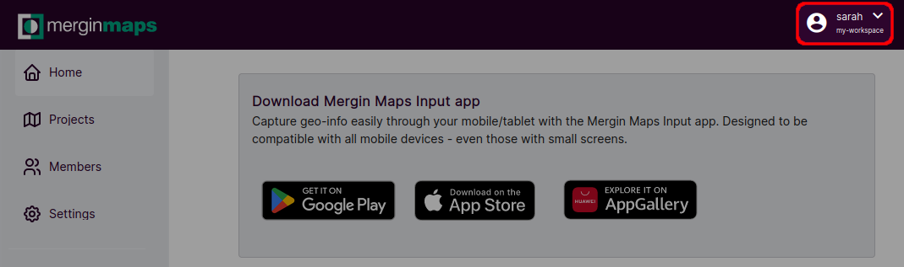
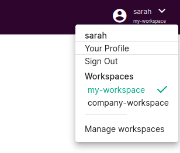
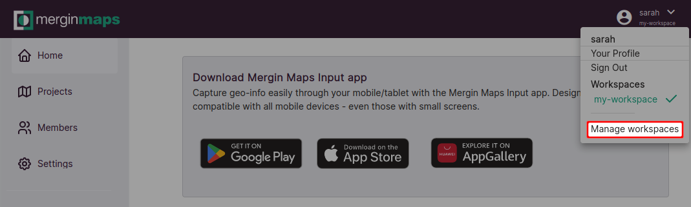
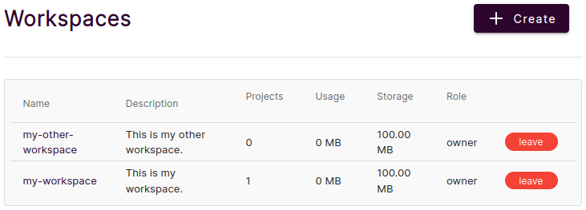
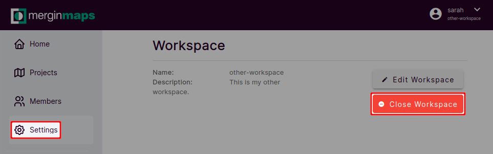

# Workspaces
[[toc]]

## Workspaces in Mergin Maps
Workspaces are used to efficiently manage projects, users and subscriptions. 

Every workspace is tied to a [subscription](https://merginmaps.com/pricing). The subscription plan defines the amount of data storage for the workspace as well as other features, such as commercial use or the level of [support](../../misc/troubleshoot/#support).

One workspace can contain multiple projects. The only limit is the storage quota (as defined by the subscription). If needed, projects can be transferred to another workspace.

Users can be invited to a workspace as [members or guests](../permissions/). These users don't need to have their own subscription. 

::: tip
Want to read more about workspaces and why they were introduced to <MainPlatformName />? Visit our blog [Introducing Workspaces: Simplified Collaboration](https://merginmaps.com/blog/introducing-workspaces-simplified-collaboration).
:::

## How to switch between workspaces
You may participate in multiple workspaces. For instance, you can have your personal workspace and be a member of the workspaces of other users.

When logged in to <AppDomainNameLink />, you will see the current workspace under the account name in the right corner of the screen.

Click on the account to see the list of all workspaces that are available to you. The active workspace is highlighted. Switch to another workspace by simply clicking on its name in the list.

## How to create a new workspace
1. Log in to <AppDomainNameLink />
2. Click on your account and navigate to **Manage workspaces**
   
3. Here, you can see the overview of your existing workspaces. Click on **Create workspace**
   
4. Fill in the name and description of your new workspace
   
5. Now you have a new workspace! Now you can [create projects](../create-project/) in the workspace and [invite other users](../project-advanced/#add-users-to-a-workspace) to contribute.
   

Currently, it is possible to have up to 3 workspaces. Note that every workspace has its own subscription. When created, the workspace has automatically a free subscription. If you want to use it commercially or need more storage, you will have to [switch to a paid subscription](../../setup/subscriptions/#changing-a-subscription-from-web). 

See our [pricing](https://merginmaps.com/pricing) for details about different plans.

## How to delete a workspace
1. Make sure you are in the workspace you want to remove
2. Navigate to **Settings** and select **Close workspace**
   
3. Confirm the closing of a workspace by typing the workspace name and click on **Delete**
   

