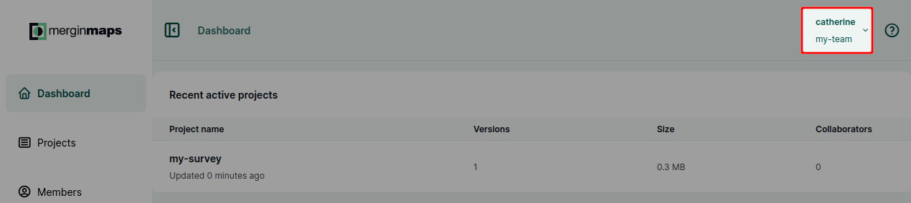
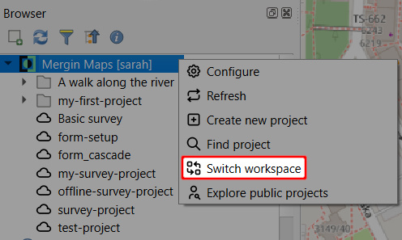

# Workspaces
[[toc]]

## Workspaces in Mergin Maps
Workspaces are used to efficiently manage projects, users and subscriptions. Every workspace is tied to a [subscription](../subscriptions/). The subscription plan defines the number of contributors and the amount of data storage for the workspace.

One workspace can contain multiple projects. The only limit is the storage quota (as defined by the subscription). If needed, projects can be transferred to another workspace.

Users can be invited to a workspace as [members or guests](../permissions/). These users don't need to have their own subscription. 

::: tip
Want to read more about workspaces and why they were introduced to <MainPlatformName />? Visit our blog [Introducing Workspaces: Simplified Collaboration](https://merginmaps.com/blog/introducing-workspaces-simplified-collaboration).
:::

<YouTube id="SZf93akn0tM" />

:::tip Integrations and workspaces
Integrations like [PostgreSQL DB Sync](../../dev/dbsync/), [Media Sync](../../dev/media-sync/) and [Work Packages](../../dev/work-packages/) do not share the concept of *active workspace*. They simply work with one specific project from any workspace.
:::

## How to switch between workspaces
You may have access to multiple workspaces. For instance, you can have your personal workspace and be a member of the workspaces of other users.

### Switch workspaces in Mergin Maps dashboard

When logged in to the <DashboardShortLink />, you will see the current workspace under the account name in the right corner of the screen (here: `my-team`).

Click on the account to see the list of all workspaces that are available to you. The active workspace is highlighted. Switch to another workspace by simply clicking on its name in the list.

### Switch workspaces in Mergin Maps mobile app
1. Navigate to **My Account** in <MobileAppName />
   

2. Here you will see your current workspace and your [role](../permissions/) in this workspace. 
   
   Tap on it to switch to another workspace.
   

3. Now you will see a list of workspaces that are available to you. 

   Select the one you want to switch to.
   

### Switch workspaces in QGIS
Navigate to <MainPlatformName /> in the **Browser** panel. The name of the current workspace is displayed in square brackets.

Right click on the plugin's name and select **Switch workspace**

From the list of available workspaces, select the one you want to switch to:

## How to create a new workspace 
A new workspace can be created through the <DashboardShortLink /> or through the <MobileAppNameShort />. Note that the name of a workspace cannot be changed later.

Every workspace has its own [subscription](../subscriptions/). With your first workspace, you can use a free trial to try out <MainPlatformName /> features. After the trial period, you will have to [switch to a paid subscription](../../manage/subscriptions/#how-to-change-a-subscription). See our [pricing](https://merginmaps.com/pricing) for more details.

### Create a workspace in Mergin Maps dashboard 
1. Log in to <AppDomainNameLink />

2. Click on your account and navigate to **Manage workspaces**
   

3. Here, you can see the overview of your workspaces. Click on **Create workspace**
   

4. Fill in the name and description of your new workspace.

   Note that **the name of a workspace cannot be changed later**.
   
   
5. Now you have a new workspace! You can [create projects](../create-project/) in the workspace and [invite other users](../project-advanced/#add-users-to-a-workspace) to contribute.
   

### Create a workspace in Mergin Maps mobile app

1. Navigate to the list of available workspaces as described [here](#switch-workspaces-in-mergin-maps-mobile-app) and click on the **+** button in the right upper corner of the screen
   
 
2. Fill in the name of your new workspace and tap **Create workspace**.

   Keep in mind that **the name of a workspace cannot be changed later**.
   

5. Now you have a new workspace! 
   
   You can [create projects](../create-project/) in the workspace and [invite other users](../project-advanced/#add-users-to-a-workspace) to contribute.
   

   
## How to delete a workspace
Closing a workspace means that all projects in this workspace will be removed as well. Therefore we recommend going through the projects in the workspace and, if needed, downloading them to your computer or [transferring them to another workspace](../project-advanced/#transfer-a-project) so that you don't lose your work.

You have to be the workspace [owner](../permissions/#workspace-member-roles-overview) to be able to delete the workspace.

1. [Switch](#how-to-switch-between-workspaces) to the workspace you want to remove

2. Navigate to **Settings** and select **Close workspace**
   
   
3. Confirm the closing of a workspace by typing the workspace name and click on **Yes**
   

After closing a workspace, it is kept on <MainPlatformNameLink /> servers for 5 days before it is deleted permanently. During this period, it can be restored if you contact <MerginMapsEmail id="support" />.

If you want to create a new workspace with the same name sooner, you can contact <MerginMapsEmail id="support" />. 

:::warning
If you want to reuse the name of a deleted workspace, make sure to remove all downloaded projects from the original workspace before it is deleted to avoid synchronisation issues.
:::
