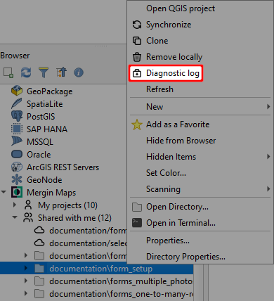
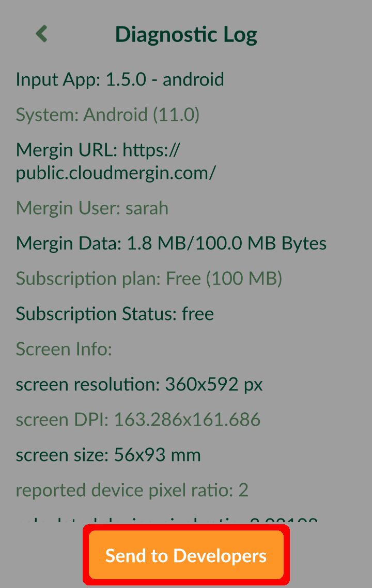

# Troubleshoot
[[toc]]

Did you encounter an issue when using <MainPlatformNameLink />? Here are some troubleshooting tips and resources that can help:
- Do you have enough storage? Check your [subscription and data usage](../manage/dashboard/#subscription).
- Are you missing some data after synchronisation? [How to Recover Missing Data](../../manage/missing-data/) will show you how to deal with [**conflict files**](../../manage/missing-data/#there-are-conflict-files-in-the-folder) and how to [**manually download**](../../manage/missing-data/#there-are-no-conflict-files-in-the-folder) data from your mobile device.
- Modifying data schema of survey layers is a common source of synchronisation issues. [How to Deploy Revised Projects](..//manage/missing-data/) will instruct you how to do it correctly.
- if <MobileAppName /> cannot open your project, see [How to Fix a Broken Project](../field/broken-project/).
- if <MobileAppName /> displays **PROJ error**, see [Custom Projections](../gis/proj/).

Need more help with your issue? <LutraConsultingWeb /> provides commercial support and free standard support for active subscriptions.

<CommunityJoin />

## Support

### Commercial SLA support

The commercial support or consultancy for your projects is carried by <LutraConsultingWeb />

<PublicImage src="logo_lutra.svg" title="Lutra Consulting Ltd. logo" />
    
Please see the <LutraConsultingWeb id="support/" desc="support packages" /> available. SLA support offers you the contracted response time, dedicated hotline as well as premium email support.

### Subscribed client support

If you have an active subscription on <AppDomainNameLink />, we also offer free standard support on <MerginMapsEmail id="support" />.

### Community support
- Join our [community chat on Slack](https://merginmaps.com/community/join) and ask questions!
- See [GIS Stack Exchange](https://gis.stackexchange.com/questions/tagged/mergin-maps) with "<NoSpellcheck id="mergin-maps" />" tag to ask questions and see other users' answers.
- See <QGISHelp ver="3.22" link="user_manual/index.html" text="QGIS documentation" /> for QGIS Desktop related problems.

## Diagnostic logs

If you experience any issues with syncing data, you can send diagnostic logs to the developers for debugging the issues. Logs contain detailed information about application run, so there may be hints for you on how to troubleshoot the problem. Once you have uploaded the logs, you can contact us on <MerginMapsEmail id="support" /> to look into the issues.

### Diagnostic log on Mergin Maps plugin for QGIS  

The diagnostic log `client-log.txt` can be found in the `.mergin` folder located in the project folder on your computer.

To send the diagnostic log to the developers:
1. Navigate to your local project in Browser panel under <QGISPluginName />
2. Right-click on the project and select **Diagnostic log**

3. Click **OK** to proceed

### Diagnostic log on Mergin Maps Input
To access the diagnostic log in <MobileAppName />:
1. Tap **More** and open **Settings** 
2. Select **Diagnostic log** to display the log

3. If you want to send the log to the developers, tap the **Send to Developers** button.

