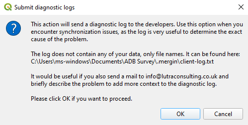
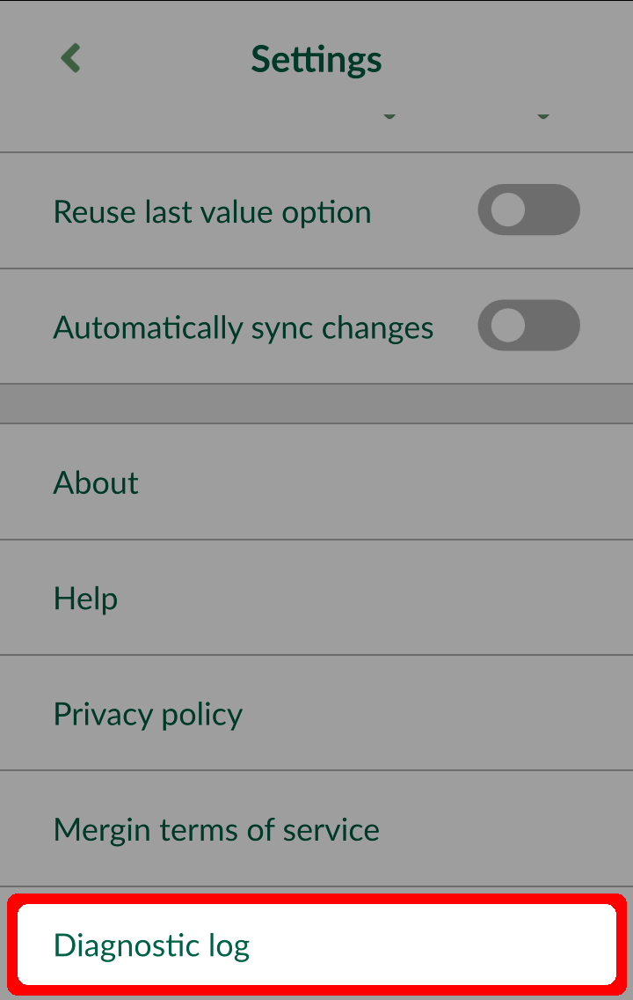

# Troubleshoot

[[toc]]

## Support

### Commercial SLA support

The commercial support or consultancy for your projects is carried by <LutraConsultingWeb />

<PublicImage src="logo_lutra.svg" />
    
Please see the <LutraConsultingWeb id="support/" desc="support packages" /> available. SLA support offers you the contracted response time, dedicated hotline as well as premium email support.

### Subscribed client support

If you have active subscription on <MainDomainNameLink />, we also offer free standard support on <MerginMapsEmail id="support" />

### Community support

 - Join our [community chat on Slack](https://merginmaps.com/community/join) and ask questions!
 - See [GIS Stack Exchange](https://gis.stackexchange.com/questions/tagged/lutra-input-app) with "<NoSpellCheck id="lutra-input-app" />" tag to ask questions and see other users' answers.
 - See [QGIS Online docs](https://www.qgis.org/en/docs/index.html) for QGIS Desktop related problem

## Diagnostic logs

If you experience any issues with syncing data, you can send the logs to the developers for debugging the issues. Logs also contains detailed information about application run, so there may be hints for you to troubleshoot the problem.

### Diagnostic log on Mergin Maps plugin for QGIS  

In QGIS Desktop to send the logs, right-click on a local project under Mergin in the Browser panel and select **Diagnostic logs**. A new window will appear, click **OK** to confirm.

### Diagnostic log on Mergin Maps Input

<MobileAppName /> to send the logs, go to "Settings" and click on "About". Select **Diagnostic logs**. A new window will appear, click **OK** to confirm.

Once you have uploaded the logs, you can contact us on <MerginMapsEmail id="support" /> to look into the issues.
