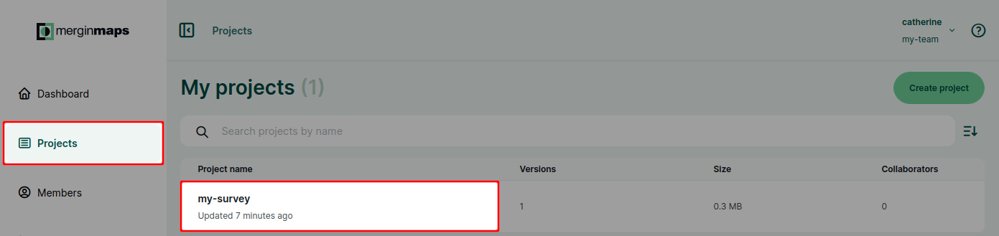
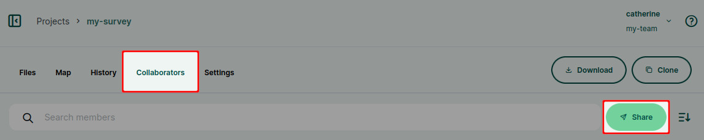
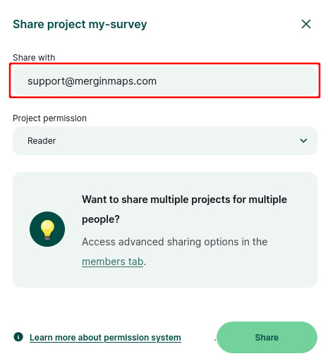
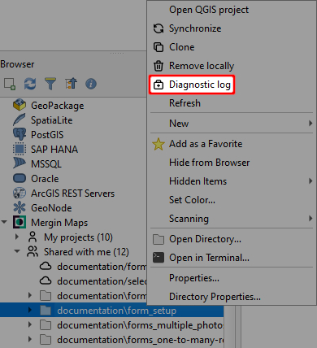
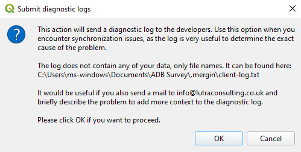
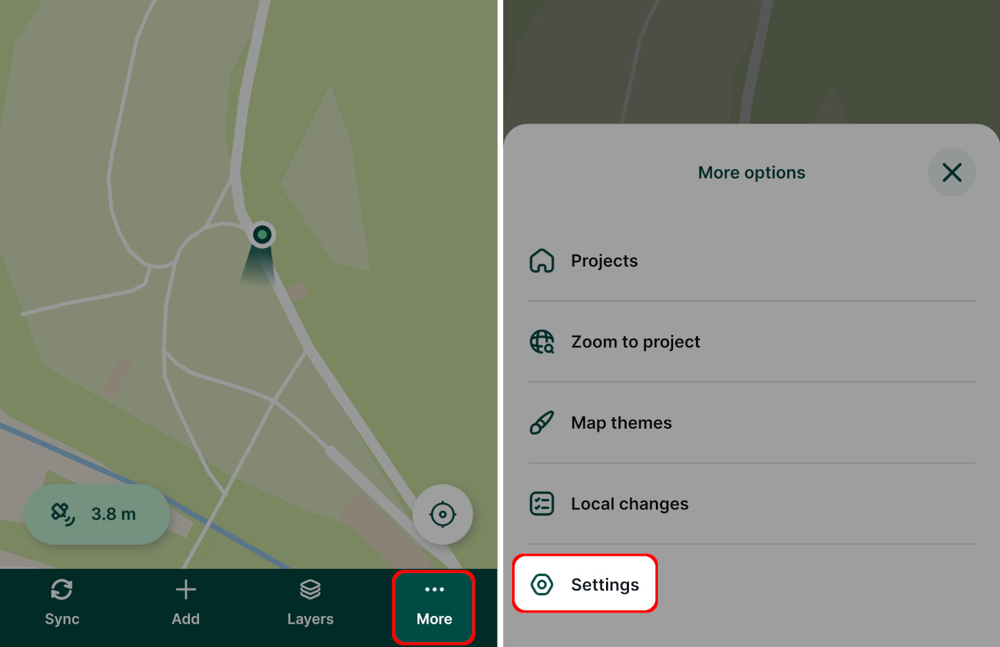
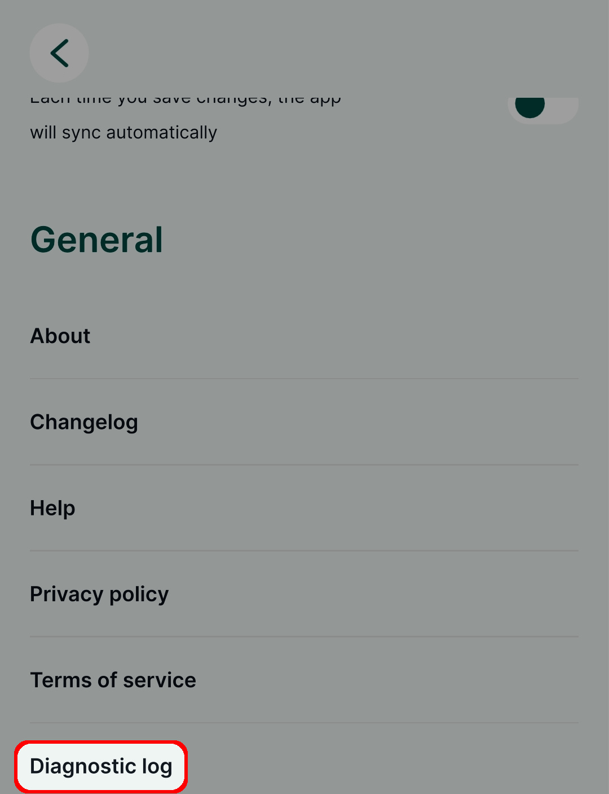
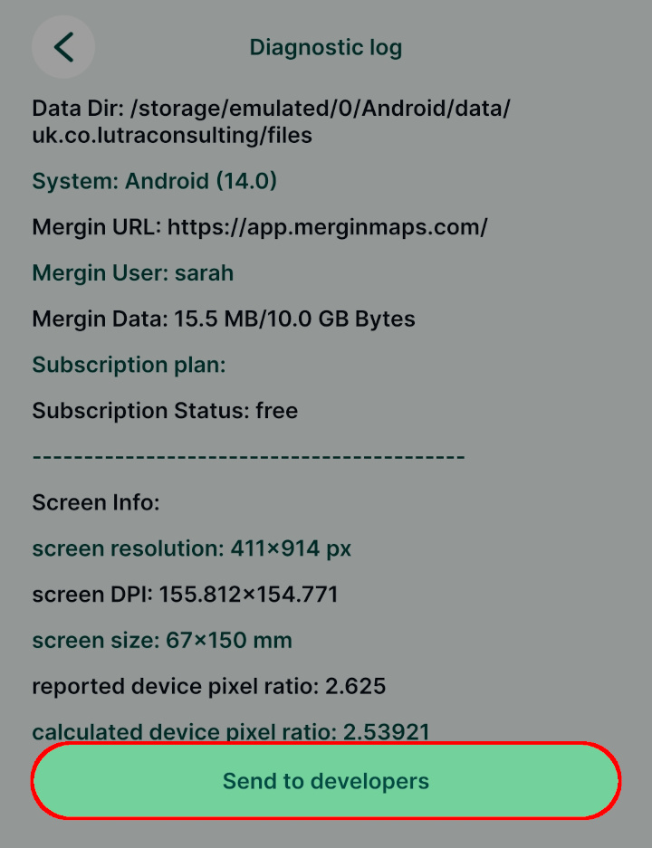

# Troubleshoot
[[toc]]

## Troubleshooting tips
Did you encounter an issue when using <MainPlatformNameLink />? Here are some troubleshooting tips and resources that can help:
- Do you have enough storage? Check your [subscription and data usage](../../manage/dashboard/#subscriptions).
- Are you missing some data after synchronisation? [How to Recover Missing Data](../../manage/missing-data/) will show you how to deal with [**conflict files**](../../manage/missing-data/#there-are-conflict-files-in-the-folder) and how to [**manually download**](../../manage/missing-data/#there-are-no-conflict-files-in-the-folder) data from your mobile device.
- Modifying data schema of survey layers is a common source of synchronisation issues. [How to Deploy Revised Projects](../../manage/missing-data/) will instruct you how to do it correctly.
- Unable to install or update <MobileAppName />? Check the [OS version](#minimum-os-versions-for-mergin-maps-mobile-app) of your mobile device. 
- If <MobileAppName /> cannot open your project or form, see [How to Fix a Broken Project](../../field/broken-project/).
- If <MobileAppName /> displays **PROJ error**, see [Custom Projections](../../gis/proj/).
- For troubleshooting custom server deployments, look at [this dedicated page](../../server/troubleshoot/).

Need more help with your issue? <LutraConsultingWeb /> provides commercial support and free fair-use support for your workspaces with an active subscription on <MerginMapsEmail id="support" />. 

<CommunityJoin />

## Support

You can also see all your options on our <MainPlatformNameLink id="support" desc="support" /> page.

### Commercial SLA support

The commercial support or consultancy for your projects is carried by <LutraConsultingWeb />

<PublicImage src="lutra-logo.png" title="Lutra Consulting Ltd. logo" style="width:50%" />
    
Please see the <MainDomainNameLink id="support" desc="support packages"/> available. SLA support offers you the contracted response time, dedicated hotline as well as premium email support.

### Subscribed client support

If you have an active <MainPlatformNameLink /> subscription or during the trial period, we also offer free fair-use support on <MerginMapsEmail id="support" />.

### Community support
- Join our [community chat on Slack](https://merginmaps.com/community/join) and ask questions!
- See [GIS Stack Exchange](https://gis.stackexchange.com/questions/tagged/mergin-maps) with "<NoSpellcheck id="mergin-maps" />" tag to ask questions and see other users' answers.
- See <QGISHelp ver="3.22" link="user_manual/index.html" text="QGIS documentation" /> for QGIS Desktop related problems.

## Minimum OS versions for Mergin Maps mobile app

The <MobileAppNameShort /> currently supports following OS versions:
- **Android 9** or above
- **iOS 16** or above
- Windows 10 or Windows 11

If your mobile device uses an older version of OS, you may be unable to install or update the <MobileAppNameShort />.

## How to share your project with Mergin Maps support

Sometimes it is useful to share your project with our support team so that they can help you solve your issues.

To share your project with the support team:
1. Log in to <AppDomainNameLink />
2. In the **Project** tab on the left panel, find the project that needs to be shared with the support team and click on it.
   
   
   ::: tip
   If you have access to multiple workspaces, you might need to [switch to another workspace](../../manage/workspaces/#switch-workspaces-in-mergin-maps-dashboard) first.
   :::

3. In the **Collaborators** tab, click on the **Share** button 
   

4. Use the email <MerginMapsEmail id="support" /> in the sharing form and click **Share** to send the invitation to the support team.
   

Our support team can now access your <MainPlatformNameLink /> project.

## Diagnostic logs

If you experience any issues with syncing data, you can send diagnostic logs to the developers for debugging the issues. Logs contain detailed information about application run, so there may be hints for you on how to troubleshoot the problem. 

Once you have uploaded the logs, please contact us on <MerginMapsEmail id="support" /> with your username/workspace and problem description so we can have a look into the issues.

::: tip Diagnostic logs on custom servers
If you use <EnterprisePlatformName /> or <CommunityPlatformName />, diagnostic logs are by default saved to the `diagnostic_logs` folder on your [custom server](../../server/).
:::

### Diagnostic log on Mergin Maps QGIS plugin 

The diagnostic log `client-log.txt` can be found in the `.mergin` folder located in the project folder on your computer.

To send the diagnostic log to the developers:
1. Navigate to your local project in Browser panel under <QGISPluginName />

2. Right-click on the project and select **Diagnostic log**
   

3. Click **OK** to proceed
   

4. Contact our support team (<MerginMapsEmail id="support" />) with your username/workspace and problem description so we can have a look into the issue. 

### Diagnostic log on Mergin Maps mobile app
In the <MobileAppNameShort />:
1. Tap on the **More** button and go to **Settings** 
   

2. Scroll down to the **Diagnostic log** option and tap it to display the log
   

3. Tap the **Send to developers** button to proceed
   

4. Contact our support team (<MerginMapsEmail id="support" />) with your username/workspace and problem description so we can have a look into the issue.

## Common issues
The following are some common issues encountered by users:
- [Project fails to sync and there is a *Gateway Timeout* or *502 Bad Gateway* error](./not_syncing/#gateway-timeout-or-502-bad-gateway) 
