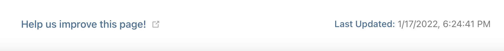
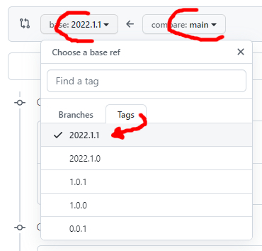
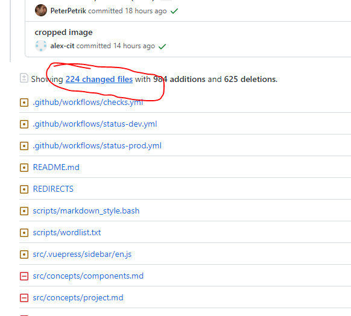

# Write Documentation

Thank you for your interest in helping out with writing [<MainPlatformName /> Documentation](https://merginmaps.com/docs). The documentation framework is based on [VuePress](https://vuepress.vuejs.org/) and we welcome any contributions as <GitHubRepo id="MerginMaps/docs/pulls" desc="GitHub Pull Requests" />. If you are unsure how to contribute of what tasks are best to start with, join us on our [community chat](https://merginmaps.com/community/join) and ask in the `#dev` channel. We are happy to get you up to speed!

The version of the documentation you see on [<MainPlatformName /> Documentation](https://merginmaps.com/docs) is the <GitHubRepo id="MerginMaps/docs/tags" desc="latest tagged release" /> on main branch. The latest commit on main branch can be seen on [<MainPlatformName /> Staging Documentation](https://dev.merginmaps.com/docs).

[[toc]]

## Quick Start

If you are about to do only *a tiny change* in the documentation, you can skip this section and fast track to section [for doing small modifications](./index.md#how-to-fix-typo-in-the-documentation). 

If you are a (web) *developer*, you can skip all and just look at <GitHubRepo id="MerginMaps/docs" desc="Mergin Maps README" />.

Otherwise, it is better to run the local development on your machine. The similar steps as described can be done on (almost) any operation system with slight modifications (e.g. using brew or apt on macOS or Linux for installation)

If you are not part of the <MainPlatformName /> core documentation team, you will need to work with [fork](#when-fork-is-needed). Follow the instructions in the section instead. We are happy to include more people into the team, so if you consider writing more documentation, let us know on our [community chat](https://merginmaps.com/community/join)

### Prepare Local Repository

As requirement, you need to <GitHubRepo id="git-guides/install-git" desc="install git" />.

Once installed, open command line/terminal and clone the repository locally (you can use http or SSH)

```
cd MyProjects
git clone git@github.com:MerginMaps/docs.git
```

### Start Local Server

To be able to see your changes interactively, you should start local VuePress server, and as requirement, you need to [install  yarn](https://yarnpkg.com/getting-started/install).

Once installed you can proceed by first installation of all dependent packages and following by start of the server:

```
cd MerginMaps/docs
yarn install 
yarn dev
```

If `yarn install` fails with `*ERROR: [Errno 2] No such file or directory: 'install'*` then [check out this page](https://www.stackoverflow.com/questions/46013544/yarn-install-command-error-no-such-file-or-directory-install).


Now you can open `http://localhost:8080/` in your browser and see the live version.

### Prepare Pull Requests

To commit your changes to the official documentation, you need to prepare pull request. To start, update your repository to the latest version

```
cd MerginMaps/docs
git checkout main
git pull origin main
```

Next is to create your branch where you work. Best to create some descriptive branch name.

```
git checkout -b my_docs_fix_branchname
```

Now, *modify the markdowns* in your favourite text editor.

When done, commit your changes and push your branch to GitHub 

```
git status
git add .
git commit -m "Improved documentation of XXX"
git push origin my_docs_fix_branchname
```

Now go to <GitHubRepo id="MerginMaps/docs" desc="GitHub" /> and create pull request (either from web or use the link from the terminal).

Check the automatic tests in the pull requests for spellcheck or broken link and fix the issues in your code.

To ensure your pull request will be merged, it is nice to ping the <MainPlatformName /> docs team on the [community chat](https://merginmaps.com/community/join) in the `#dev` channel.

### When Fork Is Needed
::: warning 
You can skip this step if you are member of the <MainPlatformName /> docs team and you have write permissions to the repository. 
:::

To fork <GitHubRepo id="MerginMaps/docs" /> repository with the source code of documentation, follow the steps as described in [GitHub docs](https://docs.github.com/en/get-started/quickstart/fork-a-repo). 

You will end up with the fork of <GitHubRepo id="MerginMaps/docs" /> in your namespace. 

If you use fork, you need to add both fork and upstream to your local namespace:

   ```
   mkdir MerginMaps; cd MerginMaps
   git clone git@github.com:<my_fork_of_MerginMaps/docs>.git
   git remote add upstream git@github.com:MerginMaps/docs.git
   ``` 

and you need to update your remote fork before starting the work:

   ```
   cd MerginMaps/docs
   git checkout main
   git pull upstream main
   git push origin main
   ``` 

## The Documentation System

Each markdown should be written as one of the 4 basic types of documentation: tutorials, how-to guides, technical reference and explanation. 

It is best to read about this [documentation system](https://documentation.divio.com/).

In each section in the menu (except Getting Started and Guides):
- we start with concepts
- following with a bunch of how to articles
- ending with reference documentation pages

References to other articles, blog posts or resources should be linked where relevant, either as [tips](#tip-warning-info-error-note-box) or as *Further reading* sections.

### Users & Workspaces

- To store all projects referenced in the documentation use <MainPlatformName /> workspace `documentation`
- For users that are referenced in the documentation (e.g. screenshots or in texts), use "fake" <MainPlatformName /> users `jack`, `jill` and `sarah`

### Naming things

* We can use Vue [custom components](./index.md#naming-mergin-maps-components) references names, allowing us to change them quickly in the future.
* This doesn't work for things like url component names, anchor links, titles or pages, sidebar
* In these situations:
	* Filenames:
		* <NoSpellcheck id="mergin-maps-mobile" />
	* Titles/Sidebar
		* Mergin Maps Mobile App
    * For titles (`#`)/sidebar capitalise the first letter in *all* words
        * Correct: "Opening Surveyed Data on Your Computer"
        * Wrong: ~~"Opening surveyed data on your computer"~~
        * Never shorten the names of components (e.g. Mergin Maps Mobile App)
    * For headers (`##`, `###`, `####` )  capitalise only the first letter in *first* word
        * Correct: "Putting your project in the cloud"
        * Wrong: ~~"Putting Your Project in the Cloud"~~
        * Never shorten the names of components (e.g. <MobileAppName />)
    * Titles and headers should contain specific keywords to return relevant search results:
        * Correct: "Further reading about projections and transformations"
        * Wrong: ~~"Further reading"~~  

## Questions 
     
### How To Fix Typo in the Documentation

If you see the typo or other issue on a page, you can scroll to the very bottom of the page to see a footer similar to this



If you click on the link, you will get the markdown source of the page that you can edit. If you are not in the <MainPlatformName /> core documentation team, you would also need to work on [fork](#when-fork-is-needed) to be able to proceed.

### Why the Markdown Has Different Content as the Public Docs

Occasionally, it can happen that the link in the footer is broken or the content in markdown does not match the content on [<MainPlatformName /> Documentation](https://merginmaps.com/docs). 
This is due to the fact that the released version is the <GitHubRepo id="MerginMaps/docs/tags" desc="latest tagged release" />. The latest commit on main branch can be seen on staging server [<MainPlatformName /> Staging Documentation](https://dev.merginmaps.com/docs).

### How Search Works

Full-text search is used in the docs thanks to the <GitHubRepo id="leo-buneev/vuepress-plugin-fulltext-search" /> plugin.

### How to Add New Page to Menu

1. Add the page in `src/.vuepress/sidebar/en.js`, the order of articles in the menu is always "concepts - how to - reference".
2. Add the page in `src/index.md`

## Using Markdown

If you are not familiar with markdown, best to take some tutorial or use [cheatsheet](https://www.markdownguide.org/cheat-sheet/). On top of regular markdown. you can use HTML tags as well as some extra Vue.js/custom components described in this section

### Tip/Warning/Info/Error/Note box

::: warning 
warning example
:::

```
::: warning 
warning example
:::
```

---

::: tip 
tip example
:::

```
::: tip 
tip example
:::
```

---

::: details 
details example
:::

```
::: details 
details example 
:::
```

---

::: danger 
danger example 
:::

```
::: danger 
danger example 
:::
```

---

You can also change title to a custom one
::: danger Custom title
Custom title example
:::
```
::: warning Custom title
Custom title example
:::
```

### Emoji

You can use any of supported <GitHubRepo id="markdown-it/markdown-it-emoji/blob/master/lib/data/full.json" desc="supported emoji" /> by markdown-it project.


:tada: :grinning: :rofl: :scream: :heart: :pray:

   ```
   :tada: :grinning: :rofl: :scream: :heart: :pray:
   ```


### Labels/Badges


<Badge text="tip badge" type="tip"/>


   ```<Badge text="tip badge" type="tip"/>```

---

<Badge text="warning badge" type="warning"/>


   ```<Badge text="warning badge" type="warning"/>```

---

<Badge text="error badge" type="error"/>


   ```<Badge text="error badge" type="error"/>```

For mentioning that some feature is available from specific version, use `<SinceBadge />`

   ```<SinceBadge type="App" version="2022.1.1" />```
<SinceBadge version="2022.1.1" type="App" />

   ```<SinceBadge type="Plugin" version="2023.2" />```
<SinceBadge version="2023.2" type="Plugin" />

   ```<SinceBadge type="Server" version="2024.3" />```
<SinceBadge version="2024.3" type="Server" />

### Images


#### Preparation

* Any image prepared should have an associated Gimp `.xcf` file containing the original, full resolution image
* Screenshots of QGIS should be taken with the window sized at 1024x768. [Sizer](http://www.brianapps.net/sizer) is good for this task.
* Consistent buttons / toolbars in QGIS
* Windows/macOS, not Linux
* Making dialogs as small as possible without scrollbars or other bad visuals
* Highlighting
	* New layer, black, called Black with 66% opacity
	* Tightly select what you want to highlight
	* Grow selection by:
		* Desktop: 3px
		* Mobile: 24px
	* Delete hole from Black layer
	* Add a layer called Red, transparent, 100% opacity
	* Stroke the selection with red, at width:
		* Desktop: 3px
		* Mobile: 12px

#### Export, title and alt

Every exported image:

* has `webp` (preferable) or `jpg` format
* has around 50-150kb. Only images where zoomed detail is important could have higher size.
* has title and alt text (exception: don't add alt text to decorative images like icons that are not part of docs)

e.g. ``

The image alt text is used to describe images to users who can't see them (they are using a screen-reader or image failed to load). The image title attribute is only visible on mouse-over and displays just the title over image.

For texts:

* Usually, use the same for alt and titles
* Include text that's part of the image
* Use keywords sparingly - describe in simple words
* Never start with “Image of …” or “Picture of …”
* Be specific and succinct

#### Referencing

 - Do not add `docs` prefix (base)
 - Place images next to the markdown files that reference them
 - Do not start with `/`, use relative paths

e.g. `` if the image is in the same folder as your markdown file
 
 - For global pictures/assets placed in `src/.vuepress/public` use custom component `<PublicImage />`

e.g. `<PublicImage src="logo_lutra.svg" title="Lutra Consulting Ltd. logo" />`

<PublicImage src="logo_lutra.svg" title="Lutra Consulting Ltd. logo" />

### Table of Contents 

use `[[toc]]` in markdown 


### Spellcheck

if you want to omit spellcheck for a word, use component
`NoSpellcheck`, e.g. `<NoSpellcheck id="myword" />`


### Links 

Reference other markdowns 

 - use relative path to the current file
 - add `.md` extension
 - use `#` for anchors

e.g. `[see this](../web/otherfile.md#permissions)`


## Custom Vue Components for Markdown

see `src/.vuepress/components` for list of all components

If you are adding new component: 

 - add your component to `src/.vuepress/components/MyComponent.vue`
 - use in markdown as `<MyComponent></MyComponent>` or `<MyComponent />`

### Reference QGIS and QGIS Help pages
To reference QGIS website, use `<QGIS />` component, e.g. `<QGIS link="en/site/forusers/download.html" text="QGIS Download page" />` transforms to

<QGIS link="en/site/forusers/download.html" text="QGIS Download page" />

To reference QGIS documentation, use `<QGISHelp />` component, e.g. `<QGISHelp ver="3.22" link="user_manual/index.html" text="See QGIS Help page" />` transforms to

<QGISHelp ver="3.22" link="user_manual/index.html" text="See QGIS Help page" />

### Reference GitHub content
Use `<GitHubRepo />` component, e.g. `<GitHubRepo id="MerginMaps/docs/" desc="documentation" />` transforms to <GitHubRepo id="MerginMaps/docs/" desc="documentation" />.


### Embed YouTube content

Use `<YouTube />` component, e.g. `<YouTube id="DQXrINUqiFI" />` transforms to

<YouTube id="DQXrINUqiFI" />


### Reference Mergin Maps project 

Use `<MerginMapsProject />` component, e.g. `<MerginMapsProject id="documentation/test_forms" />` transforms to

<MerginMapsProject id="documentation/test_forms" />

For a short reference (e.g. in tables), use `<MerginMapsProjectShort />` component, e.g. `<MerginMapsProject id="documentation/test_forms" />` transforms to 

<MerginMapsProjectShort id="documentation/test_forms" />

### Show Mergin Maps Mobile App Google/Apple badges for download

Use `<AppDownload />` component
    
<AppDownload />

### Naming Mergin Maps Components

Use `<AppDomainNameLink />` component, transforms to <AppDomainNameLink />

Use `<MainDomainName />` component, transforms to <MainDomainName />

Use `<MainDomainNameLink />` component, transforms to <MainDomainNameLink />

Use `<MainPlatformName />` component, transforms to <MainPlatformName />

Use `<MainPlatformNameLink />` component, transforms to <MainPlatformNameLink />

Use `<CommunityPlatformName />` component, transforms to <CommunityPlatformName />

Use `<CommunityPlatformNameLink />` component, transforms to <CommunityPlatformNameLink />

Use `<EnterprisePlatformName />` component, transforms to <EnterprisePlatformName />

Use `<EnterprisePlatformNameLink />` component, transforms to <EnterprisePlatformNameLink />

Use `<MobileAppName />` component, transforms to <MobileAppName />

Use `<MobileAppNameShort />` component, transforms to <MobileAppNameShort />

Use `<QGISPluginName />` component, transforms to <QGISPluginName />

Use `<QGISPluginNameShort />` component, transforms to <QGISPluginNameShort />

## Translations

Translations are not yet supported/implemented.


## Redirects

As documentation matures, content gets moved, renamed or deleted. As 3rd party sites may link to content, it's important to maintain information on how requests for now non-existent content should be redirected usefully.

This information is captured in the <GitHubRepo desc="REDIRECTS" id="MerginMaps/docs/blob/main/REDIRECTS" /> file.


### Seeing what's changed

When all authors have committed their changes to the _main_ branch and are ready for the site to be released we can easily generate a clear picture of what's changed.

We can do this by comparing the current state of the _main_ branch with the last released version of the docs site. Do this by:

1. <GitHubRepo desc="Comparing changes" id="MerginMaps/docs/compare" />
    * Use the latest tag on the left
    * Use _main_ on the right
    
    

2. Scroll down a little and click where it says _**224 changed files**_ or similar

    You should now see a nice summary below of files which have been added, renamed or deleted
    
    

You can now see which content has been changed.


### Updating the REDIRECTS file

The REDIRECTS file is a tab-separated list of old/new URL pairs. It describes how requests for old content should be redirected.

With a clear picture of how the structure of content will change in a given release (see above), update the REDIRECTS as follows:

* **Renamed pages** (`.md`) **or data files** (e.g. `.json`, `.zip`):
    * Add a new line to the REDIRECTS file to reflect this
    * Check if existing lines in the REDIRECTS file point to the page/data file that is being renamed
        * If so, update those targets to point to the renamed page/data file's new path
* **Deleted pages** (`.md`):
    * Add a new line to the REDIRECTS file to point requests somewhere sensible
    * Check if existing lines in the REDIRECTS file point to the deleted page
        * If so, update those targets to point somewhere sensible
* **Renamed images** (e.g. `.png`, `.jpg`) **and deleted data files** (e.g. `.json`, `.zip`):
    * We ignore these for the time being
* **General checks**
    * Ensure source and destination URLs are separated by a single tab, not spaces
    * Ensure all target URLs end with a trailing `/` for example:
        * `https://merginmaps.com/docs/howto/input_ui` (bad)
        * `https://merginmaps.com/docs/howto/input_ui/` (good)


## Known Limitations

* Anchors don't work
* elements in anchors don't show
* elements also don't work in TOC
* when a component is followed by a hyperlink, the hyperlink is displayed as plain text

