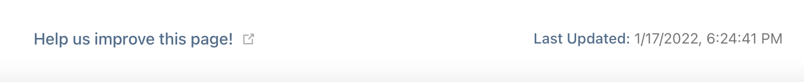

# Write Documentation

Thank you for your interest in helping out with writing [Mergin Maps Documentation](https://www.merginmaps.com/docs). The documentation framework is based on [VuePress](https://vuepress.vuejs.org/) and we welcome any contributions as <GitHubRepo id="MerginMaps/docs/pulls" desc="GitHub Pull Requests" />. If you are unsure how to contribute of what tasks are best to start with, join us on our [community chat](https://merginmaps.com/community/join) and ask in the `#dev` channel. We are happy to get you up to speed!

The version of the documentation you see on [Mergin Maps Documentation](https://www.merginmaps.com/docs) is the <GitHubRepo id="MerginMaps/docs/tags" desc="latest tagged release" /> on main branch. The latest commit on main branch can be seen on [Mergin Maps Staging Documentation](https://dev.merginmaps.com/docs).

[[toc]]

## Quick Start

If you are about to do only *a tiny change* in the documentation, you can skip this section and fast track to section [for doing small modifications](./index.md#how-to-fix-typo-in-the-documentation). 

If you are a (web) *developer*, you can skip all and just look at <GitHubRepo id="MerginMaps/docs" desc="Mergin Maps README" />.

Otherwise, it is better to run the local development on your machine. The similar steps as described can be done on (almost) any operation system with slight modifications (e.g. using brew or apt on macOS or Linux for installation)

If you are not part of the Mergin Maps core documentation team, you will need to work with [fork](#when-fork-is-needed). Follow the instructions in the section instead. We are happy to include more people into the team, so if you consider writing more documentation, let us know on our [community chat](https://merginmaps.com/community/join)

### Prepare Local Repository

As requirement, you need to <GitHubRepo id="git-guides/install-git" desc="install git" />

Once installed, open command line/terminal and clone the repository locally (you can use http or SSH)

```
cd MyProjects
git clone git@github.com:MerginMaps/docs.git
```

### Start Local Server

To be able to see your changes interactively, you should start local VuePress server, and as pre-requirement, you need to [install  yarn](https://yarnpkg.com/getting-started/install).

Once installed you can proceed by first installation of all dependent packages and following by start of the server:

```
cd MerginMaps/docs
yarn install 
yarn dev
```

If `yarn install` fails with `*ERROR: [Errno 2] No such file or directory: 'install'*` then [check out this page](https://www.stackoverflow.com/questions/46013544/yarn-install-command-error-no-such-file-or-directory-install).


Now you can open `http://localhost:8080/` in your browser and see the live version.

### Prepare Pull Requests

To commit your changes to the official documentation, you need to prepare pull request. To start, update your repository to the latest version

```
cd MerginMaps/docs
git checkout main
git pull origin main
```

Next is to create your branch where you work. Best to create some descriptive branch name.

```
git checkout -b my_docs_fix_branchname
```

Now, *modify the markdowns* in your favourite text editor.

When done, commit your changes and push your branch to GitHub 

```
git status
git add .
git commit -m "Improved documentation of XXX"
git push origin my_docs_fix_branchname
```

Now go to <GitHubRepo id="MerginMaps/docs" desc="GitHub" /> and create pull request (either from web or use the link from the terminal).

Check the automatic tests in the pull requests for spellcheck or broken link and fix the issues in your code.

To ensure your pull request will be merged, it is nice to ping the Mergin Maps docs team on the [community chat](https://merginmaps.com/community/join) in the `#dev` channel.

### When Fork Is Needed
::: warning 
You can skip this step, in case you are member of the Mergin Maps docs team and you have write permissions to the repository. 
:::

To fork <GitHubRepo id="MerginMaps/docs" /> repository with the source code of documentation, follow the steps as described in <GitHubRepo id="git-guides/install-git" desc="GitHub docs" /> [](https://docs.github.com/en/get-started/quickstart/fork-a-repo). 

You will end up with the fork of <GitHubRepo id="MerginMaps/docs" /> in your namespace. 

If you use fork, you need to add both fork and upstream to your local namespace:

```
mkdir MerginMaps; cd MerginMaps
git clone git@github.com:<my_fork_of_MerginMaps/docs>.git
git remote add upstream git@github.com:MerginMaps/docs.git
``` 

you need to update your remote fork before starting the work:

```
cd MerginMaps/docs
git checkout main
git pull upstream main
git push origin main
``` 

## The Documentation System

Each markdown should written as one of the 4 basic types of documentation:
tutorials, how-to guides, technical reference and explanation. 

It is best to read about this [documentation system](https://documentation.divio.com/).

In each section in the menu (except Getting Started and Guides) 
- we start with concepts
- following with a bunch of how to articles
- ending with reference documentation

### Users & Organisations

- To store all projects referenced in the documentation use Mergin Maps organisation `documentation`
- For users that are referenced in the documentation (e.g. screenshots or in texts), use "fake" Mergin Maps users `jack`, `jill` and `sarah`

### Naming things

* We can use Vue components references names, allowing us to change them quickly in the future
* This doesn't work for things like url component names and anchor links
* In these situations:

	* Filenames:
		* mergin-maps-mobile
	* Titles
		* Mergin Maps Input
   
   
## Questions 
     
## How To Fix Typo in the Documentation

If you see the typo or other issue on a page, you can scroll to the very bottom of the page to see a footer similar to this



If you click on the link, you will get the the markdown source of the page that you can edit. If you are not in the Mergin Maps core documentation team, you would also need to work on [fork](#when-fork-is-needed) to be able to proceed.

## Why the Markdown Has Different Content as the Public Docs

Occasionally, it can happen that the link in the footer is broken or the content in markdown does not match the content on [Mergin Maps Documentation](https://www.merginmaps.com/docs). 
This is due to the fact that the released version is the <GitHubRepo id="MerginMaps/docs/tags" desc="latest tagged release" />. The latest commit on main branch can be seen on staging server [Mergin Maps Staging Documentation](https://dev.merginmaps.com/docs).


## How Search Works

We do not use the full search, but rather limited. The search at the documentation page only indexes the titles and headers in all articles. Another reason to make sure your headers are meaningful :)

## Using Markdown

If you are not familiar with markdown, best to take some tutorial or use [cheatsheet](https://www.markdownguide.org/cheat-sheet/). On top of regular markdown. you can use HTML tags as well as some extra Vue.js/custom components described in this section

### Tip/Warning/Info/Error/Note box

::: warning 
warning example
:::

```
::: warning 
warning example
:::
```

---

::: tip 
tip example
:::

```
::: tip 
tip example
:::
```

---

::: details 
details example
:::

```
::: details 
details example 
:::
```

---

::: danger 
danger example 
:::

```
::: danger 
danger example 
:::
```

---

You can also change title to a custom one
::: danger Custom title
Custom title example
:::
```
::: warning Custom title
Custom title example
:::
```

### Emoji

You can use any of supported <GitHubRepo id="markdown-it/markdown-it-emoji/blob/master/lib/data/full.json" desc="supported emoji" /> by markdown-it project.


:tada: :grinning: :rofl: :scream: :heart: :pray:

```
:tada: :grinning: :rofl: :scream: :heart: :pray:
```


### Labels/Badges


<Badge text="tip badge" type="tip"/>


```<Badge text="tip badge" type="tip"/>```

---

<Badge text="warning badge" type="warning"/>


```<Badge text="warning badge" type="warning"/>```

---

<Badge text="error badge" type="error"/>


```<Badge text="error badge" type="error"/>```


### Images


#### Preparation

* Any image prepared should have an associated Gimp `.xcf` file containing the original, full resolution image
* Screenshots of QGIS should be taken with the window sized at 1024x768. [Sizer](http://www.brianapps.net/sizer/#:~:text=Sizer%20is%20a%20freeware%20utility,to%20an%20exact%2C%20predefined%20size.) is good for this task.
* Consistent buttons / toolbars in QGIS
* Windows/macOS, not Linux
* Making dialogs as small as possible without scrollbars or other bad visuals
* Highlighting
	* New layer, black, called Black with 66% opacity
	* Tightly select what you want to highlight
	* Grow selection by:
		* Desktop: 3px
		* Mobile: 24px
	* Delete hole from Black layer
	* Add a layer called Red, transparent, 100% opacity
	* Stroke the selection with red, at width:
		* Desktop: 3px
		* Mobile: 12px
	


#### Referencing

 - Do not add `docs` prefix (base)
 - Place images next to the markdown files that reference them
 - Do not start with `/`, use relative paths

e.g. `` if the image is in the same folder as your markdown file
 
 - For global pictures/assets placed in `src/.vuepress/public` use custom component `<PublicImage />`

e.g. `<PublicImage src="mergin.svg" />`

<PublicImage src="mergin.svg" />

### Table of Contents 

use `[[toc]]` in markdown 


### Spellcheck

if you want to omit spellcheck for a word, use component
`NoSpellcheck`, e.g. `<NoSpellcheck id="myword" />`


### Links 

Reference other markdowns 

 - use relative path to the current file
 - add `.md` extension
 - use `#` for anchors

e.g. `[see this](../web/otherfile.md#permissions)`


### Custom Components 

see `src/.vuepress/components` for list of all components

If you are adding new component: 

 - add your component to `src/.vuepress/components/MyComponent.vue`
 - use in markdown as `<MyComponent></MyComponent>` or `<MyComponent />`

#### Reference QGIS Help pages

Use `<QGISHelp />` component, e.g. `<QGISHelp ver="3.10" link="user_manual/index.html" text="See QGIS Help page" />` transforms to

<QGISHelp ver="3.10" link="user_manual/index.html" text="See QGIS Help page" />
    
#### Embed YouTube content

Use `<YouTube />` component, e.g. `<YouTube id="DQXrINUqiFI" />` transforms to

<YouTube id="DQXrINUqiFI" />

#### Reference Mergin project 

Use `<MerginMapsProject />` component, e.g. `<MerginMapsProject id="lutraconsulting/test_forms" />` transforms to

<MerginMapsProject id="lutraconsulting/test_forms" />

#### Show Input App Google/Apple badges for download

Use `<AppDownload />` component
    
<AppDownload />


### Translations

Translations are not yet supported/implemented. 

### Known Limitations

* Anchors don't work
* elements in anchors don't show
* elements also don't work in TOC


