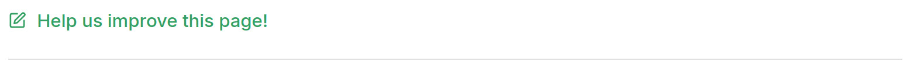

# Write Documentation

Thank you for your interest in helping out with writing [<MainPlatformName /> Documentation](https://merginmaps.com/docs). The documentation framework is based on [VitePress](https://vitepress.dev/). We welcome any contributions as <GitHubRepo id="MerginMaps/docs/pulls" desc="GitHub Pull Requests" />. If you are unsure how to contribute or what tasks are best to start with, join us on our [community chat](https://merginmaps.com/community/join) and ask in the `#dev` channel. We are happy to get you up to speed!

The version of the documentation you see on [<MainPlatformName /> Documentation](https://merginmaps.com/docs) is the <GitHubRepo id="MerginMaps/docs/tags" desc="latest tagged release" /> on the main branch. The latest commit on the main branch can be seen on [<MainPlatformName /> Staging Documentation](https://dev.merginmaps.com/docs).

[[toc]]

## Quick start

If you are about to do only *a tiny change* in the documentation, you can skip this section and fast track to the instructions for [fixing a typo or doing small modifications](#how-to-fix-typo-in-the-documentation) in the docs.

If you are a (web) *developer*, you can skip all and just look at <GitHubRepo id="MerginMaps/docs" desc="Mergin Maps README" />.

Otherwise, it is best to run the local development on your machine. The similar steps as described can be done on (almost) any operation system with slight modifications (e.g. using `brew` or `apt` on macOS or Linux for installation).

If you are not a part of the <MainPlatformName /> core documentation team, you will need to work with a [fork](https://docs.github.com/en/get-started/quickstart/fork-a-repo). Follow the instructions in the section [When fork is needed](#when-fork-is-needed). We are happy to include more people into the team, so if you consider writing more documentation, let us know on our [community chat](https://merginmaps.com/community/join).

### Prepare local repository

As a requirement, you need to <GitHubRepo id="git-guides/install-git" desc="install git" />.

Once installed, open command line/terminal and clone the repository locally (you can use HTTP or SSH)

```
cd MyProjects
git clone git@github.com:MerginMaps/docs.git
```

### Start local server

To be able to see your changes interactively, you have to run a local VitePress server. Also, you need to [install yarn](https://yarnpkg.com/getting-started/install).

Once installed, you can proceed by installing all dependent packages and starting the server:

```
cd MerginMaps/docs
yarn install 
yarn dev
```

Now you can open `http://localhost:5173/docs/` in your browser and see the live version of the docs.

### Prepare pull requests

To commit your changes to the official documentation, you need to prepare a pull request. 

Always begin with updating your repository to the latest version:

```
cd MerginMaps/docs
git checkout main
git pull origin main
```

The next step is to create a new branch for your work. Best to use a descriptive branch name:

```
git checkout -b my_docs_fix_branchname
```

Now you can modify the Markdowns in your favourite text editor. We recommend inspecting the changes as you go in the locally run version of the docs `http://localhost:5173/docs/`.

When done, commit your changes and push your branch to GitHub:

```
git status
git add .
git commit -m "Improved documentation of XXX"
git push origin my_docs_fix_branchname
```

Now go to <GitHubRepo id="MerginMaps/docs" desc="GitHub" /> and create a pull request (from web or by using the link from the terminal).

Check the automatic tests in the pull requests for [spellcheck](#spellcheck), [Markdown](#using-markdown), broken links or [redirects](#redirects) and, if needed, fix the issues in your code.

To ensure your pull request will be reviewed and merged, it is nice to ping the <MainPlatformName /> docs team on the [community chat](https://merginmaps.com/community/join) in the `#dev` channel.

### When fork is needed
::: warning
You can skip this step if you are a member of the <MainPlatformName /> docs team and you have write permissions to the repository. 
:::

To fork <GitHubRepo id="MerginMaps/docs" /> repository with the source code of documentation, follow the steps described in [GitHub docs](https://docs.github.com/en/get-started/quickstart/fork-a-repo).

You will end up with the fork of <GitHubRepo id="MerginMaps/docs" /> in your namespace. 

If you use fork, you have to add both fork and upstream to your local namespace:

   ```
   mkdir MerginMaps; cd MerginMaps
   git clone git@github.com:<my_fork_of_MerginMaps/docs>.git
   git remote add upstream git@github.com:MerginMaps/docs.git
   ``` 

You also have to update your remote fork before starting the work:

   ```
   cd MerginMaps/docs
   git checkout main
   git pull upstream main
   git push origin main
   ``` 
### How to fix typo in the documentation

If you see a typo or other issue on a page that can be easily fixed, you can scroll to the bottom of the page to see a footer similar to this



Use the **Help us improve this page** link to go to the editable Markdown source of the page. If you are not in the <MainPlatformName /> core documentation team, you will also need to work on [fork](#when-fork-is-needed) to be able to proceed.

### Why the Markdown has different content as the public docs

Occasionally, it can happen that the link in the footer is broken or the content in Markdown does not match the content on [<MainPlatformName /> Documentation](https://merginmaps.com/docs).

This is due to the fact that the released version is the <GitHubRepo id="MerginMaps/docs/tags" desc="latest tagged release" />. The latest commit on the main branch can be seen on the staging server [<MainPlatformName /> Staging Documentation](https://dev.merginmaps.com/docs).

## The documentation system

Our documentation is inspired by this [documentation system](https://documentation.divio.com/). Each page should be written as one of the 4 basic types of documentation: tutorials, how-to guides, technical reference and concepts (explanation). 

In general, *tutorials* are located in the **Get Started** section. 

The rest of the sections follow this logic:
- explain *concepts* at the beginning of the section/subsection
- following with a bunch of *how to guides* and use cases
- *technical reference* is included at the end of the section/subsection

References to other articles, blog posts or resources should be linked where relevant, either as [tips](#tip-warning-info-error-note-box) or as *Further reading* headers.

### Titles, headers, sidebar names

Use [custom components](#mergin-maps-components) to reference names, allowing us to change them quickly if needed. Note that custom components do not work for things like URL component names, anchor links, titles or pages, sidebar.

In these situations:
- Filenames: <NoSpellcheck id="mergin-maps-mobile" />
- Titles/Sidebar: Mergin Maps Mobile App

For **titles (`#`) and sidebar** capitalise the first letter in *all* words and *never shorten the names of components* (e.g. Mergin Maps Mobile App)
- Correct: "Opening Surveyed Data on Your Computer"
- Wrong: ~~"Opening surveyed data on your computer"~~

For **headers (`##`, `###`, `####` )**  capitalise only the first letter in *first* word and never shorten the names of components (e.g. <MobileAppName />)
- Correct: "Putting your project in the cloud"
- Wrong: ~~"Putting Your Project in the Cloud"~~

Titles and headers should contain specific keywords to return relevant search results:
- Correct: "Further reading about projections and transformations"
- Wrong: ~~"Further reading"~~  

### Sample projects, users and workspaces
All projects referenced in the documentation use <MainPlatformName /> workspace `documentation`. Make sure these projects are [public](../../manage/project-advanced/#make-your-project-public-private).

For users that are referenced in the documentation (e.g. screenshots or in texts), it is best to use generic <MainPlatformName /> users `jack`, `jill`, `sarah`, etc. and generic workspaces.

### Documentation folder structure
Every section of the docs (e.g. Get Started, Install & Sign Up, Manage Account & Project, ...) has its folder.

In the same manner, all pages have their subfolder within the sections. All Markdowns are stored as `index.md` files in the pages' subfolders.

::: warning
Every folder in the docs can contain only one Markdown file. This file needs to be named `index.md`. Please avoid creating Markdowns with other names (e.g. `page.md`).
:::

### Adding a new page
To add a new page, create a folder in the relevant section. This folder should contain relevant files, such as `index.md` and images.

This page should be then:
- added to the sidebar `src/.vitepress/sidebar/en.js` (note that the order of articles in the menu is always "concepts - how to - reference")
- added to the landing page `src/index.md`

If the page contains multiple headers, include the [Table of contents](#table-of-contents) at the beginning using `[[toc]]`.

### Images
Images should be located in the same folder as the Markdown `index.md` file that references them.

Every image used in the docs should have an associated Gimp `.xcf` file containing the original, full resolution image.

Images should be exported to `webp` (preferable) or `jpg` format. Their size should not exceed 150kb. Only images where zoomed detail is important can have bigger size.

Screenshots of **QGIS** should:
- be taken with the window sized at 1024x768
- have consistent buttons / toolbars in QGIS
- Windows/macOS, not Linux
- have dialogs as small as possible without scrollbars or other bad visuals

Screenshots of the **<MobileAppNameShort />** should:
- be taken without unnecessary empty spaces (say in a split screen mode) for the best readability
- be scaled down by 1.5 (depending on the resolution of the screen of the mobile device) before exporting to reduce the image size

#### Highlighting
Relevant parts of images should be highlighted as follows:
- add a new layer called `Black` with 66% opacity, fill it using black colour
- add a new layer called `Red` with 100% opacity
- tightly select what you want to highlight and **Grow selection** by:
	- Desktop: 3px
	- Mobile: 24px
- delete the selection from `Black` layer
- stroke the selection with red colour in the `Red` layer, at width:
	- Desktop: 3px
	- Mobile: 12px

#### Title and alt texts

Every image used in the docs should have a title and alt text (except for decorative images like icons that are not part of docs):

``

The image *title* attribute is visible on mouse-over. It displays the title over the image.

The *image alt text* is used to describe images to users who can't see them. It is used when using a screen-reader or if the image fails to load. 

For texts:
- in general, use the same for alt and titles
- be specific and succinct, it is best to use about 5-7 words and under 125 characters
- use keywords sparingly, describe it in simple words
- include text that is a part of the image
- never start with “Image of …” or “Picture of …”


## Using Markdown

If you are not familiar with Markdown, best to take some tutorial or use a [cheatsheet](https://www.markdownguide.org/cheat-sheet/). 

On top of regular Markdown. you can use HTML tags as well as some extra components described in this section.

### Table of Contents and Outline

Use `[[toc]]` to generate the table of contents.

Use `outline` on the page front matter to define which header should appear in the Outline:

```
---
outline: deep
---
```

or 

```
---
outline: [number, number]
---
```


### Links 

Reference other Markdowns by a using relative path to the current file. 

Reference the **folder**, not the `index.md` file itself.

To reference a page, the reference should end with a forward slash `/`, e.g.:

`[see this](../misc/write-docs/)`

To reference a header/anchor, use `#`, e.g.:

`[see this](../misc/write-docs/#links)`

### Referencing images
Images are referenced using relative paths, e.g.:

- `` if the image is in the same folder as the Markdown file
- `` if the image is in a different folder then the Markdown file

For global pictures/assets placed in `/src/public/` use custom component `<PublicImage />`, e.g. `<PublicImage src="lutra-logo.png" title="Lutra Consulting Ltd. logo" />`:

<PublicImage src="lutra-logo.png" title="Lutra Consulting Ltd. logo" />

### Tip/Warning/Info/Error/Note box
Use tip, warning, error or details note box when relevant. It is recommended to use a [custom title](#custom-titles-for-info-boxes).

::: tip 
tip example
:::

```
::: tip 
tip example
:::
```

---

::: warning 
warning example
:::

```
::: warning 
warning example
:::
```
---

::: danger 
danger example 
:::

```
::: danger 
danger example 
:::
```
---

::: details 
details example
:::

```
::: details 
details example 
:::
```
---

#### Custom titles for info boxes
The info boxes can have custom titles:

::: danger Custom title
Custom title example
:::
```
::: warning Custom title
Custom title example
:::
```

### Emoji

You can use any of supported <GitHubRepo id="markdown-it/markdown-it-emoji/blob/master/lib/data/full.mjs" desc="supported emoji" /> by markdown-it project, e.g.:


:tada: :grinning: :rofl: :scream: :heart: :pray: :white_check_mark: :no_entry_sign:

```
:tada: :grinning: :rofl: :scream: :heart: :pray: :white_check_mark: :no_entry_sign:
```


### Labels/badges
Markdown supports using badges, such as:

<Badge text="tip badge" type="tip"/>


```markdown
<Badge text="tip badge" type="tip"/>
```

---

<Badge text="warning badge" type="warning"/>


```markdown
<Badge text="warning badge" type="warning"/>
```

---

<Badge text="error badge" type="danger"/>


```markdown
<Badge text="error badge" type="danger"/>
```

For mentioning that some feature is available from specific version, use `<SinceBadge />`

```markdown
<SinceBadge type="App" version="2022.1.1" />
```
<SinceBadge version="2022.1.1" type="App" />

```markdown
<SinceBadge type="Plugin" version="2023.2" />
```
<SinceBadge version="2023.2" type="Plugin" />

```markdown
<SinceBadge type="Server" version="2024.3" />
```
<SinceBadge version="2024.3" type="Server" />

To refer to <EnterprisePlatformName /> or <CommunityPlatformName /> edition, use `<ServerType />`

```markdown
<ServerType type="CE" />
```
<ServerType type="CE" />

```markdown
<ServerType type="EE" />
```
<ServerType type="EE" />


## Custom components for Markdown

see `src/.vitepress/components/` for list of all components

If you are adding new component: 

- add your component to `src/.vitepress/components/MyComponent.vue`
- use in Markdown as `<MyComponent></MyComponent>` or `<MyComponent />`
- include it on this page in the relevant section (e.g. [<MainPlatformName /> components](#mergin-maps-components))

### Reference QGIS and QGIS Help pages
To reference QGIS website, use `<QGIS />` component, e.g. 

`<QGIS link="en/site/forusers/download.html" text="QGIS Download page" />`

 transforms to

<QGIS link="en/site/forusers/download.html" text="QGIS Download page" />

To reference QGIS documentation, use `<QGISHelp />` component, e.g. 

`<QGISHelp ver="3.22" link="user_manual/index.html" text="See QGIS Help page" />`

transforms to

<QGISHelp ver="3.22" link="user_manual/index.html" text="See QGIS Help page" />

### Reference GitHub content
Use `<GitHubRepo />` component, e.g. `<GitHubRepo id="MerginMaps/docs/" desc="documentation" />` transforms to <GitHubRepo id="MerginMaps/docs/" desc="documentation" />.

### Mergin Maps components

#### General

Use `<MainDomainName />` component, transforms to <MainDomainName />

Use `<MainDomainNameLink />` component, transforms to <MainDomainNameLink />

Use `<MainPlatformName />` component, transforms to <MainPlatformName />

Use `<MainPlatformNameLink />` component, transforms to <MainPlatformNameLink />

Use `<LutraConsultingName />` component, transforms to <LutraConsultingName />

Use `<LutraConsultingWeb />` component, transforms to <LutraConsultingWeb />

Use `<DockerHubLink />` component, transforms to  <DockerHubLink />

#### Mobile app

Use `<MobileAppName />` component, transforms to <MobileAppName />

Use `<MobileAppNameShort />` component, transforms to <MobileAppNameShort />

#### QGIS plugin

Use `<QGISPluginName />` component, transforms to <QGISPluginName />

Use `<QGISPluginNameShort />` component, transforms to <QGISPluginNameShort />

#### Server

Use `<AppDomainNameLink />` component, transforms to <AppDomainNameLink />

Use `<DashboardLink />` component, transforms to  <DashboardLink />

Use `<DashboardShortLink />` component, transforms to  <DashboardShortLink />

Use `<ServerCloudName />` component, transforms to <ServerCloudName />

Use `<CommunityPlatformName />` component, transforms to <CommunityPlatformName />

Use `<CommunityPlatformNameLink />` component, transforms to <CommunityPlatformNameLink />

Use `<EnterprisePlatformName />` component, transforms to <EnterprisePlatformName />

Use `<EnterprisePlatformNameLink />` component, transforms to <EnterprisePlatformNameLink />


### Reference Mergin Maps project 

Use `<MerginMapsProject />` component, e.g. `<MerginMapsProject id="documentation/test_forms" />` transforms to <MerginMapsProject id="documentation/test_forms" /> .

For a short reference (e.g. in tables), use `<MerginMapsProjectShort />` component, e.g. `<MerginMapsProject id="documentation/test_forms" />` transforms to <MerginMapsProjectShort id="documentation/test_forms" /> .

### Show Mergin Maps Mobile App Google/Apple badges for download

Use `<AppDownload />` component to display
    
<AppDownload />


### Embed YouTube content

Use `<YouTube />` component, e.g. `<YouTube id="DQXrINUqiFI" />` transforms to

<YouTube id="DQXrINUqiFI" />


## Spellcheck
It might happen that you need to use a word/string that does not pass the spellcheck.

To omit spellcheck for a single word that is not expected to use more than a few times, use the following component:

`NoSpellcheck`, e.g. `<NoSpellcheck id="myword" />`

Words that will be used multiple times can be added to the `/scripts/wordlist.txt` to be omitted from the spellcheck permanently.

## Search in the docs

Full-text search is used in the docs thanks to the <GitHubRepo id="leo-buneev/vuepress-plugin-fulltext-search" /> plugin.

## Translations

Translations are not yet supported/implemented.

## Redirects

As documentation matures, pages get moved, renamed or deleted. As 3rd party sites may link the pages, it is important to maintain information on how to redirect the non-existent links to something useful.

This information is captured in the <GitHubRepo desc="REDIRECTS" id="MerginMaps/docs/blob/main/REDIRECTS" /> file.


### Updating the REDIRECTS file

The REDIRECTS file is a tab-separated list of old/new URL pairs. It describes how requests for old content should be redirected.

With a clear picture of how the structure of content will change in a given release (see above), update the REDIRECTS as follows:

- **Renamed pages** (`.md`) **or data files** (e.g. `.json`, `.zip`):
    - Add a new line to the REDIRECTS file to reflect this
    - Check if existing lines in the REDIRECTS file point to the page/data file that is being renamed
        - If so, update those targets to point to the renamed page/data file's new path
- **Deleted pages** (`.md`):
    - Add a new line to the REDIRECTS file to point requests somewhere sensible
    - Check if existing lines in the REDIRECTS file point to the deleted page
        - If so, update those targets to point somewhere sensible
- **Renamed images** (e.g. `.png`, `.jpg`) **and deleted data files** (e.g. `.json`, `.zip`):
    - We ignore these for the time being
- **General checks**
    - Ensure source and destination URLs are separated by a single tab, not spaces
    - Ensure all target URLs end with a trailing `/` for example:
        - `https://merginmaps.com/docs/howto/input_ui/` :white_check_mark:
        - `https://merginmaps.com/docs/howto/input_ui` :no_entry_sign:

## Seeing what's changed

When all authors have committed their changes to the _main_ branch and are ready for the site to be released we can easily generate a clear picture of what's changed.

We can do this by comparing the current state of the _main_ branch with the last released version of the docs site. Do this by:

1. <GitHubRepo desc="Comparing changes" id="MerginMaps/docs/compare" />
    * Use the latest tag on the left
    * Use _main_ on the right
    
    

2. Scroll down a little and click where it says _**224 changed files**_ or similar

    You should now see a nice summary below of files which have been added, renamed or deleted
    
    

You can now see which content has been changed.
