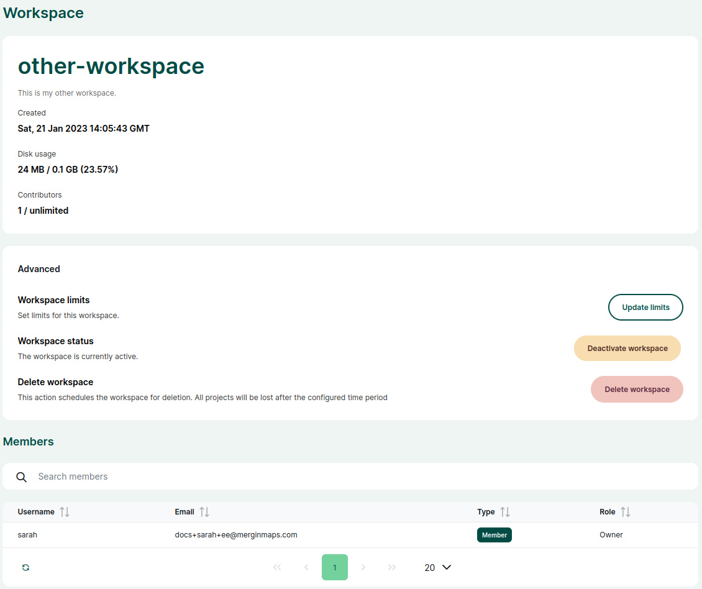

# Administration Panel

[[toc]]

The server administration panel can be used to get an overview of the server usage, manage user access, projects and workspace.

It is accessible from the dashboard of your custom server. This option is available for super-users (server admins) or users who were [granted access](#accounts).

## Overview
The **Overview** provides a quick summary of the server: the number of editors, used storage, registered accounts, projects and workspaces.

## Accounts
The **Accounts** tab contains a list of all user accounts on the server.

Accounts can be sorted by usernames or emails. Use the search bar to find a specific account.

### Manage account
To manage accounts and see their details:
1. Navigate to the **Accounts** tab of the admin panel. 
2. Click on an account to display its details. 

Here, you can:
- **Grant admin access** or **Revoke** it. Users with admin access have full access to all data on the server. They see all users and projects and can update or remove them.
- **Deactivate** or **Activate** account. Deactivated accounts can not use the server. If needed, they can be activated later.
- **Delete account** to permanently remove the user and all their data.

### How to add a new user to a custom server
To add a new user to your server:
1. Navigate to the **Accounts** tab of the admin panel.
2. Click on the **Add user** button.

3. Fill in the details: first name, email and password.

An email invitation with login details will be sent to the email address provided. 

## Projects
In the **Projects** tab, all projects in all workspaces on the server can be found.

Use the search bar to find a specific project using its name or the name of the workspace.

Click on a project to display its details. You can also **Download** the project or use the **Open in dashboard** button as a shortcut to the [dashboard](../../manage/dashboard/).

## Workspaces
<ServerType type="EE" />
The **Workspaces** tab provides the overview of all workspaces on the server.

Workspaces can be sorted by their name or description. Use the search bar to find a specific workspace.

Click on a workspace to display its details. Here, you can also:
- **Update limits** of the workspace by setting a custom storage and contributors limit for the workspace
- **Deactivate** or **Activate** the workspace
- **Delete workspace** to schedule the removal of a workspace from the server
- see the list of workspace members

### How to create a new workspace

1. Navigate to the **Workspaces** tab and click on the **Create workspace** button
   

2. Fill in the name of the workspace and **Save changes**.

The new workspace is created.

## Settings
In the **Settings** tab, you can:
- enable/disable the **Check for updates** option
- **Download** the server usage report with statistics for your server deployment

