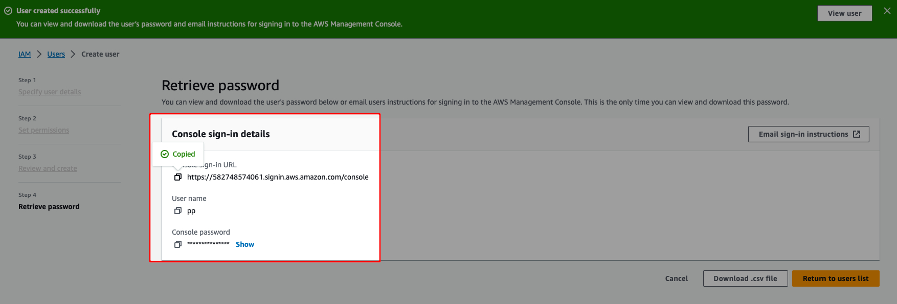

# Download your Mergin Maps EE images
<ServerType type="EE" />

To get access your docker images, you need your contract and license from <MerginMapsEmail id="sales" desc="sales team" />. If you do not have them, please contact our team. The repository is private and your team need to secure you the access to them before the steps will work.

[[toc]]

## Amazon Web Services (AWS)

### Create (root) AWS account

::: warning
If your organisation already uses AWS cloud services and has root user, skip this step. 

Maintenance of cloud accounts and security requires deep knowledge. <LutraConsultingName /> does not take responsibility for incorrectly set up of accounts. The AWS account and its maintenance is the responsibility of your user.
:::

Go to [aws.amazon.com](https://aws.amazon.com/) and create new root account


Continue with all steps and verify your account

### Create IAM user 

::: warning
If your organisation already uses AWS cloud services and has root user, skip this step. 

Maintenance of cloud accounts and security requires deep knowledge. <LutraConsultingName /> does not take responsibility for incorrectly set up of accounts. The AWS account and its maintenance is the responsibility of your user.
:::

 - Login as root user


 - Create an IAM user by searching in the console “IAM” and creating a new user. 
 
 

 - Assign the IAM user administrator account permissions. Look for <NoSpellCheck id="AdministratorAccess” /> permission.
 
 

- Review and add it to your new IAM user account

 

 - Logout from root AWS account
 
### Identify Account ID and IAM user name

Account ID and IAM users names are needed for assigning the permissions to docker images by <LutraConsultingName /> operations team. 

::: warning 
<LutraConsultingName /> will never ask you to share a IAM or root login password or other access details to your accounts.
:::

- Login to your IAM account


- Now create CLI access key


- Note down ACCESS_ID and SECRET for AWS command line client



- Send Account ID and IAM user name to <MerginMapsEmail id="sales" desc="sales team" />
- Wait for confirmation that we have shared ECR repository with you. This can take up to 5 working days.

## Download Docker Images

::: warning
To be able to download the images, you need to have permission to do so for your IAM user that are granted by <LutraConsultingName />
:::

 - Open command line and write (you may need to change to your IAM account region). You will be asked for your id and secret to be used.

```
aws ecr get-login-password --region eu-west-1 | docker login --username AWS --password-stdin 433835555346.dkr.ecr.eu-west-1.amazonaws.com
```

 - Now list docker images that are shared with you (`mergin-ee-front` is frontend application, `mergin-ee-back` is backend application)
 
```
aws ecr describe-images --repository-name mergin/mergin-ee-front --registry-id 433835555346 --region eu-west-1
aws ecr describe-images --repository-name mergin/mergin-ee-back --registry-id 433835555346 --region eu-west-1
```

 - Select tag you want to use and download image, e.g. `2023.6.1-ee` or any other from the list of images

```
docker pull 433835555346.dkr.ecr.eu-west-1.amazonaws.com/mergin/mergin-ee-back:2023.6.1-ee
``` 


