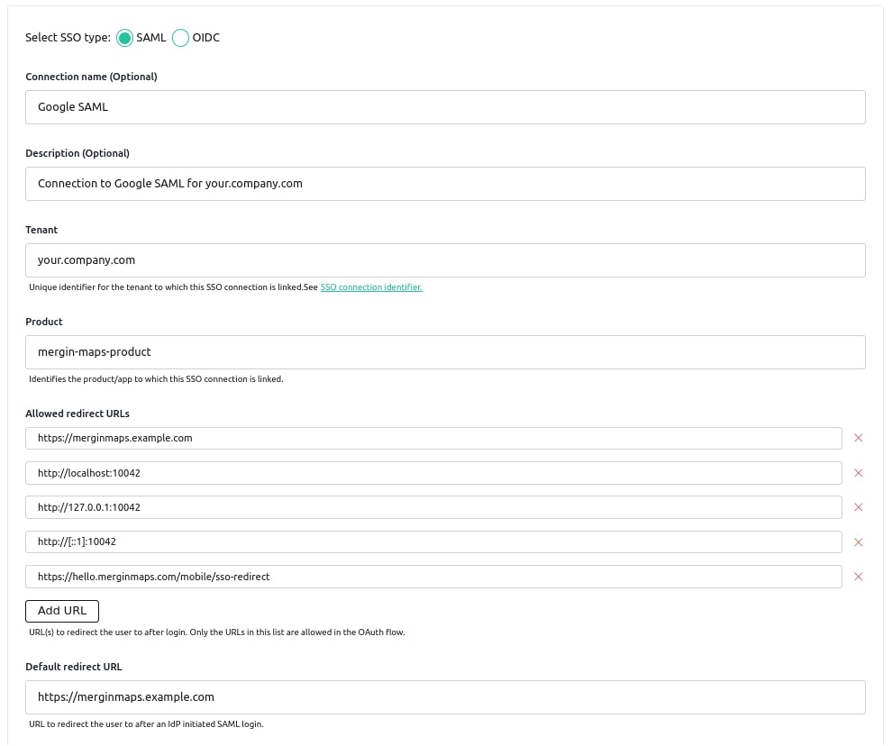

# Single Sign-On Deployment

This installation guide will help you set up Single Sign-On (SSO) for <MainPlatformName /> server. The <MainPlatformName /> server is integrated with the most commonly used SAML and OIDC identity providers via the [Ory Polis](https://www.ory.sh/docs/polis) service.
SSO is available for Enterprise edition servers.
[[toc]]

## Configure server

To enable SSO in <MainPlatformName />, ensure that you have `SSO_ENABLED` environment variables set in your `.prod.env` file:

```shell
SSO_ENABLED=True
```

To run the Ory Polis stack, you need to provide environment variables in the `.sso.env` file. In the <GitHubRepo id="MerginMaps/server/blob/master/deployment/enterprise" desc="deployment folder for the enterprise edition" />, you can find the `.sso.env.template` file with all the required variables and their default values. Use the provided script to automatically pre-generate the `.sso.env` file with all the necessary variables.

```shell
cd deployment/enterprise/sso
./sso-init.sh
```

The script will also pre-generate the `SSO_SERVER_API_KEY` variable for the <MainPlatformName /> server. This variable is used to authenticate the <MainPlatformName /> server with Ory Polis. If you created the `.sso.env` file manually, you need to set this variable to match one of the `JACKSON_API_KEYS`.

Pay close attention to these environment variables and change their default values before using them in production:

* `NEXTAUTH_ADMIN_CREDENTIALS` - administrator credentials for Ory Polis.
* `DB_URL` - the PostgreSQL database connection URL (change this if you use a different database location for Ory Polis).
* `IDP_ENABLED` - set to `true` to enable the IDP-initiated authorization flow.

More details about all available Ory Polis variables [here](https://www.ory.sh/docs/polis/deploy/env-variables).

:::tip Production deployment security
After successful initialisation of environment variables in `.sso.env`, we recommend double-checking the values or generating your own secrets and certificates.
:::

## Start the SSO stack

To run the SSO stack, you need to have a running <MainPlatformName /> server - see previous section about [deployment](../install/index.md). 

Mount the `deployment/enterprise/sso/sso-nginx.conf` file to the `merginmaps-proxy` container in the `docker-compose.yml` file:

```yaml
volumes:
  - ./sso/sso-nginx.conf:/etc/nginx/templates/sso.conf.template
```

Then restart or reload the configuration in the `merginmaps-proxy` container and start the SSO stack:

```shell
docker compose -f docker-compose.sso.yml up -d
```

The admin panel for Ory Polis will be available at `http://localhost:8081` (the value in `SSO_SERVER_URL`). You can sign in to the admin portal with the credentials you set in the variable `NEXTAUTH_ADMIN_CREDENTIALS`.

:::tip Domain for SSO Service 
We recommend running the Ory Polis server on a separate domain or subdomain to make it accessible to your users. The `./sso/sso-nginx.conf` in the <GitHubRepo id="MerginMaps/server/blob/master/deployment/enterprise" desc="deployment folder" /> file provides a reverse proxy configuration for running in a local environment. For your production deployment, use HTTPS to serve the SSO service. See the `./enterprise/ssl-sso-nginx.conf` file in the <GitHubRepo id="MerginMaps/server/blob/master/deployment/" desc="deployment folder" />. You also need to set the variable `SSO_SERVER_URL` to the publicly available URL of the Ory Polis service.
:::

If you want to configure the Ory Polis service to run on its own domain in production (e.g., `sso.example.com`), you need to add this domain to the following variables:

* `EXTERNAL_URL=https://sso.example.com`
* `NEXTAUTH_URL=https://sso.example.com`
* `SSO_SERVER_URL=https://sso.example.com`

:::tip <MainPlatformName /> and Ory Polis communication
If your <MainPlatformName /> server is running without a connection to the publicly available Ory Polis `SSO_SERVER_URL`, you can set internal IP or domain names (e.g. `http://sso:5225`) in the following variables to ensure communication: `SSO_SERVER_INTERNAL_URL=http://sso:5225` and `SSO_SERVER_API_URL=http://sso:5225`.
:::

## Configure SSO connection

You can now set up your first SSO (SAML or OIDC) connection in the Ory Polis admin panel.

Follow the steps below to create a new connection:

* Go to <MainPlatformName /> admin panel and log in.
* In the left menu click **SSO Administration**.
* Log in to the Ory Polis admin panel using credentials from the `NEXTAUTH_ADMIN_CREDENTIALS` variable.
* Navigate to the **Enterprise SSO** tab and click **New Connection**.
* Choose **SAML** or **OIDC** as the connection type.
* Fill in the connection name and description (any value).
* Provide your domain name in the **Tenant** field - this is the domain for your users emails (e.g. you users emails will be `user@your.company.com`, then use `your.company.com` in the **Tenant** field).
* Enter the value `mergin-maps-product` in the **Product** field.
* Specify **Allowed redirect URLs** with the domain name of your <MainPlatformName /> server (e.g. `https://merginmaps.example.com`) and the domain names used by <MainPlatformName /> clients (`http://localhost:10042`, `http://127.0.0.1:10042`, `http://[::1]:10042` and `https://hello.merginmaps.com/mobile/sso-redirect`).
* Provide **Default redirect URL** with the domain name of your <MainPlatformName /> server.

Your connection form will look like this for your users with `your.company.com` domain and <MainPlatformName /> server running on `https://merginmaps.example.com`:



For the rest of the connection configuration parameters, refer to the [Ory Polis documentation](https://www.ory.sh/docs/polis/sso-providers/) for your SAML or OIDC provider guide and follow the steps to configure your connection.

Once you have created the connection, go to your <MainPlatformName /> dashboard and click **Continue with SSO**.