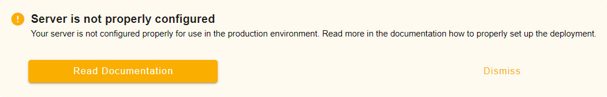

# Troubleshoot Custom Servers

This article will help you debug and resolve issues in your <CommunityPlatformNameLink /> or <EnterprisePlatformNameLink /> deployment. If you use the main SaaS <DashboardLink desc="Mergin Maps Server"/>, it is always up-to-date and managed by <MainPlatformName /> team, so report your problems to us as [described here](../../misc/troubleshoot/index.md). Read more about server platforms in [overview article](../index.md).

[[toc]]

:::tip
Haven't found a solution to your issue? Look at your other [troubleshooting options](../../misc/troubleshoot/index.md).
:::

## Server is not properly configured
Did you get an error that the server is not properly configured?

1. Check if `MERGIN_BASE_URL` docker environment variable is assigned correctly.
   `MERGIN_BASE_URL` should contain the URL of your <CommunityPlatformName /> server.
   
2. Restart the container with the `MERGIN_BASE_URL` variable

