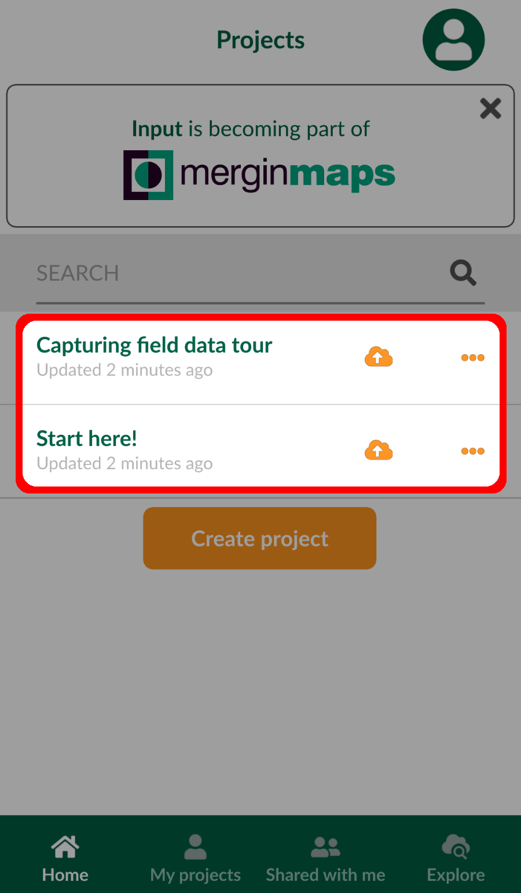
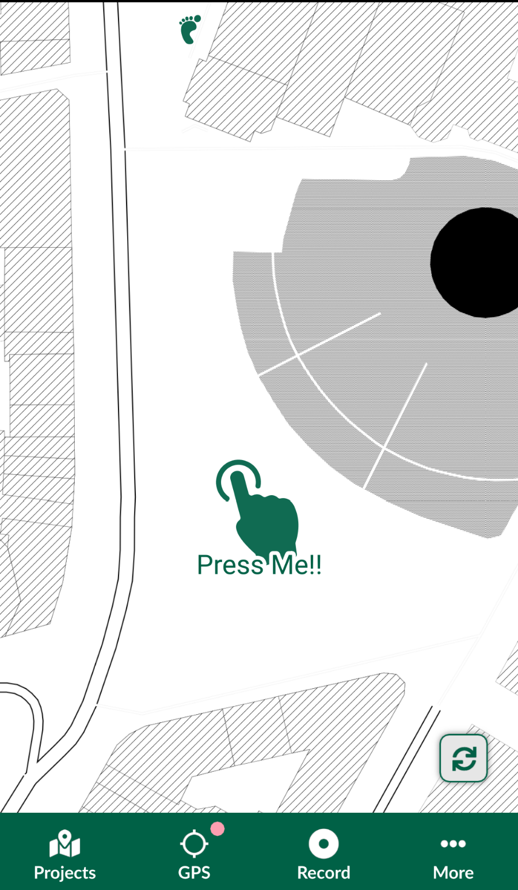
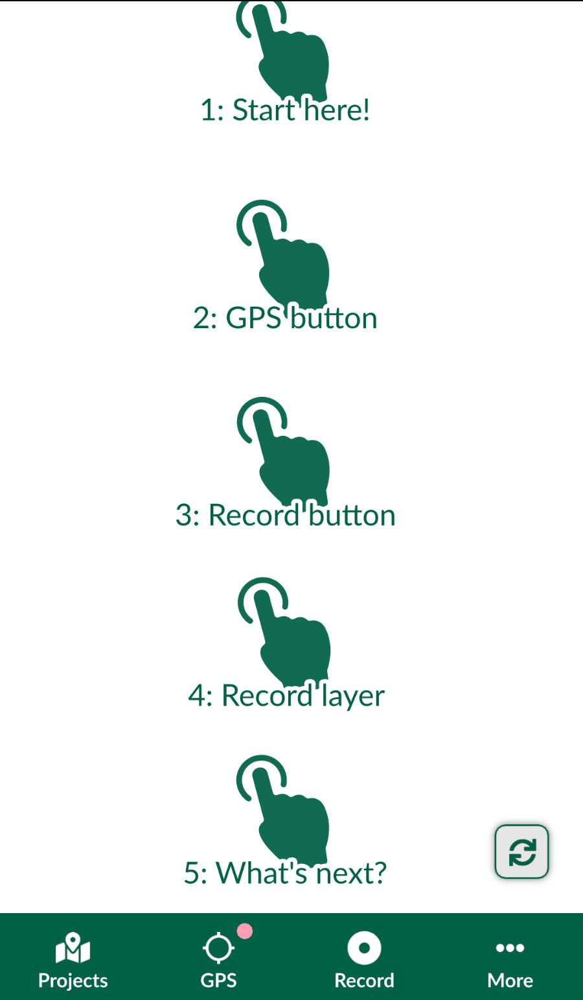

# How to Install Mergin Maps Input

Download <MobileAppName /> to your Android device, iPhone or iPad. You can find it in the app store of your platform:

<AppDownload></AppDownload>

With <MobileAppName />, you can view your data and location on the map, capture points, lines, areas, photos and much more!

## Mergin Maps Input on Windows
If you want to use <MobileAppName /> on Windows, you need to download the <NoSpellcheck id=".exe" /> installer from <GitHubRepo id="MerginMaps/input/releases/latest" desc="MerginMaps/Input" /> repository and install it on your computer.

## Input's tour projects
Once you have installed and opened <MobileAppName /> you will see the **Login** page.

Sign in, if you already have a <MainPlatformNameLink /> account. If not, you may create your account by clicking **Sign up for free**.

 

Want try <MobileAppName /> without signing up? Click on the back arrow in the upper left corner.  two tour projects that will guide you through the basics.

**Start here!** will show you how to navigate the map, change layer themes and edit the attributes of map features.

**Capturing field data tour** will explain how to capture new features and photos in the field.

:::tip
Do you want to learn more? Get up-to-speed quickly by following our [Quick Start tutorials](../../tutorials/capturing-first-data/index.md)!
:::

