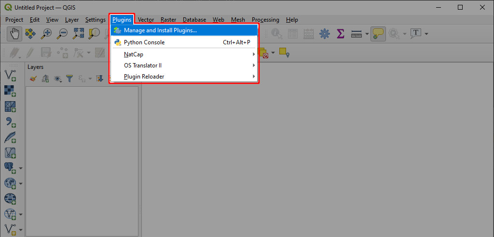
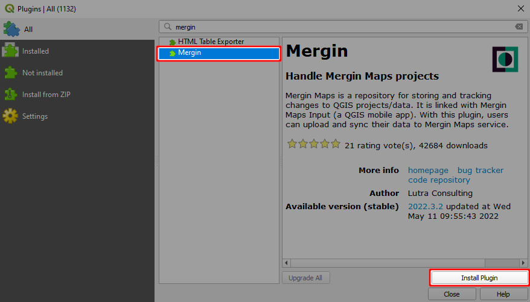
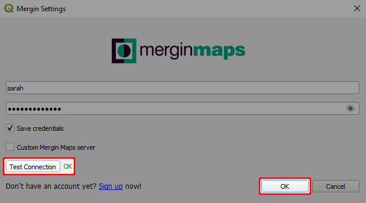
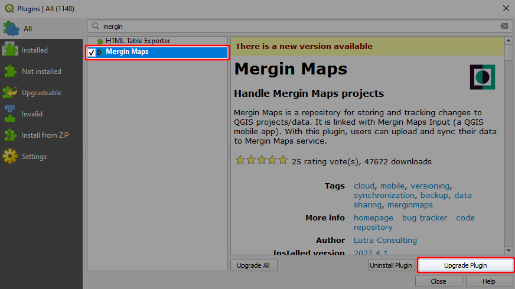

# How to Install QGIS Plugin
[[toc]]

Before the <QGISPluginName /> installation, please ensure you have already:
* [Signed up to <MainPlatformNameNoLink />](../sign-up-to-mergin-maps/)
* [Installed QGIS](../install-qgis/)

## Plugin installation
1. Open QGIS on your computer
2. Select **Manage and Install Plugins...** in the **Plugins** tab:
   

3. Find the **Mergin Maps** plugin and click **Install Plugin**:
   

4. Close the Plugins dialog. The <MainPlatformNameNoLink /> plugin toolbar should appear in QGIS:
   
   
   ::: tip
   If you cannot see the toolbar, ensure **<MainPlatformNameNoLink /> Toolbar** is checked under **View > Toolbars**.
   :::

## Plugin configuration
With the plugin installed, we'll now configure it with your <MainPlatformName /> credentials.

1. Click the **Configure <MainPlatformNameNoLink /> Plugin** icon on the **<MainPlatformNameNoLink /> Toolbar**:
   

2. Enter your login credentials if these are blank

3. Click **Test Connection** to verify that everything works correctly. If so, click **OK**.
   

<QGISPluginName /> is now able to load projects from the cloud in QGIS.

The plugin has been installed and configured. You can learn more about its functionality in [<QGISPluginName /> Overview](../../manage/plugin-sync-project/).

## Plugin upgrade
Upgrade the plugin periodically to ensure you can use the latest improvements.

1. In QGIS, navigate to **Manage and Install Plugins...** in the **Plugins** tab
   
   
2. Find the **<MainPlatformNameNoLink />** plugin. If there is a new version available, click **Upgrade Plugin**.
   
