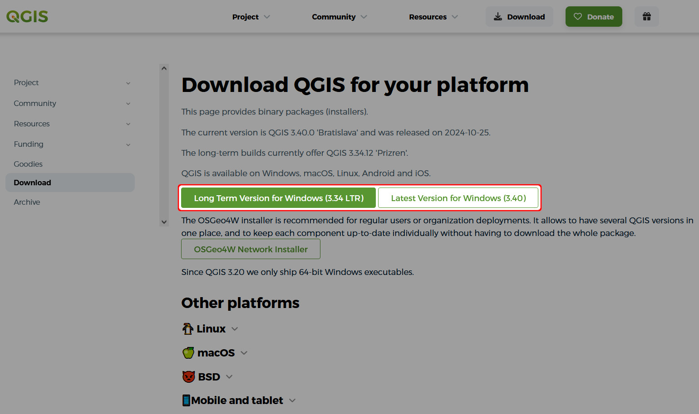
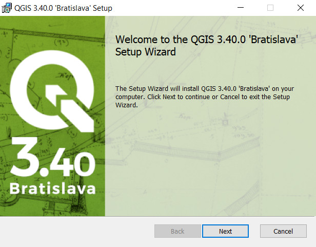

# How to Install QGIS

1. Navigate to the <QGIS link="download/" text="QGIS Download page" />

2. Find the appropriate installer for your operating system. 

   For Windows users, we recommend downloading a standalone MSI installer for the long term release.
  

   :::tip Choosing QGIS installer and version
   The <QGIS link="resources/installation-guide/" text="Installation Guide" /> contains more details about installation options for different platforms.
   
   The download page offers two QGIS versions: *long term* and *latest*. The *long term release* (LTR) is more stable, while the *latest* version can have more functionality.
   :::

3. Run the installer when it has finished downloading:
   

4. Continue the installation using the default installation options.

QGIS should now be installed on your computer.

:::tip
QGIS is a powerful tool with a great community that can help you achieve a lot.

We recommend using <QGISHelp ver="3.22" link="user_manual/index.html" text="QGIS User Guide" /> and <QGISHelp ver="3.22" link="training_manual/index.html" text="QGIS Training Manual" /> to get familiar with QGIS and its functionality.
:::
