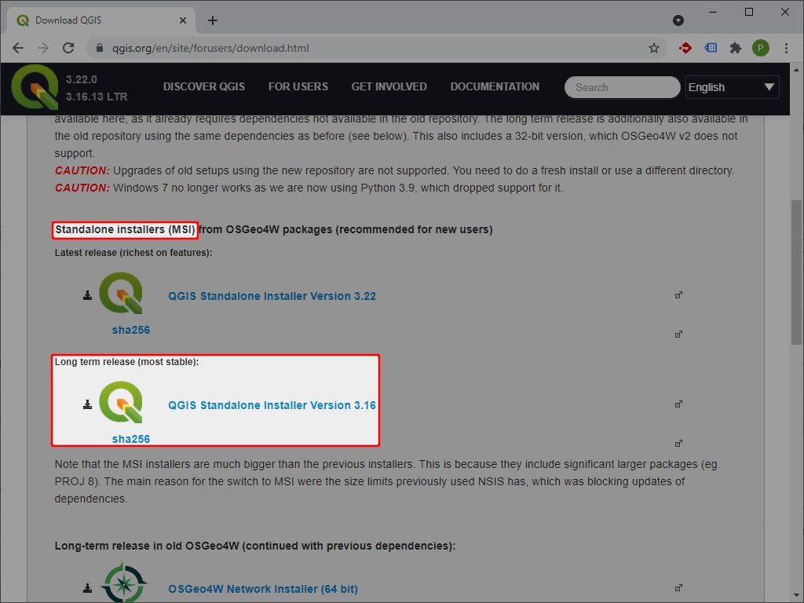
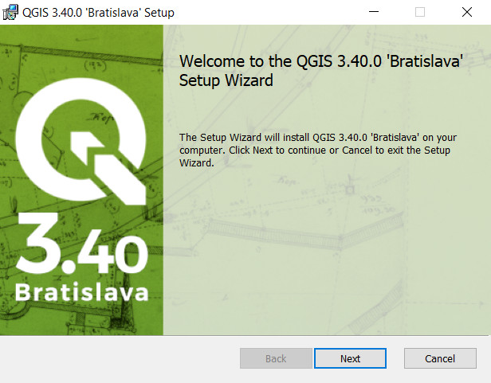

# How to Install QGIS

1. Navigate to the <QGIS link="download/" text="QGIS Download page" />

2. Find the appropriate installer for your operating system. 

   For Windows users, we recommend downloading a standalone MSI installer for the long term release.
  

   :::tip Choosing QGIS installer and version
   The <QGIS link="resources/installation-guide/" text="Installation Guide" /> contains more details about installation options for different platforms.
   
   The download page offers two QGIS versions: *long term* and *latest*. The *long term release* (LTR) is more stable, while the *latest* version can have more functionality.
   :::

3. Run the installer when it has finished downloading:
   

4. Continue the installation using the default installation options.

QGIS should now be installed on your computer.

:::tip
QGIS is a powerful tool with a great community that can help you achieve a lot.

We recommend using <QGISHelp ver="latest" link="user_manual/index.html" text="QGIS User Guide" /> and <QGISHelp ver="latest" link="training_manual/index.html" text="QGIS Training Manual" /> to get familiar with QGIS and its functionality.
:::

:::warning QGIS 4 and QGIS 3 compatibility: what to check before upgrading
QGIS 4 stores some settings, such as the map canvas CRS, in a format QGIS 3 cannot read. In QGIS 3 these appear as unset. The same applies to settings from our <QGISPluginNameShort />: options you enable in QGIS 4, like map sketching, custom photo naming or position tracking, will show as disabled when the project is opened in QGIS 3. The compatibility goes one way only. QGIS 4 reads entries written by QGIS 3, but not the other way round.

This affects QGIS desktop only. The <MobileAppName /> reads these entries correctly, whether they were set in QGIS 3 or QGIS 4.

**What we recommend**
- Make sure everyone on your team who works in QGIS uses the same major version, either QGIS 4 or QGIS 3.
- If you're migrating to QGIS 4, migrate the whole team at the same time. That avoids the problem entirely.
:::
