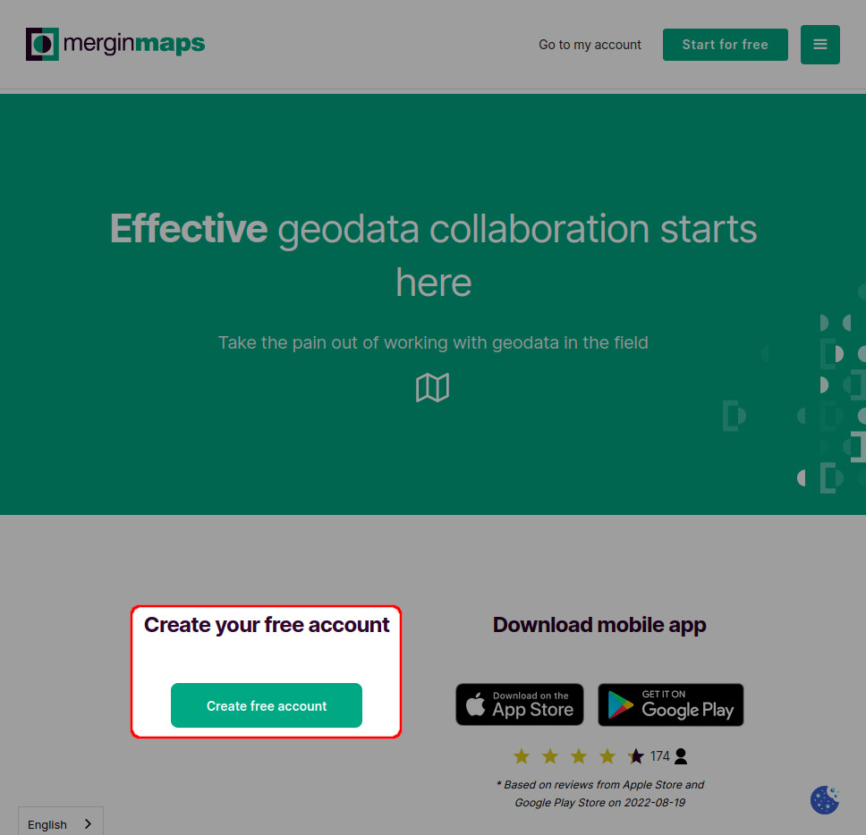

# How to Sign Up to Mergin Maps
[[toc]]

To start using the <MainPlatformNameLink /> service, you need to sign up. You can sign up either through <MainDomainNameLink /> or from your mobile device using the <MobileAppName />.

When you register with <MainPlatformNameLink />, you will be automatically signed up as a free tier user with 100 MB of storage. To upgrade your account, see our <MainDomainNameLink id="pricing" desc="Subscription plans" />.

::: tip
One can view and download public projects even without an account, but creation of projects and synchronisation of geo-data only works when you are logged in.
:::

## From web

1. Navigate to <MainDomainNameLink /> 
2. Click on **Start for free**
   

3. Click on **Create your free account**
   
   
4. Create your account by filling up the form and click on **Sign Up**. You will receive a confirmation email with a link to verify your email.
   

   ::: warning
   Check your spam folder if the confirmation email does not appear in your inbox after 5 minutes.
   :::

**Welcome to <MainPlatformNameLink />!**

You can get up-to-speed quickly by following our [Quick Start tutorials](../../tutorials/capturing-first-data/index.md).

## From Mergin Maps Input
You can also sign up from <MobileAppName />.

1. Download <MobileAppName /> to your Android device, iPhone or iPad. You can find it in the app store of your platform:
   <AppDownload></AppDownload>

2. Open <MobileAppName />. You will see the **Login** page.
   
   
   
3. Tap the **Sign up for free** button
   
   
4. Create your account by filling up the form
   

   Once you press **Sign up**, you will receive a confirmation email. To sign in and use the <MainPlatformNameLink /> service, you will need to activate your account by clicking on the link in the email.

::: warning
Check your spam folder if the confirmation email does not appear in your inbox after 5 minutes.
:::

**Welcome to <MainPlatformNameLink />!**

You can get up-to-speed quickly by following [<MobileAppName />'s tour projects](../install-input/#mergin-maps-input-s-tour-projects) and our [Quick Start tutorials](../../tutorials/capturing-first-data/index.md).

## Forgotten password
If you forget your password, you can reset it through <AppDomainNameLink id="login/reset" desc="Mergin Maps website" /> or by clicking **Forgot password?** in the login page.

The option to reset password is also available in <MobileAppName />

