# How to Sign Up to Mergin Maps
[[toc]]

To make full use of the <MainPlatformNameLink /> service, you need to sign up. You can sign up either through <MainDomainNameLink /> or from your mobile device using the <MobileAppName />.

::: tip
Public projects can be accessed and downloaded even without a <MainPlatformNameLink /> account, but projects can be managed, shared and synchronised only when you are logged in.
:::

## From web

1. Navigate to <AppDomainNameLink />

2. Fill in the registration form and click on **Sign Up**.
   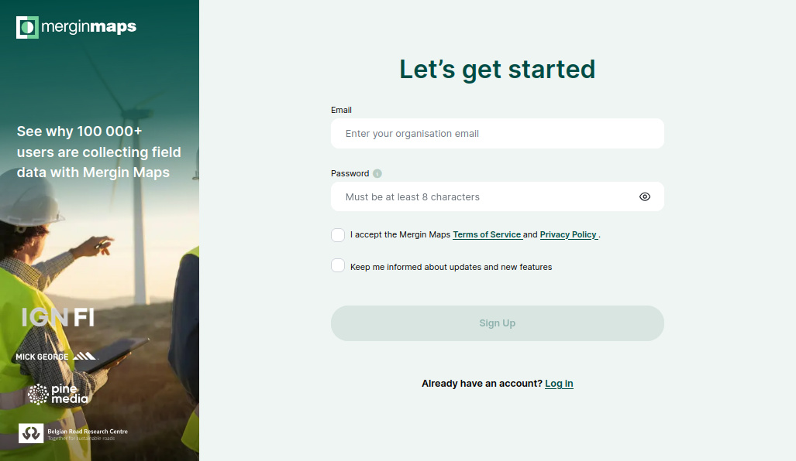

   :::tip
   While signing up, you can subscribe to <MainPlatformName /> newsletter. You can unsubscribe anytime by clicking the **Unsubscribe** link at the bottom of the email.
   :::
  
3. You will receive a confirmation email with a link to verify your email.

   Check your spam folder if the confirmation email does not appear in your inbox after 5 minutes.

4. Now your account needs a [workspace](../../manage/workspaces/)! 

   To create a workspace, choose an appropriate name and click on **Create workspace**
   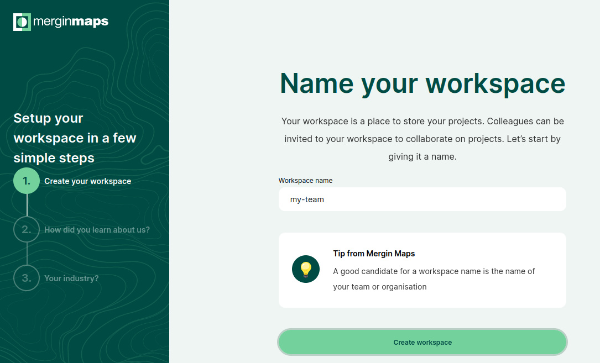

   :::tip
   Projects, collaborations and subscriptions in <MainPlatformNameLink /> are tied to [workspaces](../../manage/workspaces/). When you create your own workspace, it will automatically start with a free trial. After the trial, you can [upgrade your subscription](../../subscriptions/#how-to-upgrade-a-subscription-from-the-trial-plan). 
   
   See our <MainDomainNameLink id="pricing" desc="pricing page" /> for more information about subscriptions.
   :::

**Welcome to <MainPlatformNameLink />!**

You can get up-to-speed quickly by following our [Quick Start tutorials](../../tutorials/capturing-first-data/index.md).

### Invitation to a workspace
If someone invited you to join their workspace, you will get an email with the invitation link. You need to have a <MainPlatformName /> account in order to contribute to this workspace. 

1. Use the link to get the registration form. Your email address will be filled in automatically, so you just need to enter a username and password. 

   Click on **Sign Up** to create your account.

2. Now you have the option to **join workspace** you were invited to
   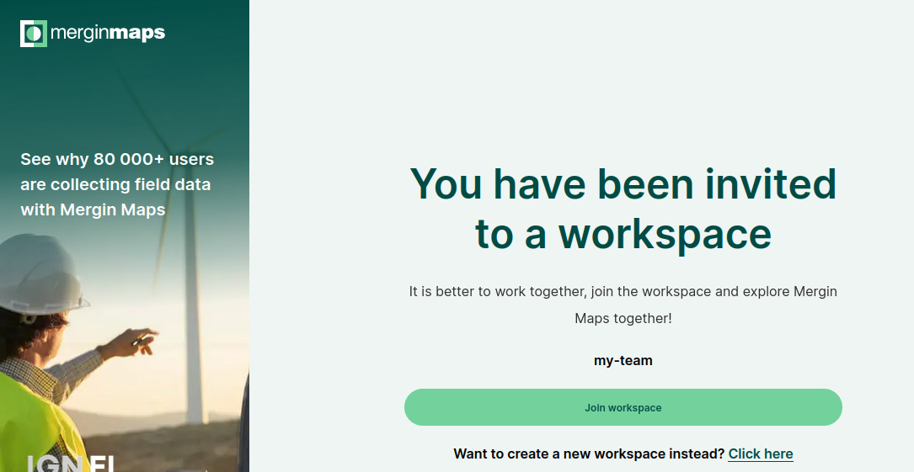

**Welcome to <MainPlatformNameLink />!**

You can get up-to-speed quickly by following our [Quick Start tutorials](../../tutorials/capturing-first-data/index.md).

## From Mergin Maps mobile app
You can also sign up from <MobileAppName />.

1. Download the <MobileAppNameShort /> to your Android device, iPhone or iPad. You can find it in the app store of your platform:
   <AppDownload></AppDownload>

2. Open the <MobileAppNameShort />. Tap the account icon in the upper right corner to go to the login page.
   
   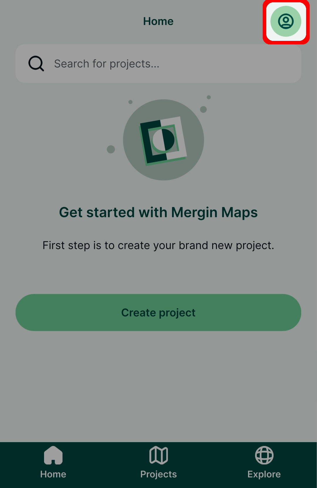
   
3. Tap on **Sign up**
   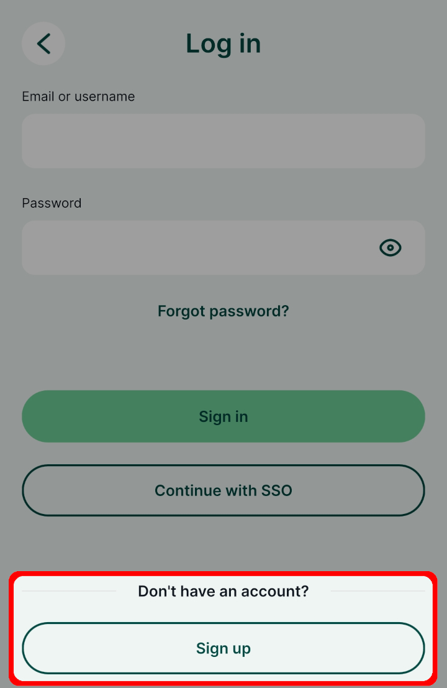
   
4. Fill up the form and tap on **Sign up** to create your account. 

   You will receive a confirmation email with a link to verify your email.

   Check your spam folder if the confirmation email does not appear in your inbox after 5 minutes.
   
   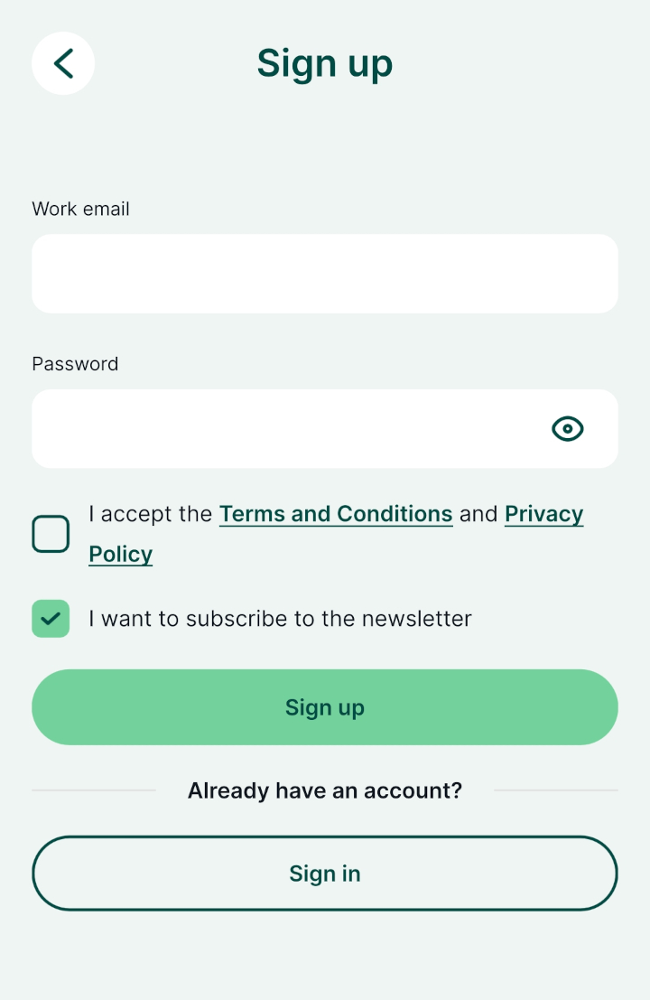
   
5. Every account needs to have a [workspace](../../manage/workspaces/) for storing projects. Choose an appropriate name for your workspace and tap on the **Create workspace** button.
   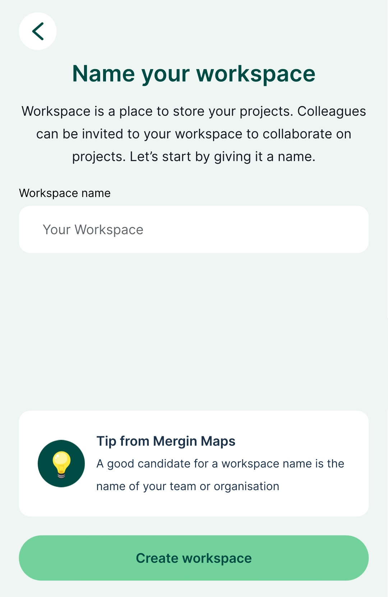

   :::tip
   Projects, collaborations and subscriptions in <MainPlatformNameLink /> are tied to [workspaces](../../manage/workspaces/). If you create your own workspace, you will be automatically signed up as a free tier user with 100 MB of storage. To upgrade your subscription, see our <MainDomainNameLink id="pricing" desc="Subscription plans" />.
   :::

**Welcome to <MainPlatformNameLink />!**

You can get up-to-speed quickly by following our [Quick Start tutorials](../../tutorials/capturing-first-data/index.md).

## Deleting Mergin Maps account
Your <MainPlatformNameLink /> account can be deleted in the <DashboardShortLink />.

Before closing the account, **make sure to** [**close your workspaces**](../../manage/workspaces/#how-to-delete-a-workspace). 

1. Log in to <AppDomainNameLink />. In the upper right corner of the screen, click on your username and go to **Your profile**.
   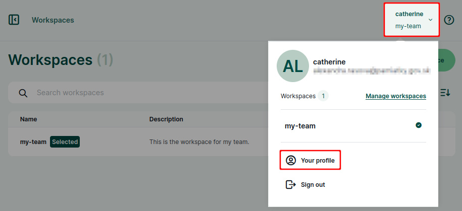
   
2. Click on the **Close account** button.
   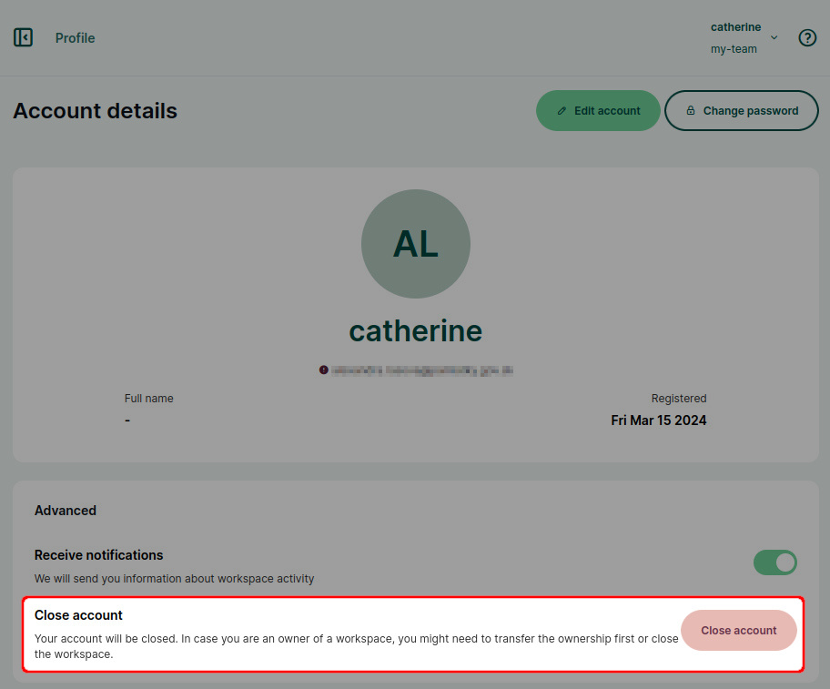

You will be prompted to confirm the closing of your account by typing the account name. 

After you close the account, it is kept on <MainPlatformNameLink /> servers for 5 days before it is deleted permanently. During this period, it can be restored if you contact <MerginMapsEmail id="support" />.

## Forgotten password
If you forget your password, you can reset it through <AppDomainNameLink /> by clicking **Forgot password**. Email with password reset link will be sent to your email address.
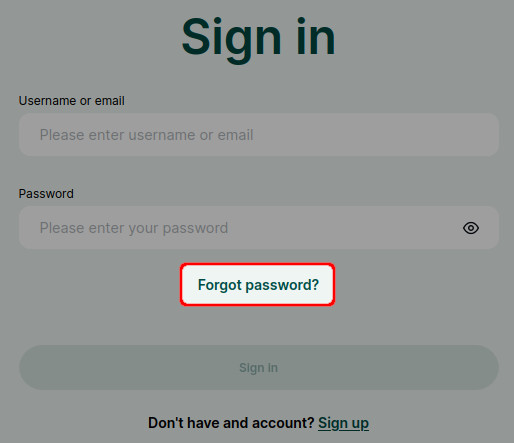

The same can be through the login page in the <MobileAppNameShort />
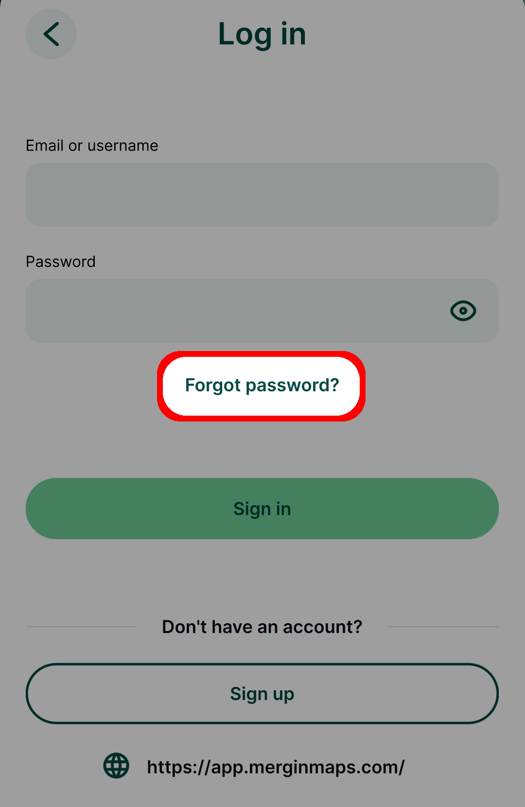

::: tip
Check your spam folder if the email with password reset link does not appear in your inbox after a few minutes. 

If that's not the case, please contact <MerginMapsEmail id="support" /> to resolve this issue.
:::
   

