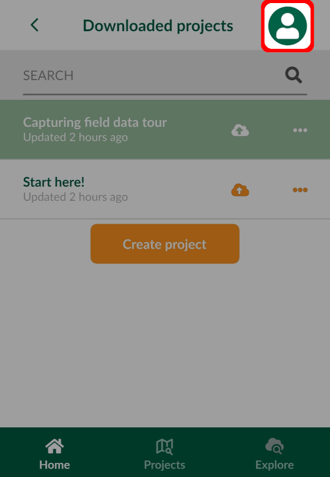
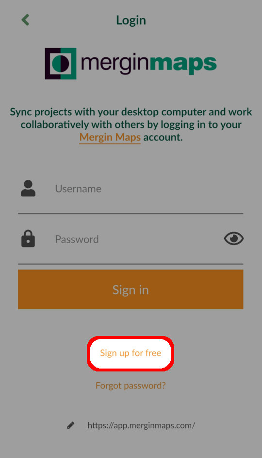
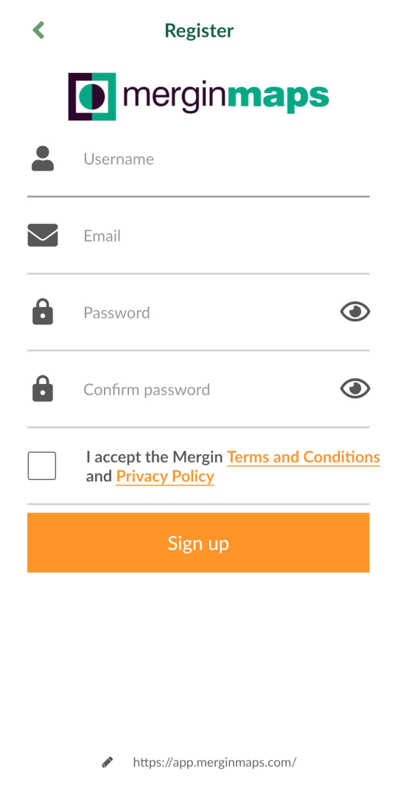
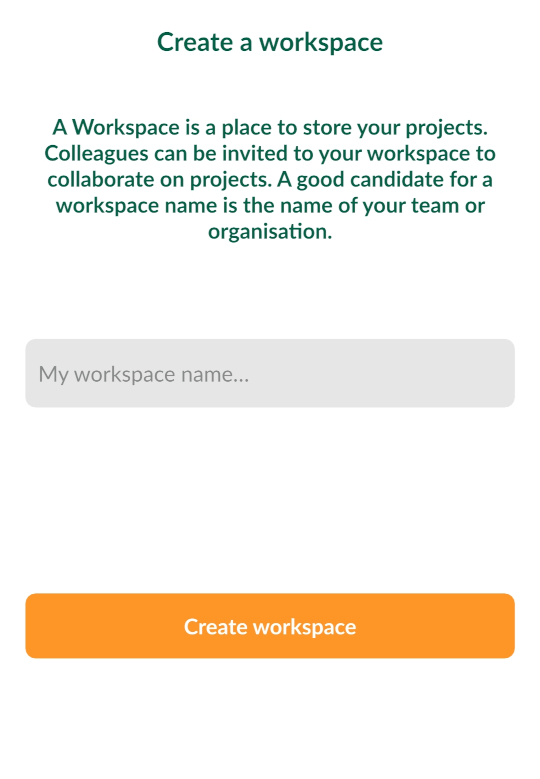
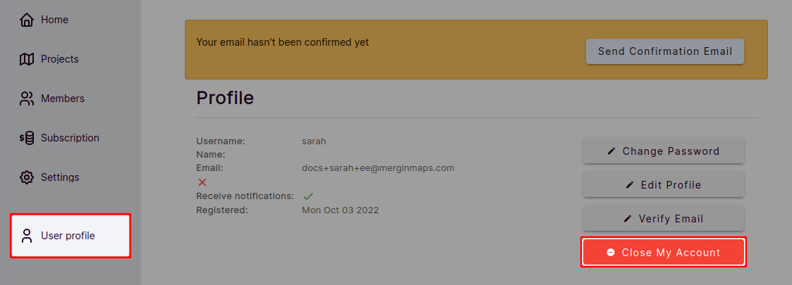
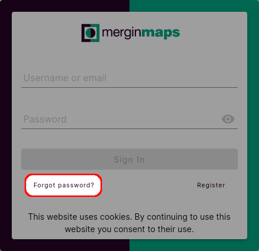

# How to Sign Up to Mergin Maps
[[toc]]

To make full use of the <MainPlatformNameLink /> service, you need to sign up. You can sign up either through <MainDomainNameLink /> or from your mobile device using the <MobileAppName />.

::: tip
Public projects can be accessed and downloaded even without a <MainPlatformNameLink /> account, but projects can be managed, shared and synchronised only when you are logged in.
:::

## From web

1. Navigate to <MainDomainNameLink /> 
2. Clicking on **Sign Up** or **Start for free** will take you to the registration form
   

3. Create your account by filling up the form and click on **Sign Up**. You will receive a confirmation email with a link to verify your email.

   Check your spam folder if the confirmation email does not appear in your inbox after 5 minutes.

   

   :::tip
   While signing up, you can subscribe to <MainPlatformName /> newsletter. You can unsubscribe anytime by clicking the **Unsubscribe** link at the bottom of the email.
   :::

4. Now your account needs a [workspace](../../manage/workspaces/)!
- If you were invited to an existing workspace, you can simply **join** this workspace without creating a new one

- If you want to create your own workspace, choose an appropriate name and click on **Create workspace**
   

   :::tip
   Projects, collaborations and subscriptions in <MainPlatformNameLink /> are tied to [workspaces](../../manage/workspaces/). When you create your own workspace, it will automatically start with a free trial. To upgrade your subscription after the trial period, see our <MainDomainNameLink id="pricing" desc="Subscription plans" />.
   :::

**Welcome to <MainPlatformNameLink />!**

You can get up-to-speed quickly by following our [Quick Start tutorials](../../tutorials/capturing-first-data/index.md).

## From Mergin Maps mobile app
You can also sign up from <MobileAppName />.

1. Download the <MobileAppNameShort /> to your Android device, iPhone or iPad. You can find it in the app store of your platform:
   <AppDownload></AppDownload>

2. Open the <MobileAppNameShort />. Tap the account icon in the upper right corner to go to the login page.
   
   
   
3. Tap on **Sign up for free**
   
   
4. Create your account by filling up the form. You will receive a confirmation email with a link to verify your email.

   Check your spam folder if the confirmation email does not appear in your inbox after 5 minutes.
   
   
   
5. Now your account needs a [workspace](../../manage/workspaces/)! Choose an appropriate name for your workspace and **Create workspace**
   

   :::tip
   Projects, collaborations and subscriptions in <MainPlatformNameLink /> are tied to [workspaces](../../manage/workspaces/). If you create your own workspace, you will be automatically signed up as a free tier user with 100 MB of storage. To upgrade your subscription, see our <MainDomainNameLink id="pricing" desc="Subscription plans" />.
   :::

**Welcome to <MainPlatformNameLink />!**

You can get up-to-speed quickly by following the [tour projects](../install-input/#mergin-maps-mobile-app-s-tour-projects) in the <MobileAppNameShort /> and our [Quick Start tutorials](../../tutorials/capturing-first-data/index.md).

## Deleting Mergin Maps account
If you want to delete your account, you can do so in the <DashboardLink /> in the **User profile** tab.

1. Before closing the account, make sure to [close your workspaces](../../manage/workspaces/#how-to-delete-a-workspace).

2. Navigate to the **User profile** tab and click on **Close My Account**
   

You will be prompted to confirm the closing of your account by typing the account name. 

After you close the account, it is kept on <MainPlatformNameLink /> servers for 5 days before it is deleted permanently. During this period, it can be restored if you contact <MerginMapsEmail id="support" />.

## Forgotten password
If you forget your password, you can reset it through <AppDomainNameLink /> by clicking **Forgot password**. Email with password reset link will be sent to your email address.

The same can be done on the login page in <MobileAppName />

::: tip
Check your spam folder if the email with password reset link does not appear in your inbox after a few minutes. 

If that's not the case, please contact <MerginMapsEmail id="support" /> to resolve this issue.
:::
   

