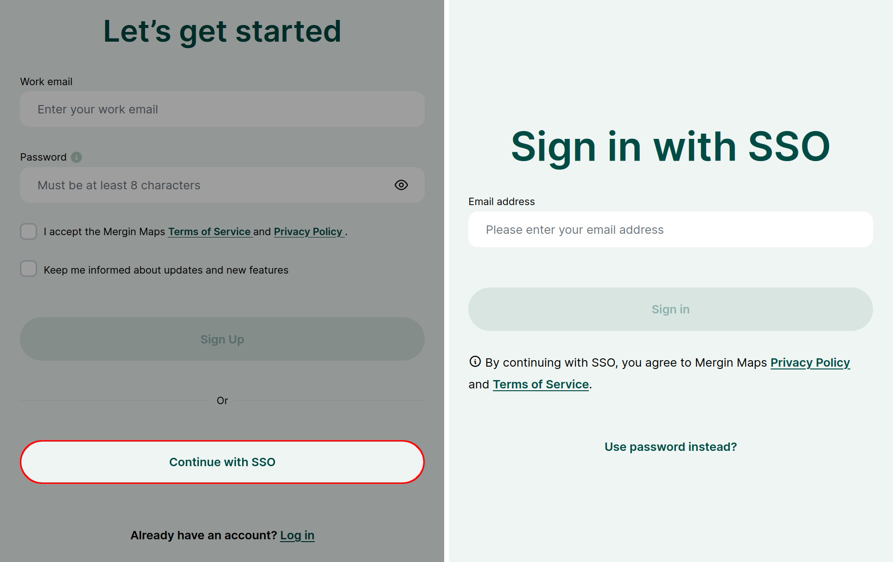
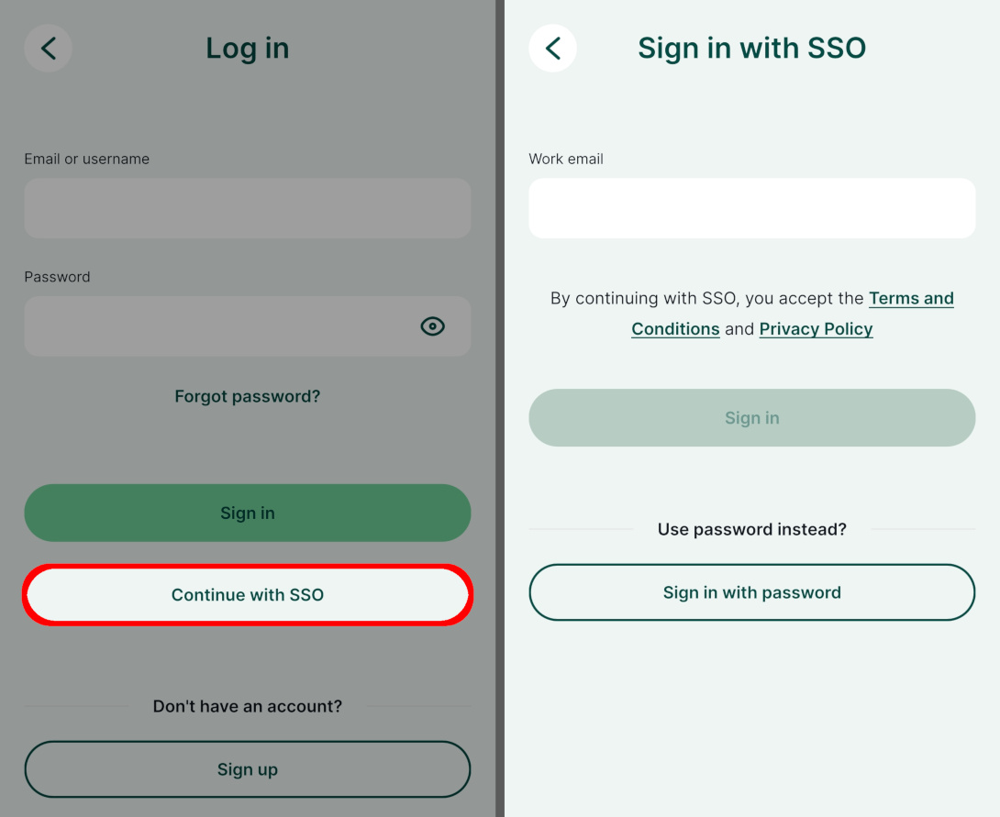
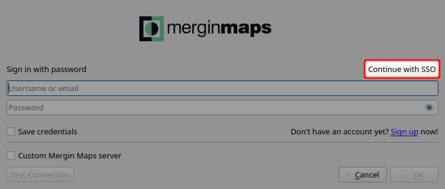

# How to Sign Up to Mergin Maps
[[toc]]

To make full use of the <MainPlatformNameLink /> service, you need to sign up.

Public projects can be accessed and downloaded even without a <MainPlatformNameLink /> account, but projects can be managed, shared and synchronised only when you are logged in.

You can sign up either through <AppDomainNameLink/> or <MobileAppName /> using:
- an email and password
- [Single sign-on (SSO)](#sign-up-using-sso)

::: tip Manage your account
Do you want to delete your account or change your details? Go to [**User Account**](../../manage/account/) for detailed steps.
:::

## Sign up using a password

### From web

1. Navigate to <AppDomainNameLink/>

2. Fill in the registration form and click on **Sign Up**.
   

   While signing up, you can choose to receive information about updates and new features. You can unsubscribe from the <MainPlatformName /> newsletter anytime by clicking the **Unsubscribe** link at the bottom of the email.
  
3. You will receive a confirmation email with a link to verify your email.

   Check your spam folder if the confirmation email does not appear in your inbox after 5 minutes.

4. Now your account needs a [workspace](../../manage/workspaces/)! 

   To create a workspace, choose an appropriate name and click on **Create workspace**
   

**Welcome to <MainPlatformNameLink />!**

You can get up-to-speed quickly by following our [Quick Start tutorials](../../tutorials/capturing-first-data/).

   ::: tip Workspaces and subscriptions
   Projects, collaborations and subscriptions in <MainPlatformNameLink /> are tied to [workspaces](../../manage/workspaces/). You can use your first  workspace for free during the 14 day trial. After the trial, you can [upgrade to a premium plan](../../manage/subscriptions/#how-to-upgrade-a-subscription-from-the-trial-plan).
   
   [Subscriptions](../../manage/subscriptions) are based on the number of contributors on the workspace. Per each contributor seat, you get 1 GB of storage. Storage is shared across the whole workspace.
   
   See our <MainDomainNameLink id="pricing" desc="pricing page"/> for more details.
   :::

<!--- is this section still relevant?

#### Invitation to a workspace
If someone invited you to join their workspace, you will get an email with the invitation link. You need to have a <MainPlatformName /> account in order to contribute to this workspace. 

1. Use the link to get the registration form. Your email address will be filled in automatically, so you just need to enter a username and password. 

   Click on **Sign Up** to create your account.

2. Now you have the option to **join workspace** you were invited to
   

**Welcome to <MainPlatformNameLink />!**

You can get up-to-speed quickly by following our [Quick Start tutorials](../../tutorials/capturing-first-data/).

-->

### From mobile app {#from-mergin-maps-mobile-app}
You can also sign up from <MobileAppName />.

1. Download the <MobileAppNameShort /> to your Android device, iPhone or iPad. You can find it in the app store of your platform:
   <AppDownload></AppDownload>

2. Open the <MobileAppNameShort />. Tap the account icon in the upper right corner to go to the login page. 
   
   
3. Tap on **Sign up**
   
   
4. Fill up the form and tap on **Sign up** to create your account.
   
   You will receive a confirmation email with a link to verify your email.

   Check your spam folder if the confirmation email does not appear in your inbox after 5 minutes.   
   
   
5. Every account needs to have a [workspace](../../manage/workspaces/) for storing projects. Choose an appropriate name for your workspace and tap on the **Create workspace** button.

   Note that the name of a workspace cannot be changed later.
   

**Welcome to <MainPlatformNameLink />!**

You can get up-to-speed quickly by following our [Quick Start tutorials](../../tutorials/capturing-first-data/).

   ::: tip Workspaces and subscriptions
   Projects, collaborations and subscriptions in <MainPlatformNameLink /> are tied to [workspaces](../../manage/workspaces/). You can use your first  workspace for free during the 14 day trial. After the trial, you can [upgrade to a premium plan](../../manage/subscriptions/#how-to-upgrade-a-subscription-from-the-trial-plan).
   
   [Subscriptions](../../manage/subscriptions) are based on the number of contributors on the workspace. Per each contributor seat, you get 1 GB of storage. Storage is shared across the whole workspace.
   
   See our <MainDomainNameLink id="pricing" desc="pricing page"/> for more details.
   :::

## Sign up using SSO
Single sign-on (SSO) is an authentication method that allows you to sign in to <MainPlatformName /> using the same credentials as you use in your organisation. 

This means you don't have to create a new <MainPlatformName /> account with a specific password: you can simply use your work email. The identity provider (e.g. Microsoft or Auth0) used by your organisation will check your credential and redirect you back to <MainPlatformName />.

SSO login is available on the <DashboardShortLink />, the <MobileAppNameShort /> and the <QGISPluginNameShort />.

### SSO connection setup
If you are the admin or owner of a **<ServerCloudName />** workspace and you want to set up SSO, please contact our <MerginMapsEmail id="sales" desc="sales team" />.

You will receive a link with step-by-step guide for your identity provider. Currently, we support SAML and OIDC protocols.

::: tip SSO for custom servers
If you want to use SSO for your <EnterprisePlatformNameLink /> workspace, you can do so from the admin panel. See [Single Sign-On Deployment](../../server/sso-deployment/) for more details.

SSO is not available for <CommunityPlatformName />.
:::

### Dashboard SSO
To sign in or sign up to <MainPlatformName /> using SSO on the <DashboardShortLink />:
1. Navigate to <AppDomainNameLink />
2. Click on the **Continue with SSO** button
3. Enter your email address associated with your organisation and click **Sign in**
4. You will be redirected to an identity provider. Enter your credentials.
5. After being redirected back to the <DashboardShortLink /> , you will be signed in.

### Mobile app SSO

1. Open the <MobileAppNameShort />. Tap the account icon in the upper right corner to go to the login page. 
   

2. Tap the **Continue with SSO** option
   

4. Enter your email address associated with your organisation and click **Sign in**.
   
   You will be redirected to an identity provider. Enter your credentials.
   
5. After successful authentication, you will be signed in to <MainPlatformName /> in the <MobileAppNameShort />.

### QGIS plugin SSO
To use SSO in the <QGISPluginNameShort />:
1. Open QGIS
2. On the toolbar, click on the **Configure <MainPlatformName /> plugin** button
   
3. Use the **Continue with SSO** option to open SSO sign in
   
4. Enter your email address associated with your organisation and click **OK**.
   
   You will be redirected to an identity provider. Enter your credentials.
5. After successful authentication, you will be signed in to <MainPlatformName /> in <QGISPluginNameShort />.

