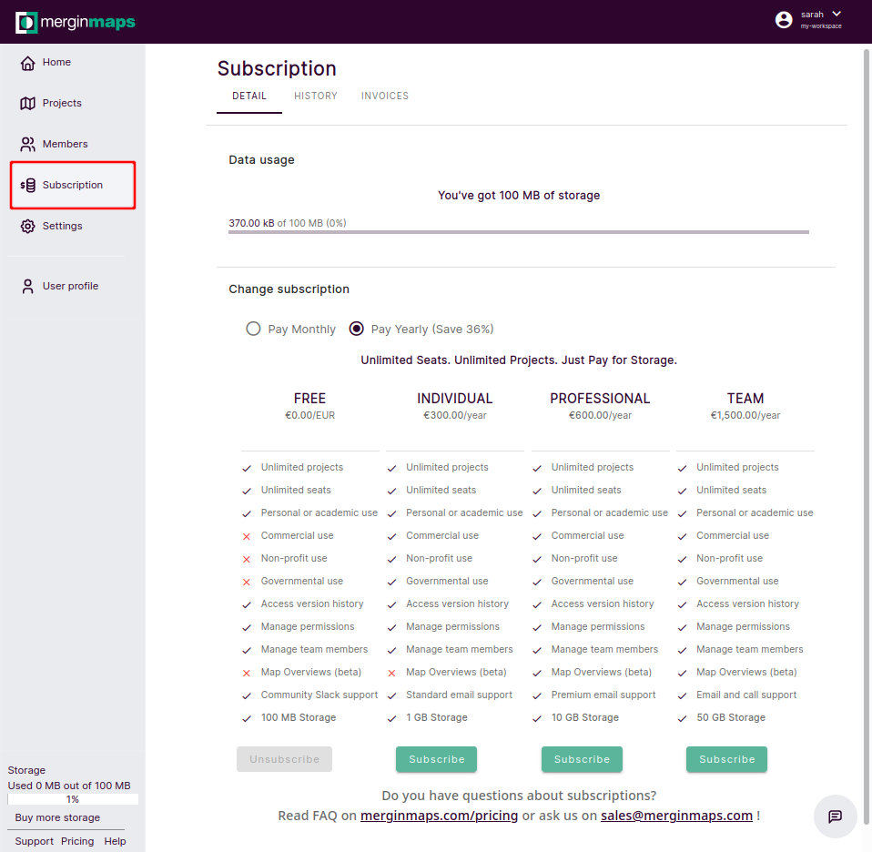

# Subscriptions and Invoicing
[[toc]]

## Subscriptions

::: tip
For details about different subscription plans visit the <MainDomainNameLink id="pricing" desc="pricing"/> page.
:::

There are four <MainPlatformName /> subscription plans you can choose from depending on the storage size, support level and other features that you need for your [workspace](../../manage/workspaces/):
- Free plan for academic or personal (hobby) use
- Individual plan
- Professional plan
- Team plan

The free plan can be used for commercial use only during the **28 day trial**. 

It is possible to get a discount if you are a non-profit or charity organisation. Please <MerginMapsEmail id="sales" desc="contact us" /> to find out more.

:::tip
If you want to have On-Premise deployment or looking for other options, please <MerginMapsEmail id="sales" desc="contact us" /> directly.
:::

Subscriptions are automatically billed monthly or annually. You can cancel or change your subscription any time, with Apple Manage Subscriptions App or through <AppDomainNameLink />.

## Changing a subscription from web
Information about the current subscription can be found in <AppDomainNameLink />. Here, you can also switch to another subscription plan and manage the billing.

1. Log into <AppDomainNameLink />
2. Navigate to **Subscriptions**
3. Here, choose if you want to be **Billed monthly** or **Billed annually** and click on **Subscribe** under the plan of your choice.
4. Fill in the form with your details. 
   When registering a business organisation, you can enter the VAT number (if you want to use reverse charge VAT payments).
5. Click on **Complete Purchase**

Notes:
- At this time we are not processing reverse-charge VAT payments but will be doing so in the future.
- If a VAT number is entered, this must be associated with the address you enter below.
- The address you enter must match the address registered with your payment method (e.g. credit card)
- The address entered needs to match the VAT registered address

If you'd like to purchase the Team plan on annual basis and would like to make bank transfer payments, please <MerginMapsEmail id="sales" desc="contact us" /> for manual invoicing.

## Changing a subscription from Mergin Maps Input
Subscriptions can be also managed from <MobileAppName /> (on Apple devices via in-app purchases).

## Invoices and payment history
To download your invoices and see your payment history:

1. Log into <AppDomainNameLink /> 
2. Navigate to the **Subscription** in the left panel
2. In the **Subscription** window, go to:
   - **HISTORY** to see your payment history 
   - **INVOICES** to access your invoices

