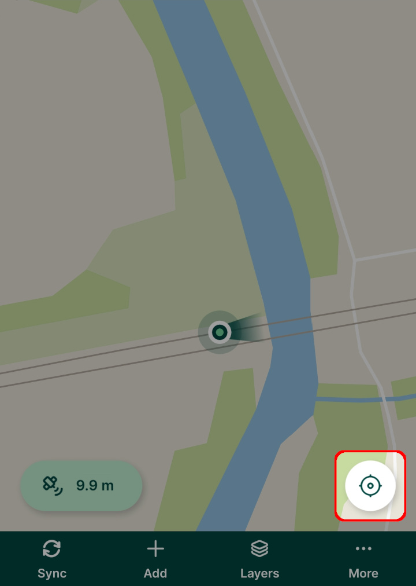
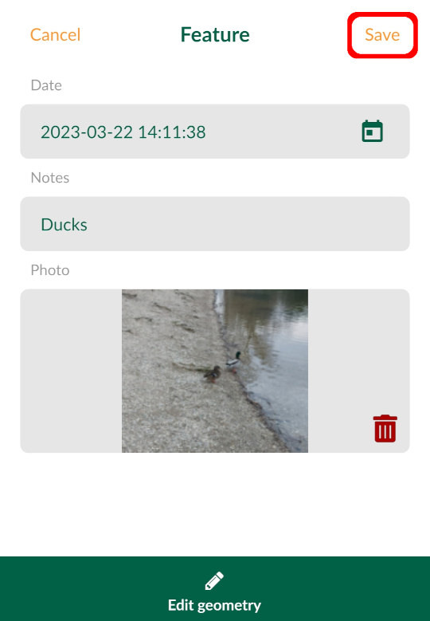
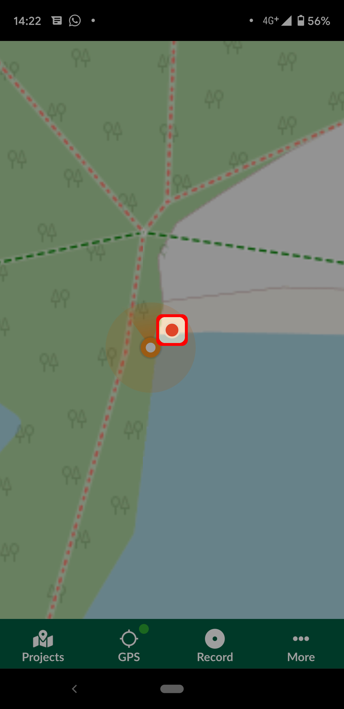

# Capturing Your First Field Data

[[toc]]

In this tutorial you will learn how to:
* See your location shown on background maps on your mobile device
* Capture field data with their locations, photos and notes
* Query and edit field data

## Install Mergin Maps mobile app
[Download <MobileAppName />](../../setup/install-mobile-app/) to your Android device, iPhone or iPad. You can find it in the app store of your platform:

<AppDownload></AppDownload>

## Creating a project in Mergin Maps mobile app
Data are stored within projects. We'll now create a new project to save our data into.

Using <MobileAppName /> is the quickest and easiest way of creating new projects. Alternative methods offering much greater flexibility are introduced in later tutorials.

1. Open <MobileAppName /> on your mobile device
2. Tap the **Create project** button in the **Home** tab
   

3. Enter the **name** of your project and press **Create project**. You might need to minimise the on-screen keyboard to see this button.
   
   
Your new project should now be visible on the **Home** tab of the **Projects** screen. It can be opened by tapping the project's name.

## Capturing field data
In the last step we created a project which will be used for our field survey. Let's now practise capturing some field data.

Note that the **background map used in this project requires network connectivity**. To display it outside, you need to be connected to the internet.

1. Open the project by tapping its row in the **Projects** screen. 

   You should see your location shown over the background map:
   

2. Pinch the map to zoom in to your current position. If needed, recentre the map using the **GPS** button in the bottom right corner of the screen.
   
   
4. To add a new feature, press **Add**. 

   The position of the feature can be defined by pinching and dragging the background map or by pressing the **GPS** button to capture your current position.
   
   Tap **Record** to capture the point.
   

5. A survey form opens. 

   Enter the *date* of your survey and *notes* about the feature. 
   
   Tap **Take a picture** to attach a photo using your camera.
    and taking photo (right)")

6. Press **Save** when you're happy with the details you've entered:
   

7. The feature you just captured should now be visible on the map.

   Tap on the feature to see its details. If you want to change these details, such as rewrite the notes or take a new photo, tap the **Edit** button.
   
   

## Summary
In this tutorial you learnt how to start capturing field data with very little effort, entirely from within <MobileAppName />. 

You may be wondering how you can survey line and polygon features, use other background maps or define the forms. These things are all possible with <MainPlatformNameLink />!

