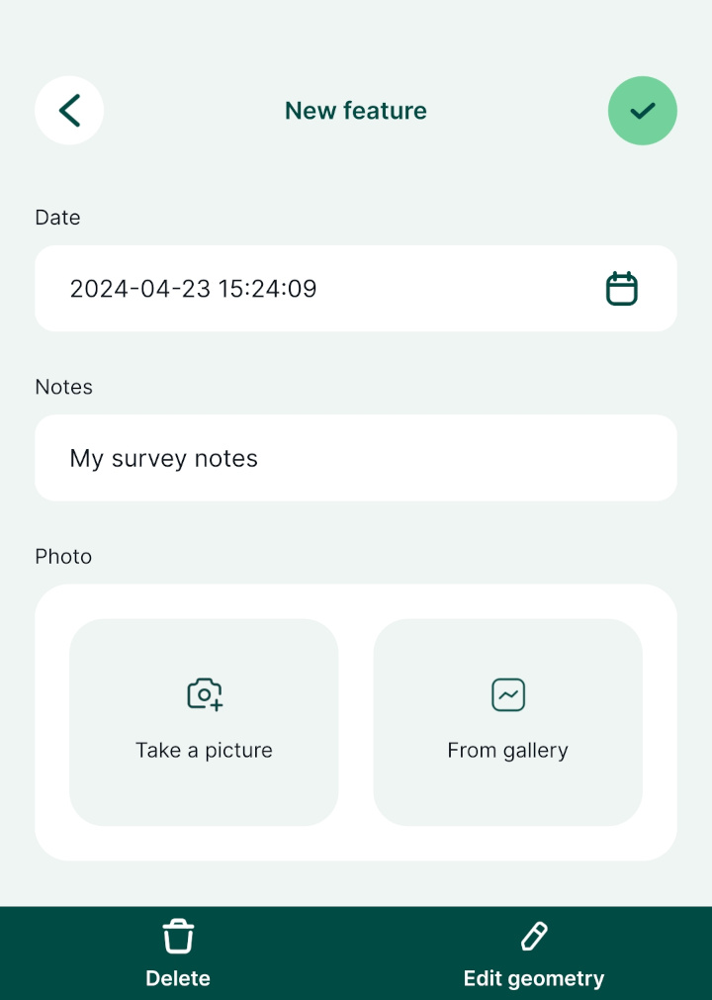
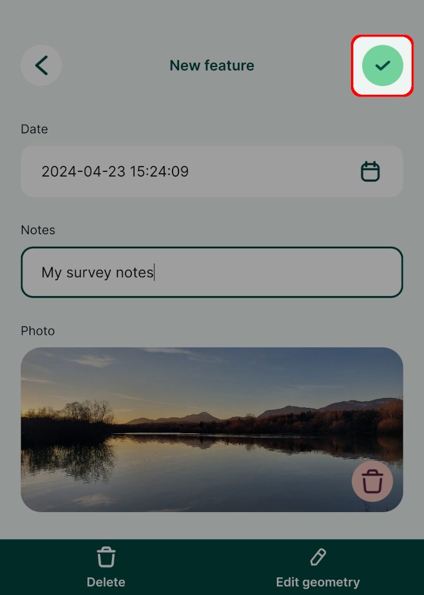

# Capturing Your First Field Data

[[toc]]

In this tutorial you will learn how to:

* See your location shown on background maps on your mobile device
* Capture field data with their locations, photos and notes
* Query and edit field data

[This](../broken/link.md) is a deliberate dead link and [this](../broken/) is another.

[A broken link to an external site](https://www.lutraconsulting.co.uk/broken-link).

## Creating a project in <MobileAppName />

Data are stored within projects. We'll now create a new project to save our data into.

<MobileAppName /> offers the quickest and easiest way of creating new projects. Alternative methods offering much greater flexibility are introduced in later turorials.

1. Open <MobileAppName /> on your mobile device
2. Go to the *Home* tab of the *Projects* screen and press *Create project*:

   

3. Give the project a name 

   

4. Press *Create project*:

   
   
   ::: tip
   You may need to minimise the on-screen keyboard to access the *Create project* button.
   :::

Your new project should now be visible on the *Home* tab of the *Projects* screen:

## Capturing field data

In the last step we created a project in which to store our captured field data. Let's now practice capturing some field data.

::: warning
The background map in this simple example requires network connectivity so may not work outside unless you have mobile internet.
:::

1. Open the project by tapping its row in the *Projects* screen

   You should see your location shown over background maps:
   
   

2. Pinch the map to zoom in to your current position

   Recentre the map if needed using the ***GPS*** button.

3. Use the ***Record*** button to capture a point:

   
   
   ::: tip
   You can override the position of the point being captured at this stage by pinching and dragging the background map.
   :::

4. Press ***Add Point***:

   

5. Enter some notes and attach a photo using your camera:

   
   
   

6. Press ***Save*** when you're happy with the details you've entered:

   

   The feature you just captured should now be visible on the map:
   
   
   
7. Tap on one of the features you captured:

   
   
   A summary of the feature's attribute data will be shown with the option to edit it if required.

## Summary

In this tutorial you learnt how to start capturing field data with very little effort, entirely from within <MobileAppName />. 

You may be wondering how you can survey area features or use your own background maps or scan barcodes. These things are all possible but are just covered in later tutorials.

