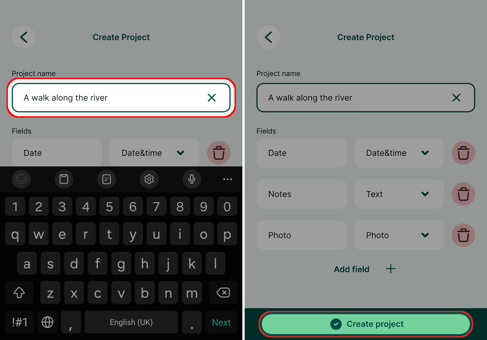

# Capturing Your First Field Data

[[toc]]

In this tutorial you will learn how to:
* See your location shown on background maps on your mobile device
* Capture field data with their locations, photos and notes
* Query and edit field data

## Install Mergin Maps Input
Download <MobileAppName /> to your Android device, iPhone or iPad. You can find it in the app store of your platform:

<AppDownload></AppDownload>

## Creating a project in Mergin Maps Input
Data are stored within projects. We'll now create a new project to save our data into.

Using <MobileAppName /> is the quickest and easiest way of creating new projects. Alternative methods offering much greater flexibility are introduced in later tutorials.

1. Open <MobileAppName /> on your mobile device
2. Go to the **Home** tab of the **Projects** screen and press **Create project**
   

3. Enter the **name** of your project
   

4. Press **Create project**. You might need to minimise the on-screen keyboard to see this button.
   
   
Your new project should now be visible on the **Home** tab of the **Projects** screen. It can be opened by tapping the project's name.

## Capturing field data
In the last step we created a project which will be used for our field survey. Let's now practise capturing some field data.

Note that the **background map used in this project requires network connectivity**. To display it outside, you need to be connected to the internet.

1. Open the project by tapping its row in the **Projects** screen. You should see your location shown over the background map:
   

2. Pinch the map to zoom in to your current position. If needed, the map can be recentred using the **GPS** button in the bottom navigation panel.
   
3. Tap the **Record** button
   

4. Press **Add** to capture a point
   

   ::: tip
   You can override the position of the point being captured at this stage by pinching and dragging the background map.
   :::

5. Enter the *date* of your survey and *notes* about the feature. Tap **Take a photo** to attach a photo using your camera
    and taking photo (right)")

6. Press **Save** when you're happy with the details you've entered:
   

   The feature you just captured should now be visible on the map:
   
   
7. Tap on the feature to see its details. If you want to change these details, such as rewrite the notes or take a new photo, tap the **Edit** button:
   

## Summary
In this tutorial you learnt how to start capturing field data with very little effort, entirely from within <MobileAppName />. 

You may be wondering how you can survey line and polygon features, use other background maps or define the forms. These things are all possible with <MainPlatformNameLink />!

