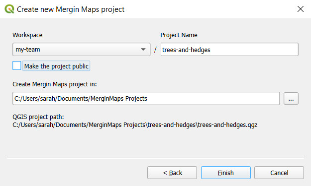
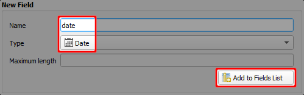
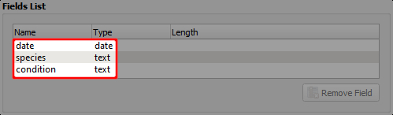
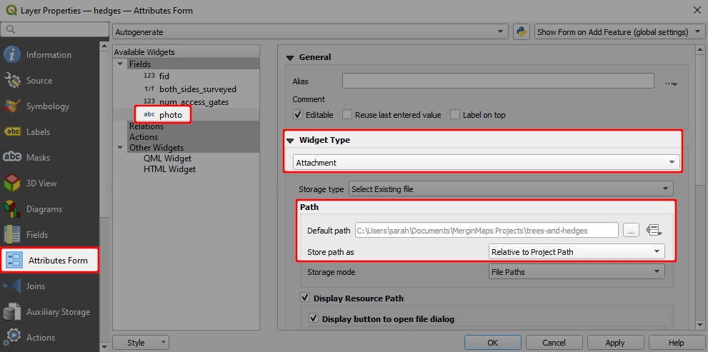
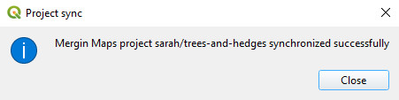

# Creating a Project in QGIS

[[toc]]

In earlier tutorials you created a new survey project from within <MobileAppName />. That was a very fast (albeit limited) way of creating a <MainPlatformName /> project.

In this tutorial you will create a new project using QGIS, a free and open source desktop GIS package. <MobileAppName /> is based on QGIS which means it's able to visualise and edit data in the same way QGIS can. This offers us great flexibility which we'll start to see in a moment.

In this tutorial we will set up a project for surveying trees and hedges.  

## Before we start

Please ensure you have already:

* [Installed the <QGISPluginName />](../../howto/install-mergin-maps-plugin-for-qgis/index.md)

## Create a minimal project

1. Open QGIS
2. Open the ***Create Mergin Project*** tool:

	

3. Select ***New basic QGIS project***:

	

4. Give the project a ***name*** and ensure it's created under `Documents\Mergin Projects`:

	

    ::: tip
	Although you can create your <MainPlatformName /> project under any folder, we recommend you store local projects under `Documents\Mergin Projects`. That convention is also used throughout this documentation.
	:::

5. Press ***Finish***

	Your new project should now be created and opened:
	
	

## Add layers

You may have noticed that the <QGISPluginName /> has created a project almost identical to the one created by <MobileAppName /> in a previous tutorial: A single point layer called *Survey* and OpenStreetMap base mapping.

::: tip
<MobileAppName /> can make use of any type of background maps (offline and online) that are supported by QGIS. TODO: Link to relavent HOWTO.
:::

We'll now add two more layers - a point layer for surveying trees and a line layer for hedges.

1. Select ***Layer > Create Layer > New GeoPackage Layer...***
	

2. Using the ***Browse*** button, ensure the geopackage is saved under `Documents\Mergin Projects\trees-and-hedges\trees.gpkg` and its geometry type is ***Point***:

	

3. Add a ***new field*** called `date` with type *Date*:

	

4. Add ***two more fields*** so the fields list looks like this:

	

5. Click ***OK***

	A new layer called trees has now been added to your project:

	

6. Repeat steps 1 to 5 above to add another new layer with these details:

	* Database: `Documents\Mergin Projects\trees-and-hedges\hedges.gpkg`
	* Geometry type: Line
	* Fields:
		* `both_sides_surveyed` with type *Boolean*
		* `num_access_gates` with type *Whole Number (integer)*
		* `photo` with type *Text Data*

	You should now have two new layers (trees and hedges):

	

::: warning 
FIXME columns / table structure cannot be changed after being set. 
:::

FIXME: Summarise best practice on how to manage layers and layer structure

## Configure attributes forms

Before we try out this new project in <MobileAppName /> we'll make a couple of small changes to the layers' attribute form settings which influence how users will interact with feature attributes in the field.

Notice how the tree species, *Black alder*, has been accidentally mistyped. This can be avoided by setting up a drop-down list (right image). Attributes have also been aliased (renamed) in the right image for easier reading. 

1. Open QGIS if not already open
2. Double-click the trees layer:

	

	Its layer properties dialog will appear.

3. Select ***Attributes Form*** on the left and click on the ***species*** attribute:

	

4. Make the following changes to the species attribute:

	* Change its widget type to ***Value Map***
	* ***Enter values and descriptions*** similar to these:

	

	::: details
	*Value* is how the data will be stored in the underlying dataset and *Description* is how it will appear to the user. Both are set the same in this example.
	:::

	Optionally experiment with the *Alias* setting which can be used to override attribute names.

5. Ensure ***fid is not editable***

	

	*fid* is a special attribute used to uniquely identify features. We recommend not allowing users to edit this attribute.

6. Click ***OK*** to close the layer properties dialog.

## Configuring photo attribute

Our hedges layer as an attribute called *photo*. The attribute itself is stored as text but we'll use it to attach photos to surveyed features. To achieve this we'll need to set its widget type to Attachment:

1. Open the layer properties of the *hedges* layer
	
	Refer back to the last section if you cannot remember how to do this.

2. Update the form for the photo attribute as follows:

	* Set its widget type to ***Attachment***
	* ***Enable relative paths*** 

	 

4. Ensure the ***fid attribute is not editable***

	Refer back to the last section if you cannot remember how to do this.

5. Click ***OK*** to close the layer properties dialog.

## Saving changes to <MainPlatformName />

In the next tutorial we will see how this project looks on <MobileAppName />. We'll now save the changes we've made here and sync the project back to the cloud.

1. ***Rename*** the layer called *Survey* to *Survey notes* (its name is a little ambiguous).
2. Save the QGIS project

	

3. Use the ***Synchronise Mergin Project*** tool:

	

	In a few moments your changes are safely stored in the cloud:

	

Synchronising changes between users and devices is a core primciple of <MainPlatformName />. When you sync a project, changes that have been made by other users and devices since you last synced are fetched and any changes you've made are pushed.

Changes are merged safely and easily from different users, even when they edit the same feature. 

<MainPlatformName /> tracks project version history so you can download a previous version of a project if you need to.

