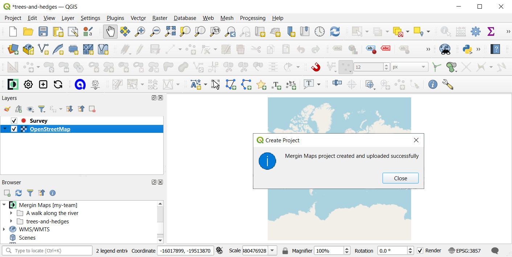

# Creating a Project in QGIS

[[toc]]

In earlier tutorials you created a new survey project from within <MobileAppName />. That was a very fast (albeit limited) way of creating a <MainPlatformName /> project.

In this tutorial you will create a new project for surveying trees and hedges using QGIS.  

## Before we start
Please ensure you have already:
* [Installed QGIS](../../setup/install-qgis/index.md)
* [Signed up to <MainPlatformName />](../../setup/sign-up-to-mergin-maps/index.md)
* [Installed the <QGISPluginName />](../../setup/install-mergin-maps-plugin-for-qgis/index.md)

## Create a minimal project
1. Open QGIS
2. Open the **Create Mergin Project** tool:
   

3. Select **New basic QGIS project**:
   

4. Give the project a **Project Name** and ensure it's created under `Documents\Mergin Projects`:
   

   ::: tip
   Although you can create your <MainPlatformName /> project under any folder, we recommend you store local projects under `Documents\Mergin Projects`. That convention is also used throughout this documentation.
   :::

5. Press **Finish**. Your new project should now be created and opened:
   

## Add layers
You may have noticed that the <QGISPluginName /> has created a project almost identical to the one created by <MobileAppName /> in a previous tutorial: A single point layer called *Survey* and OpenStreetMap base mapping.

::: tip
<MobileAppName /> can make use of any type of background maps (offline and online) that are supported by QGIS. 
You can learn how to add raster and vector background maps [here](../../gis/settingup_background_map.md).
:::

We'll now add two more layers - a point layer for surveying trees and a line layer for hedges.

1. Select **Layer > Create Layer > New GeoPackage Layer...**
   

2. Using the **Browse** button, ensure the GeoPackage is saved under `Documents\Mergin Projects\trees-and-hedges\trees.gpkg` and its geometry type is **Point**:
   

3. Add a **New Field** called ***date*** with the data type `Date`:
   

4. Add two more fields ***species*** and ***conditions*** with the data type `Text Data`. 

   The **Fields List** will look like this:
   

5. Click **OK**. A new layer called ***trees*** has now been added to your project:
   

6. Repeat steps 1 to 5 above to add another new layer called ***hedges*** with these details:
   - Database: `Documents\Mergin Projects\trees-and-hedges\hedges.gpkg`
   - Geometry type: <NoSpellcheck id="LineString" />
   - Fields:
      - *both_sides_surveyed*, data type `Boolean`
      - *<NoSpellcheck id="num_access_gates" />*, data type `Whole Number (integer)`
      - *photo*, data type `Text Data`
   
   
   
In the **Layers** panel, you should now have two new layers, ***trees*** and ***hedges***:

## Configure attributes forms
Before we try out this new project in <MobileAppName /> we'll make a couple of small changes to the layers' attribute form settings which influence how users will interact with feature attributes in the field.

Notice how the tree species, *Black alder*, has been accidentally mistyped during the field survey. This can be avoided by setting up a drop-down list (right image). Attributes can also be aliased (renamed) for easier reading. 

Now we will set up the drop-down list for the ***trees***:
1. Double-click the ***trees*** layer to open its **Layer properties**:
   

2. Select **Attributes Form** on the left and click on the ***species*** attribute:
   

4. Make the following changes to the ***species*** attribute:
   - Change the **Widget Type** to **Value Map**
   - Enter **Values** and **Descriptions** similar to these (both are set the same in this example):
   

   ::: tip
   **Value** is how the data will be stored in the underlying dataset and **Description** is how it will appear to the user.
   :::

5. Ensure ***fid*** is not editable. 
   

   ::: tip
   ***fid*** is a special attribute used to uniquely identify features. We recommend not allowing users to edit this attribute.
   :::
     
6. Click **OK** to close the layer properties dialog.

## Configuring photo attribute

Our ***hedges*** layer has an attribute called ***photo***. The attribute itself is stored as text but we'll use it to attach photos to surveyed features. To achieve this we'll need to set its **Widget Type** to Attachment:

1. Double-click the ***hedges*** layer to open its **Layer properties**.
2. Update the form for the ***photo*** attribute as follows:
   - Set its **Widget Type** to **Attachment**
   - **Path** defines where the photos will be stored. Set *Store path as* **Relative to Project Path**:
    

4. Ensure ***fid*** is not editable.
5. Click **OK** to close the layer properties dialog.

## Saving changes to Mergin Maps
In the next tutorial we will see how this project looks on <MobileAppName />. We'll now save the changes we've made here and sync the project back to the cloud.

1. **Rename** the layer called ***Survey*** to ***Survey notes*** (the name is a little ambiguous).
2. **Save** the QGIS project
   

3. Use the **Synchronise Mergin Maps Project** button:
   
   
   The **Project status** window will open with the overview of [local changes](../../manage/plugin-sync-project/#local-changes). Click **Sync** to synchronise the project:
   
 
   In a few moments your changes are safely stored in the cloud:
   

Synchronising changes between users and devices is a core principle of <MainPlatformName />. When you sync a project, changes that have been made by other users and devices since you last synced are fetched and any changes you've made are pushed.

Changes are merged safely and easily from different users, even when they edit the same feature. 

<MainPlatformName /> tracks project version history so you can download a previous version of a project if you need to.

