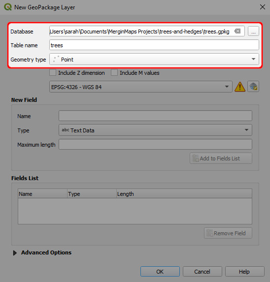
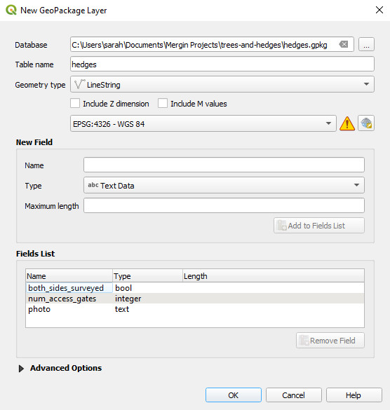
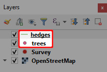

# Creating a Project in QGIS
[[toc]]

In earlier tutorials you created a new survey project from within <MobileAppName />. That was a very fast (albeit limited) way of creating a <MainPlatformNameLink /> project. In QGIS, it is possible to create more complex projects and make the field survey more effective.

In this tutorial you will create a new project for surveying trees and hedges using QGIS.  

## Before we start
Please ensure you have already:
* [Installed QGIS](../../setup/install-qgis/)
* [Signed up to <MainPlatformName />](../../setup/sign-up-to-mergin-maps/)
* [Installed the <QGISPluginName />](../../setup/install-mergin-maps-plugin-for-qgis/)

## Create a minimal project
1. Open QGIS
2. Locate the <QGISPluginName /> toolbar in the upper navigation panel in QGIS. Click on the **Create <MainPlatformName /> Project** button
   

3. Choose the first option: **New basic QGIS project**
   

4. When creating a <MainPlatformName /> project, we need to set:
   - a [workspace](../../manage/workspaces/) (here: `sarah`). If you have multiple workspaces available, choose the one you want to use.
   - **Project Name**
   - The folder where the project should be created. Here, we use `Documents\MerginMaps Projects`
   
   Press **Finish** to create the project.
   
   

5. Your new project should now be created and uploaded to <MainPlatformNameLink /> cloud. 

   **Close** the dialog window to continue working with this project in QGIS.
   
   

## Add layers
You may have noticed that the project we have just created with <QGISPluginName /> is very similar to the project created in <MobileAppName /> in the previous [tutorial](../capturing-first-data/). This basic project contains a single point layer called `Survey` and OpenStreetMap as a background map.

::: tip
Various background maps can be used in <MobileAppName />, if they are supported by QGIS. You can learn how to add offline and online background maps [here](../../gis/settingup_background_map/).
:::

We will now add two more survey layers - a point layer for surveying trees and a line layer for hedges.

1. Select **Layer > Create Layer > New GeoPackage Layer...**
   

2. Now we will create the `trees` layer:
   - **Database**: navigate to the project's folder and save the GeoPackage as `trees.gpkg` 
     Here: `Documents\MerginMaps Projects\trees-and-hedges\trees.gpkg`
   - **Table name** will be set as `trees` by default   
   - **Geometry type**: ***Point***
   
   

3. Add a **New Field** called `date` with the data type ***Date***
   

4. Add two more new fields called `species` and `conditions` with the data type ***Text Data***.

   In the **Fields List**, you can see the overview of added attributes and their respective data types. It should look like this:
   

5. Click **OK**. A new layer called `trees` has now been added to the **Layers** panel.
   

6. Repeat steps 1 to 5 above to add another new layer called `hedges` with these details:
   - **Database**: `Documents\Mergin Projects\trees-and-hedges\hedges.gpkg`
   - **Geometry type**: ***<NoSpellcheck id="LineString" />***
   - **Fields**:
      - `both_sides_surveyed`, data type ***Boolean***
      - `num_access_gates`, data type ***Whole Number (integer)***
      - `photo`, data type ***Text Data***
   
   
   
Once you are finished, there should be two new layers on the **Layers** panel: `trees` and `hedges`.

## Configure attributes forms
Before we try out this new project in <MobileAppName /> we will make a couple of small changes to the layers' form settings. The forms define how users interact with feature attributes in the field.

To illustrate how the form setup can affect the field survey, notice on the example below how the tree species, *Black alder*, has been accidentally mistyped during the field survey. This can be avoided by setting up a drop-down list (right image). Attributes can also be aliased (renamed) for easier reading.

Now we will set up the drop-down list for the `trees` layer:
1. Double-click the `trees` layer in the **Layers** panel to open the **Layer properties**
   

2. Select **Attributes Form** on the left and click on the `species` attribute
   

4. Make the following changes to the `species` attribute:
   - Enter the **Alias** that defines how the attribute's name is displayed in the form.
   - Change the **Widget Type** to ***Value Map***
   - Enter **Values** and **Descriptions** similar to these (both are set the same in this example):
   
   

   ::: tip
   **Value** is how the data will be stored in the underlying dataset and **Description** is how it will be displayed in the form to the user.
   :::

5. Click on the `fid` attribute. Uncheck **Editable** option so that it can not be edited during the survey. 
   

   ::: tip
   `fid` is a special attribute used to identify features. We recommend not allowing users to edit this attribute.
   :::
     
6. The setup of the `trees` layer is complete. Click **OK** to close the **Layer Properties** window.

## Configuring photo attribute

The `hedges` layer has an attribute called `photo`. The attribute itself is stored as ***Text Data*** and we will use it to attach photos to surveyed features. To achieve this, we need to configure the `photo` attribute's **Widget Type** as ***Attachment***.

1. Double-click the `hedges` layer to open the **Layer properties**
2. Select **Attributes Form** on the left and click on the `photo` attribute
3. Set the form for the `photo` attribute as follows:
   - **Widget Type** to ***Attachment***
   - **Path** defines where the photos will be stored. Set *Store path as* **Relative to Project Path**:
    

4. `fid` should not be editable. Click on the `fid` attribute and uncheck the **Editable** option.
5. Click **OK** to close the **Layer properties**.

:::tip
There is much more that can be done with the Attributes Form in QGIS when preparing a <MainPlatformNameLink /> project! You can learn more about forms in [Setting Up Form Widgets](../../layer/form-widgets/), [Advanced Form Configuration](../../layer/form-configuration/) or other pages in the *Configure Survey Layer* part of this documentation.
:::

## Saving changes to Mergin Maps
In the [next tutorial](../mobile/) we will see how this project looks on <MobileAppName />. We'll now make some last changes, save them and sync the project back to the <MainPlatformNameLink /> cloud.

1. Right click on the layer called `Survey` and find the **Rename Layer** option. Rename the layer to `Survey notes` (the name `Survey` is too general in this context).
2. **Save** the QGIS project
   

3. Use the **Synchronise <MainPlatformName /> Project** button in the <QGISPluginName /> toolbar (it is located in the upper navigation panel)
   
   
4. The **Project status** window will open. It contains the overview of [local changes](../../manage/synchronisation/#local-changes) that were made since the last synchronisation: two layers were added to the project (`hedges.gpkg` and `trees.gpkg`) and some changes were made in the QGIS project file (`trees-and-hedges.qgz`).

   Click **Sync** to synchronise the project
   
 
In a few moments your changes are safely stored in the <MainPlatformName />  cloud

Synchronising changes between users and devices is a core principle of <MainPlatformNameLink />. When you sync a project, changes that have been made by other users and devices since you last synced are fetched and any changes you've made are pushed.

Changes are merged safely and easily from different users, even when they edit the same feature. <MainPlatformNameLink /> tracks project version history so you can download a previous version of a project if you need to.

:::tip Public project available
The project created in this tutorial <MerginMapsProject id="documentation/t3-trees-and-hedges" /> is public. If needed, you can download it and compare it with your results.
:::

