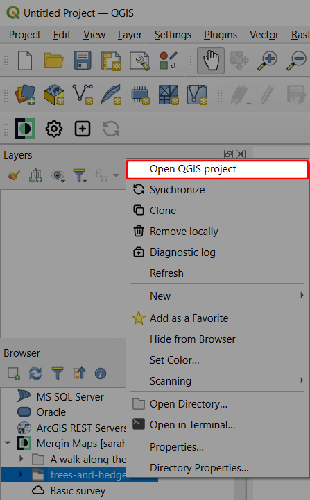
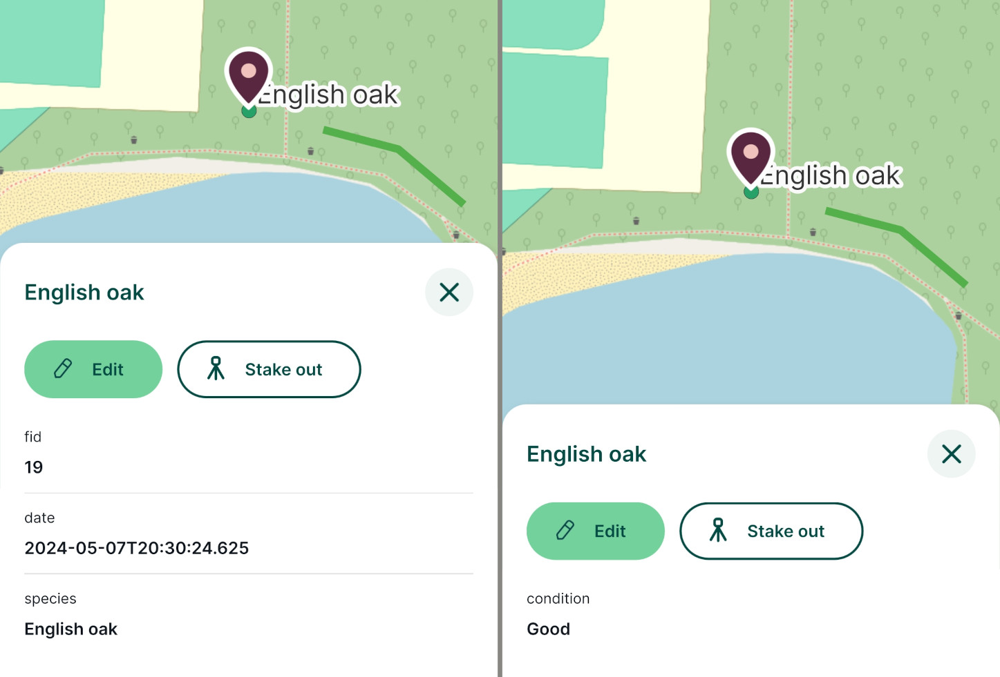
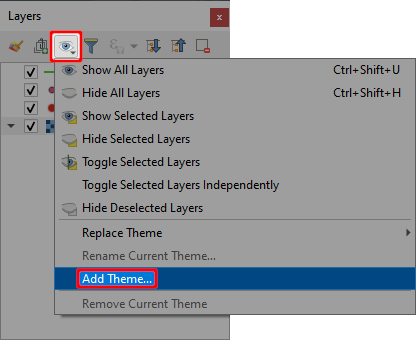
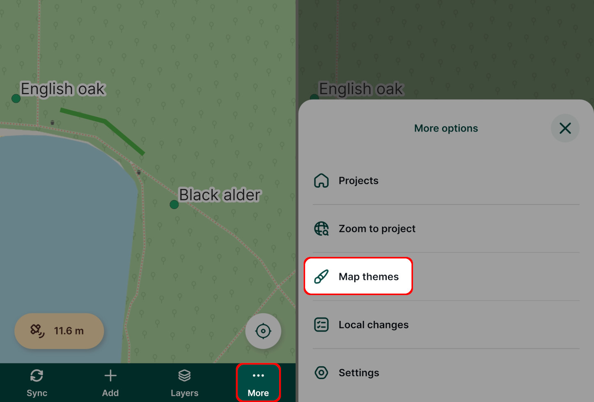

# Further Project Customisation

In this tutorial you will learn how to further customise your <MainPlatformNameLink /> project from the [previous tutorial](../creating-a-project-in-qgis/), making it even more useful. The various changes we will make to the project will be made in [QGIS](../../setup/install-qgis/) and their effect observed and tested in <MobileAppName />.

The topics covered here are:
[[toc]]

::: tip
Previous tutorials already covered the minimum concepts for data collection so feel free to skip ahead to the [Working Collaboratively](../working-collaboratively/) tutorial (and come back here later on) if you're super keen on collecting data right away.
:::

## Opening the project in QGIS
If you already have the `trees-and-hedges` project open in QGIS, skip to [Layer styles](#layer-styles).

1. Open QGIS
2. Expand the **Mergin Maps** entry in the Browser panel to show projects in your workspace:
   
   
   :::tip
   If you have access to multiple workspaces, you may need to [switch to the appropriate workspace](../../manage/workspaces/#switch-workspaces-in-qgis) in the QGIS browser to open your project.
   :::

3. Locate the `trees-and-hedges` project
4. **Right-click** it and select **Open QGIS project**:
   

The project should now be loaded in QGIS. Don't worry if you cannot see the features you surveyed in the field - this is probably because you've not yet synchronised the project in QGIS.

If this is the case, click on the **Synchronise** icon from the <QGISPluginName /> toolbar to synchronise the changes
   

## Layer styles
When using the <MobileAppNameShort /> in the field in the last tutorial, we noticed hedges were difficult to see against the background maps. We'll now fix that.

1. **Double-click** the `hedges` layer in QGIS to open its **Layer properties**
   

2. Select the **Symbology tab** on the left and click the current colour to change it:
   

3. **Pick a new colour** for hedges which stands out better
   

4. Click **OK**
5. Increase the **line width** to 0.46mm and click **OK**
   

Lines in the `hedges` layer should now be drawn thicker and in a more prominent colour. 

In the next section we'll see what these changes look like in the <MobileAppNameShort />.

## Trialling changes in Mergin Maps mobile app
Seeing how the changes look like in the <MobileAppNameShort /> is easy:

1. In QGIS, save your project:
   

2. Use the **Synchronise Mergin Maps Project** button:
   

   The **Project status** window will open with the overview of local changes. Click **Sync** to synchronise the project:
   
   
   QGIS and your project in the cloud should now be synchronised.
   

3. Open the <MobileAppNameShort /> on your mobile device

4. On the **Home** tab, you should see that the `trees-and-hedges` project has *Pending changes to synchronise*.

   Tap on the button next to the name of the project and **Synchronise project**.
   

::: tip
If you do not see the *Pending changes to synchronise* message, switch to the **Projects** tab and back to the **Home** tab. This should force the <MobileAppNameShort /> to check again for project updates.
:::

5. Tap the project to open it. 

   The surveyed hedges should now be displayed in the style we set up in the last section.
   

## Labels
Labels can be useful for showing attribute data or other information directly on the map. We'll now add labels to the `trees` layer so we can see tree species without having to open each tree's attributes:


1. Double-click the `trees` layer in QGIS:
   
   
   Its layer properties dialog should appear.

2. Select the **Labels tab** on the left hand side

3. Set the labelling mode to **Single Labels**:
   

4. Set the **Value** to the `species` attribute
   

5. Enable **Draw text buffer** under **Buffer** settings and click **OK**
   

6. Test out these settings in the <MobileAppNameShort /> as described in the [Trialling changes](#trialling-changes-in-mergin-maps-mobile-app) section above.
   

## Customising the preview panel
We will now learn how to control the content of the preview panel which is shown when you tap a feature in the <MobileAppNameShort />.

The panel for the `trees` layer looks like the left-hand image below. We will configure it to look like the right-hand image.


1. **Double-click** the **trees** layer in QGIS:
   
   
   Its layer properties dialog should appear.

2. Select the **Display tab** on the left hand side

3. Set the **Display Name** to `species`:
   

::: tip
If you notice subtle differences in the name / spelling of the field when you select it in the drop-down list, this is due to the field having been aliased.
:::

4. Set the HTML map tip to:
   ```
   # fields
   condition
   ```
   

5. Click **OK**

6. Test out these settings in the <MobileAppNameShort /> as described in the [Trialling changes](#trialling-changes-in-mergin-maps-mobile-app) section above.

## Controlling layer visibility
You might want to turn off some layers in the <MobileAppNameShort />, e.g. when working with overlaying layers or to change the background map.

There are two ways how to change the layer visibility:
- [directly in the <MobileAppNameShort />](#layers-in-mergin-maps-mobile-app)
- setting [map themes](#map-themes) in QGIS

### Layers in Mergin Maps mobile app
To control the visibility of layers in the <MobileAppNameShort />, tap the **Layers** button to see the list of layers in the project.

Toggle the button next to layer's name to turn it on or off.


### Map themes
While the visibility of single layers can be controlled easily in the <MobileAppNameShort />, it might be useful to set up map themes in QGIS. A map theme defines which layers will be displayed, so you can define useful combinations of layers and background maps and switch between them in the <MobileAppNameShort />.

Here we'll define the following map themes:
- ***All layers*** includes all map layers
- ***Hedges*** contains just the `hedges` layer and the background map

1. In QGIS, click the **Manage Map Themes** button and select **Add Theme...**:
   

2. Call the theme **All layers** and click **OK**
   

3. **Uncheck** the trees and Survey notes layers:
   

4. Add another theme like in step 1, calling it **Hedges** and click **OK**:
   

   Switching between the two themes in QGIS causes the layer visibility to be updated accordingly.
   

   The themes have now been created. **Don't forget to save and sync your project!**

5. Test out these settings in the <MobileAppNameShort /> as described in the [Trialling changes](#trialling-changes-in-mergin-maps-mobile-app) section above

   Map themes can be accessed in the <MobileAppNameShort /> from the **More** menu:
   
    
    Simply switch between map themes in your project by tapping the one you want to use.
   

## Zoom to project extent
If you experimented with the **Zoom to project** button in the <MobileAppNameShort /> you'll have seen that by default, it zooms to the extent of the somewhat large background map:


This is not very useful so we will learn how to specify the extent that this button will zoom to.

1. In QGIS, zoom / pan the map to your desired default extent:
   

2. Select **Project > Properties...**
   

3. Select the **View Settings tab**
   

4. Check **Set Project Full Extent**
5. Click **Map Canvas Extent**:
   

6. Click **OK**
7. Test out these settings in the <MobileAppNameShort /> as described in the [Trialling changes](#trialling-changes-in-mergin-maps-mobile-app) section above
   
   The **Zoom to project** button can be found in the <MobileAppNameShort /> by tapping the **More** button:
   

## Learning more
The aim of this tutorial was to introduce you to the main concepts of customising <MainPlatformName /> projects in QGIS and to cover common customisation workflows in a basic way.

You will find more tips on how to prepare your QGIS project in [Setup GIS Project](../../gis/features/).
