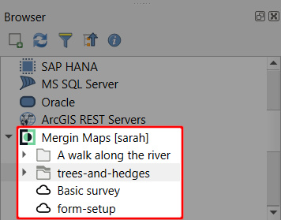
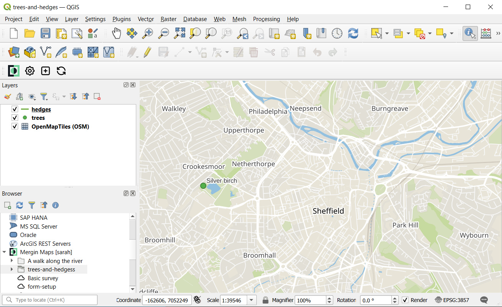

# Further Project Customisation

[[toc]]

In this tutorial you will learn how to customise your <MainPlatformName /> project further, making it even more useful. The topics covered here are:

::: tip
Previous tutorials already covered the minimum concepts for data collection so feel free to skip ahead to the [Working Collaboratively](../working-collaboratively/index.md) tutorial (and come back here later on) if you're super keen on collecting data right away.
:::

## Opening the project in QGIS

The various changes we will make to the project will be made in QGIS and their effect observed / tested in <MobileAppName />.

If you already have the *trees-and-hedges* project open in QGIS, skip to [Layer styles](#layer-styles).

1. Open QGIS
2. Expand the ***Mergin*** entry in the Browser panel to show ***My projects***:

	

3. Expand ***My projects*** and locate the *trees-and-hedges* project
4. ***Right-click*** it and select ***Open QGIS project***:

	

The project should now be loaded in QGIS. Don't worry if you cannot see the features you surveyed in the field - this is probably because you've not yet synchronised the project in QGIS.

## Layer styles

When using <MobileAppName /> in the field in the last tutorial, we noticed hedges were difficult to see against the background maps (left image). We'll now fix that so they look more like the right image.

1. ***Double-click*** the ***hedges*** layer in QGIS:

	

	Its layer properties dialog should appear.

2. Select the ***Symbology tab*** on the left hand side
3. Click the current colour to change it:

	

4. ***Pick a new colour*** for hedges which stands out better

	

5. Click ***OK***
6. ***Increase the line width*** to 0.46mm and click ***OK***

	

Lines in the hedges layer should now be drawn thicker and in a more prominent colour. In the next section we'll see what these changes look like in <MobileAppName />.

## Trialing changes in Mergin Maps Input

Seeing what the project changes we make in this tutorial look like in <MobileAppName /> is easy:

1. In QGIS, save your project:

	

2. Use the ***Synchronise Mergin Project*** tool:

	

	QGIS and your project in the cloud should now be synchronised.

	

3. Open <MobileAppName /> on your mobile device
4. Open the ***Home*** tab of the ***Projects*** page

	You should see a sync icon next to the trees-and-hedges project like this:

	

5. ***If you do not see a sync icon***, switch to the *My projects* tab and back to the *Home* tab

	This should force <MobileAppName /> to check again for project updates.

6. Sync the project by pressing the sync icon
7. Tap the project to open it

	If you zoom in to the hedge you surveyed, you should see it drawn with the new style we made in the last section:

	

## Labels

Labels can be useful for showing attribute data or other information directly on the map. We'll now add labels to the *trees* layer so we can see tree species without having to open each tree's attributes:

1. ***Double-click*** the ***trees*** layer in QGIS:

	

	Its layer properties dialog should appear.

2. Select the ***Labels tab*** on the left hand side
3. Set the labelling mode to ***Single Labels***:

	

4. Set the ***value*** to the ***species*** attribute

	

5. Enable ***Draw text buffer*** under buffer settings and click ***OK***

	

6. Test out these settings in <MobileAppName /> as described in the [Trialing changes](#trialing-changes-in-mergin-maps-input) section above

## Customising the preview panel

We will now learn how to control the content of the preview panel which is shown when you tap a feature in <MobileAppName />.

The panel for the trees layer looks like the left-hand image below. We will configure it to look like the right-hand image.

1. ***Double-click*** the ***trees*** layer in QGIS:

	

	Its layer properties dialog should appear.

2. Select the ***Display tab*** on the left hand side
3. Set the ***display name*** to `species`:

	

	::: tip
	If you notice subtle differences in the name / spelling of the the field when you select it in the drop-down list, this is due to the field having been aliased.
	:::

4. Set the HTML map tip to:

		# fields
		condition

	

5. Click ***OK***
6. Test out these settings in <MobileAppName /> as described in the [Trialing changes](#trialing-changes-in-mergin-maps-input) section above

## Controlling layer visibility

You may have noticed that <MobileAppName /> doesn't have a layer switcher. It instead allows users to switch between map themes. A map theme defines which layers will be displayed.

In a moment you'll define the following map themes:

* *All layers*
	* Which includes all map layers
* *Hedges*
	* Which contains just the *hedges* layer and background map

1. In QGIS, click the ***Manage Map Themes*** button and select ***Add Theme...***:

	

2. Call the theme ***All layers*** and click ***OK***

	

3. ***Uncheck*** the trees and Survey notes layers:

	

4. Add another theme like in step 1, calling it ***Hedges*** and click ***OK***:

	

	Switching between the two themes in QGIS should cause the layer visibility to be updated accordingly.

	

	The themes have now been created.

5. Test out these settings in <MobileAppName /> as described in the [Trialing changes](#trialing-changes-in-mergin-maps-input) section above

	You can access map themes in <MobileAppName /> from the ***More*** menu:

	

## Project extent

If you experimented with the ***Zoom to project*** button in <MobileAppName /> you'll have seen that by default, it zooms to the extent of the somewhat large background map:

This is not very useful so we will learn how to specify the extent that this button will zoom to.

1. In QGIS, zoom / pan the map to your desired default extent:

	

2. Select ***Project > Properties...***

	

3. Select the ***QGIS Server tab*** and scroll down to ***WMS capabilities***:

	

4. Check ***Advertised extent***
5. Click ***Use Current Canvas Extent***:

	

6. Click ***OK***
7. Test out these settings in <MobileAppName /> as described in the [Trialing changes](#trialing-changes-in-mergin-maps-input) section above

	The ***Zoom to project*** button can be found in <MobileAppName /> under the the ***More*** menu:

	

## Learning more

The aim of this tutorial was to introduce you to the main concepts of customising <MainPlatformName /> projects in QGIS and to cover common customisation workflows in a basic way.

<!-- Although <MobileAppName /> looks very simple, there are many things ... FIXME tell the user where to look next to get a full picture of the different things they can customise with the project. -->
