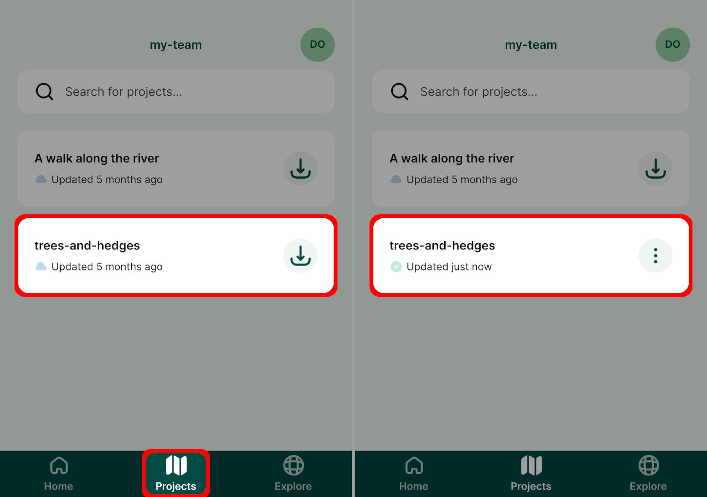
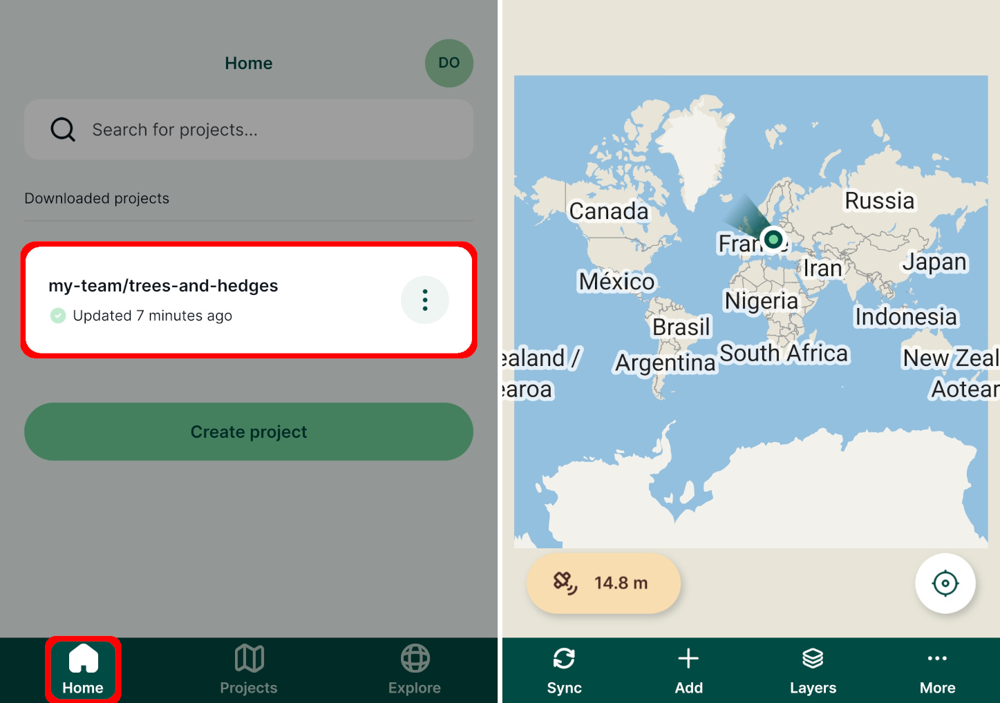
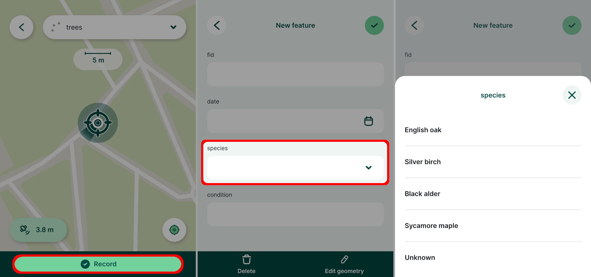

# Using Mergin Maps Mobile App

[[toc]]

In the last tutorial we created a new <MainPlatformName /> project in QGIS with layers for surveying trees and hedges. You'll now learn how to:
* Open the QGIS project in <MobileAppName />
* Switch between layers to capture new point and linear features
* Sync and save your data to <MainPlatformNameLink /> cloud

:::tip Need help navigating the mobile app?
[<MobileAppName /> interface](../../field/mobile-app-ui/) contains the overview of the features and functionality of the <MobileAppNameShort />.
:::

## Opening the project on your mobile device 
1. Open <MobileAppName /> on your mobile device
2. Go to the **Projects** tab. Here, you can see a list of projects in your workspace.
3. **Download** the ***trees-and-hedges*** project.
   
4. Projects that are downloaded to your mobile device are listed in the **Home** tab. 
   Tap the ***trees-and-hedges project*** to open it in the <MobileAppNameShort />.
   
5. Pinch the screen to zoom in on your location. If you lose sight of your location, use the **GPS button** in the right corner of the map window to recentre the map on your position.
   

::: tip Location has to be enabled
To display your current position on the map, the location has to be enabled on your mobile device and the <MobileAppNameShort /> needs permission to use it. 
:::

## GPS accuracy
Current GPS accuracy affects the quality of field data that you capture in the field and how accurately is your position displayed on the map. 

The estimated uncertainty of your current position is displayed around the position marker. Current GPS accuracy is reported in the bottom left corner of the map window. Tap it to get more information about current GPS status.

The <MobileAppNameShort /> uses colours to report whether the GPS accuracy falls within the defined threshold (green) or if it is outside of defined threshold and captured position can be inaccurate (orange). The threshold can be changed in the [Settings](../../field/mobile-app-ui/#gps-settings).

::: tip Understanding GPS accuracy
[GPS accuracy](../../field/gps_accuracy/) provides more detail about this topic.
:::

## The active layer
In a moment we'll survey a tree. Surveyed features are added to the ***active layer***. The project contains three different layers so we'll now ensure the ***trees*** layer is set as the active layer.

1. Press the **Add** button to enter the *recording* mode.

   Current active layer is displayed on the top of the map window.
   

2. Tap the active layer and set it to ***trees***.
   

3. Now we can survey a new tree by tapping the **Record** button. 

   Notice how the form reflects how we configured the species drop-down list in QGIS:
   

4. Fill in the form and **Save** :heavy_check_mark: the new point
   

## Editing features and the preview panel
Tapping a map feature shows its preview panel.

1. Tap a feature on the map.
   

   Information shown in the preview panel can be customised. We'll learn how in the next tutorial.
   
2. Experiment with editing the feature by tapping the **Edit** button.

   Change the values in the form (e.g. the tree species) or use the **Edit geometry** button to modify the location of the feature. 
   

## Survey linear features

When creating the project in QGIS, we included a layer for linear features called ***hedges***. We'll now learn how to survey lines in the <MobileAppNameShort />. Areas can be captured in a similar way to lines if the project has editable polygon layers. 

::: tip More about capturing features 
[How to add, edit, delete features](../../field/mobile-features/) has more details about capturing and editing features in the <MobileAppNameShort />.
:::

1. We'll now survey a hedge feature. 

   Set ***hedges*** as the **active layer** as described in [the active layer section](#the-active-layer).

2. Use tools in the bottom panel to survey the line: use **Add** to add vertices along the line and tab the **Record** button when finished.

   If needed, use **Remove** or **Undo** to change the feature's geometry.
   

3. Enter some **attributes** and a **photo** for the hedge:
   

It may happen that the surveyed hedge can be quite difficult to distinguish from the background map. For instance here, the line is too thin and does not have the best colour. 

We will learn how to change layer styles in the [next tutorial](../further-project-customisation/).

## Saving data to the cloud
To conclude this tutorial we will save the data we just collected back to <MainPlatformNameLink />.

Tap the **Sync** button in the bottom navigation panel and wait for notification about successful synchronisation.

When the sync process has completed your data has been stored safely in the cloud.
