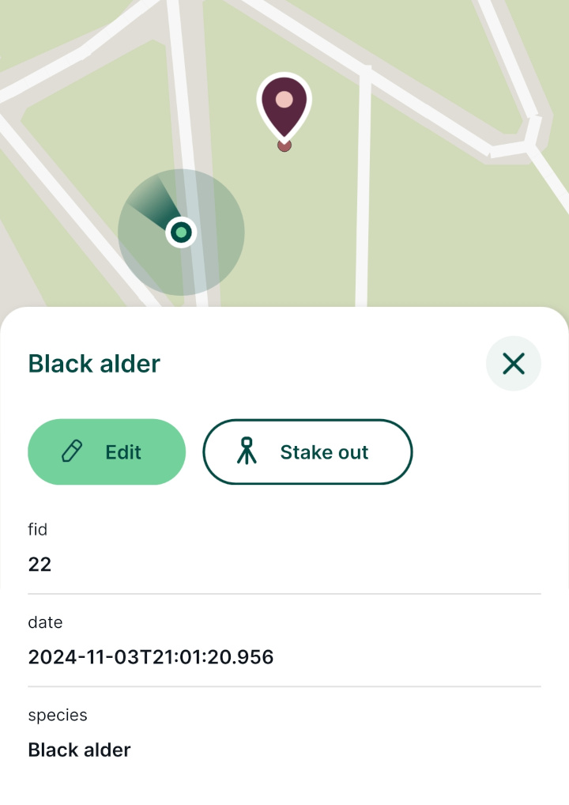
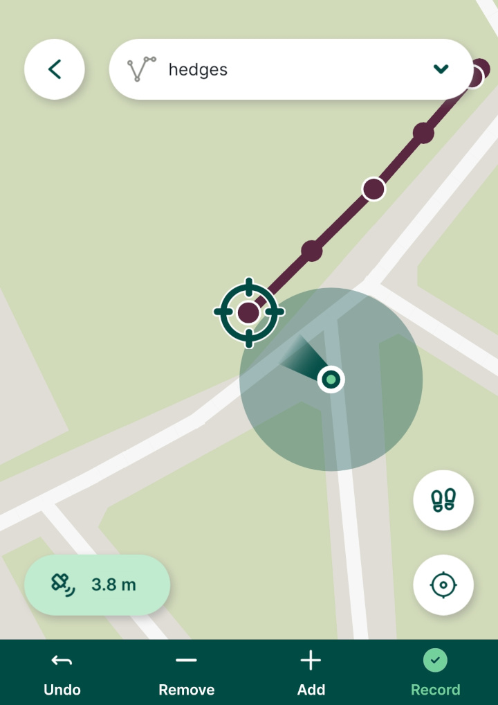
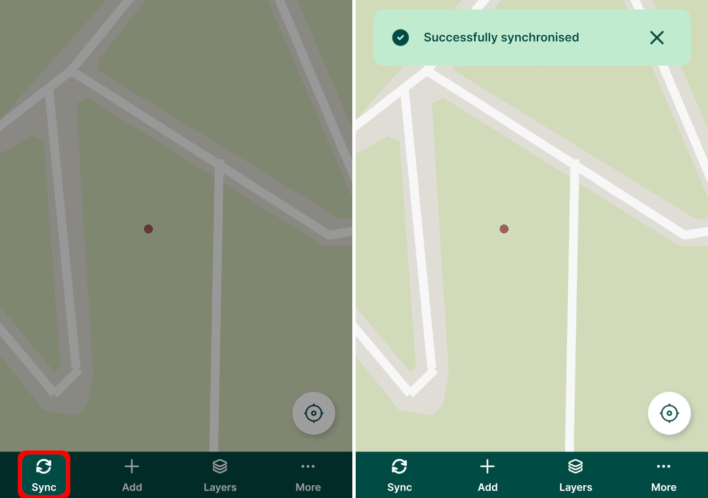

# Using Mergin Maps Input

[[toc]]

In the last tutorial we created a new <MainPlatformName /> project in QGIS with layers for surveying trees and hedges. You'll now learn how to:
* Open the QGIS project in <MobileAppName />
* Set GPS accuracy thresholds
* Switch between layers to capture new point and linear features
* Sync and save your data in <MainPlatformName /> cloud

:::tip
[<MobileAppName /> Interface](../../field/input_ui/) contains the overview of the functionality of the app's buttons and features.
:::

## Opening the project on your mobile device 
1. Open <MobileAppName /> on your mobile device
2. Open the **My projects** tab of the **Projects** page
3. **Download** the ***trees-and-hedges*** project:
   

   The project should now be downloaded to the device:
   

4. Switch to the **Home** tab and tap the ***trees-and-hedges project***
   

   The project should now be shown:
   

5. Pinch the screen to zoom in on your location. If you lose sight of your location, use the **GPS button** to recentre the map on your position.

## GPS accuracy
Let's try to capture some field data.

1. Press the **Record** button:
   
   
   You may now see a warning about GPS accuracy:
   

::: warning
When GPS accuracy falls below a threshold, <MobileAppName /> reports this to the user using the warning above and using the GPS traffic light dot. It's highly recommended that users set this threshold to a sensible value as described below.
:::
   
<MobileAppName /> uses a traffic light system to display GPS status:
* Green: OK - GPS accuracy within defined threshold
* Orange: Warning - GPS accuracy outside of defined threshold
* Red: No GPS - there's no GPS signal or the GPS is unavailable

Here's where to find the current GPS accuracy, traffic light dot and accuracy bubble:
   

2. Cancel recording and open **Settings**:
   

3. **Set Accuracy** threshold to a sensible value
   Typical values could range between 2m and 25m and typically depend on the accuracy of your mobile device and your use case.
   

   You can get an idea of what accuracy your device is reporting by watching the traffic light change colour as you change the accuracy threshold.

## The active layer
In a moment we'll survey a tree. Surveyed features are added to the **active layer**. The project contains three different layers so we'll now ensure the ***trees*** layer is set as the active layer.

1. Press the **Record** button:
   

   The active layer is shown just above the button bar:
   

2. Tap the active layer and set it to ***trees***:
   

3. Press the **Add Point** button to survey a new tree.

   Notice how the form (e.g. species drop-down list) reflects how we configured the project in QGIS:
   

4. Enter some values and **Save** the new point

## Editing features and the preview panel
Tapping a map feature shows its preview panel.

1. Tap the tree you just surveyed:
   

   Information shown in the preview panel can be customised. We'll learn how in the next tutorial.
   
2. Experiment with editing the tree's species and location using the **edit** button:
   

   The edit button can be used to edit the feature's attributes (e.g. species, condition) and even its location/geometry.

## Survey linear features

When creating the project in QGIS, we included a layer for linear features called ***hedges***. We'll now learn how to survey lines in <MobileAppName />.

1. Set ***hedges*** as the **active layer**.
   
   Refer back to [the active layer section](#the-active-layer) if you cannot remember how to do this.
   
   We'll now survey a hedge feature.

2. Use **Add Point** to add points along the line and **Done** when finished:
   

::: tip
Drag the map to position points manually or press **GPS** to recentre the map on your location.
:::

::: tip
Areas can be captured in a similar way to lines if the project has editable area/polygon layers.
:::

3. Enter some **attributes** and a **photo** for the hedge:
   

When I surveyed my hedge, it was quite difficult to distinguish from the background map - it was a thin, light green line: 

We will learn how to change layer styles in the [next tutorial](../further-project-customisation/).

## Saving data to the cloud
To conclude this tutorial we will push the data we just collected back to <MainPlatformName />.
1. Open the **Home** tab of the **Projects** page
2. Press the sync button:
   

When the sync process has completed your data has been stored safely in the cloud.
