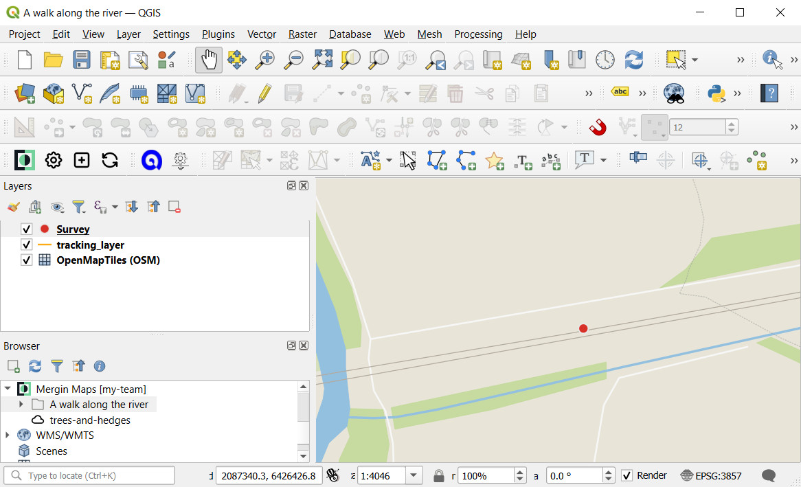
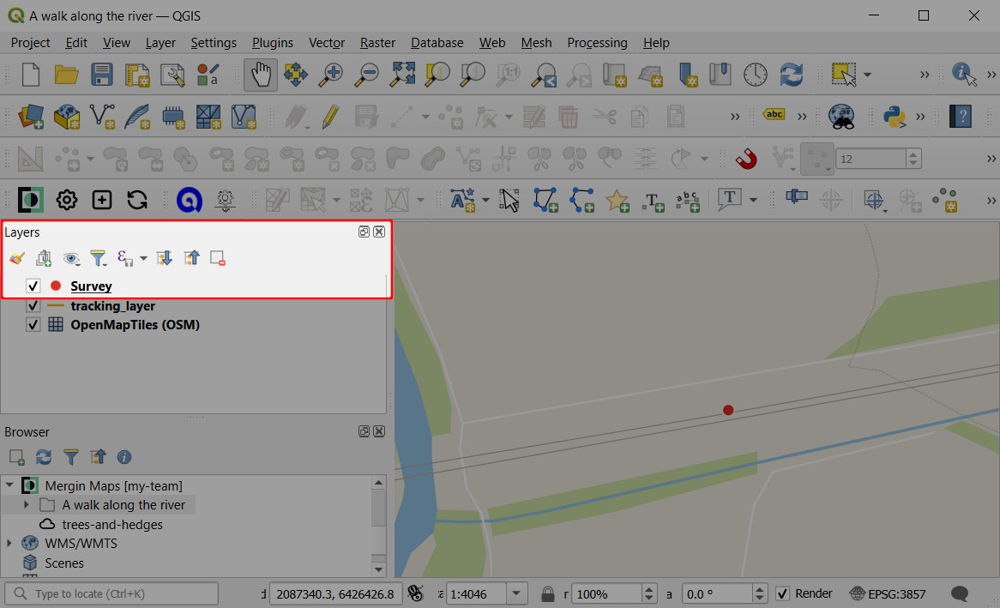

# Opening Surveyed Data on Your Computer

[[toc]]

In the last tutorial you learnt how to capture field data using <MobileAppName />.

In this tutorial you'll learn how to transfer your project and data from mobile device to computer in seconds using the powerful QGIS and <MainPlatformNameLink /> combination. <QGIS link="" text="QGIS" /> is a free and open source desktop GIS package. The <MobileAppNameShort /> is based on QGIS, which means it's able to visualise and edit data in the same way QGIS can. This offers us great flexibility which we'll start to see in a moment.

## Before we start
To open the project and field data on the computer, we will need to do some setup. Before going to the next steps, please:
- [Sign up to <MainPlatformName />](../../setup/sign-up-to-mergin-maps/#from-mergin-maps-mobile-app), as we will use <MainPlatformName /> platform to transfer the data between the mobile app and QGIS
- [Install QGIS](../../setup/install-qgis/) on your computer
- [Install the <QGISPluginName />](../../setup/install-mergin-maps-plugin-for-qgis/) and use your credential to [configure the plugin](../../setup/install-mergin-maps-plugin-for-qgis/#plugin-configuration), so that QGIS knows how to communicate with <MainPlatformName /> 

## Putting your project in the cloud
1. Open <MobileAppName /> and navigate to the **Home** tab. Tap the button next to the project's name and select the **Upload** option.
   
   If you are logged in, the project will be uploaded to <ServerCloudName /> and you can continue to the next step: [opening your project in QGIS](#locating-and-opening-your-project).
    
   
2. If you are not logged in, you will be asked to. Enter your <MainPlatformName /> credentials and **Sign in**.

   If you don't have an account yet, create one! Tap **Sign up** to [sign up to <MainPlatformName />](../../setup/sign-up-to-mergin-maps/#from-mergin-maps-mobile-app).   
   
  
3. Once you are logged in, **Upload** your project to the <ServerCloudName />. 

Notice that the name of your [workspace](../../manage/workspaces/) is displayed along with the project's name (here, the workspace is called `my-team`).

Now that your project is in the cloud, it can easily be shared with colleagues or downloaded to your computer.

   

## Locating and opening your project
Now that the project is stored in <ServerCloudName />, we can open it in QGIS.

1. Open QGIS on your computer

2. Make sure you have already [installed](../../setup/install-mergin-maps-plugin-for-qgis/) and [configured](../../setup/install-mergin-maps-plugin-for-qgis/#plugin-configuration) <QGISPluginName />
   
3. Find the <MainPlatformName /> entry in the QGIS **Browser** panel
   

   Notice that the name of the current workspace (here: `my-team`) is displayed next to <MainPlatformName /> and the projects in this workspace are listed below.
      
   ::: tip
   If you cannot see the **Browser** panel, ensure it's enabled under **View (top-level menu) > Toolbars**.
   :::
   
4. Right-click on the project and select **Download**
   

5. **Select a folder** where you want to store your project locally.

   For example, here we will create a folder for storing <MainPlatformName /> projects called `MerginMaps Projects`. It is also possible to select an existing folder.
   
   
   
   After selecting a folder, <QGISPluginName /> will automatically create a subfolder based on the project's name and download the project there.
   

6. Open the project when prompted:
   
   
Your survey project is now open in QGIS and you can see the data you captured in the field.

:::tip
If you're new to QGIS we really recommend getting some basic familiarity with the software. <QGISHelp ver="latest" link="user_manual/index.html" text="QGIS User Guide" /> and <QGISHelp ver="latest" link="training_manual/index.html" text="QGIS Training Manual" /> are great resources to get acquainted with QGIS and its functionality. 

QGIS is a powerful tool with a great community that can help you achieve a lot!
:::

## Extracting data from QGIS
Users who are not already familiar with GIS may be wondering how they can extract their data into familiar tools like MS Office and how to access their photographs.

There are many ways how you can extract the data. Here we'll just cover the basics.

1. Locate the `Survey` layer in the **Layers** panel:
   
   
2. Right-click on the `Survey` layer and find the **Export** option. Here, select  **Save Features As...**:
   

3. **Save Vector Layers as...** dialog opens. Here you can define the export parameters:
   - Set **Format** to ***Comma Separated Value [CSV]***
   - Specify an output **File name**
   - Uncheck **Add saved file to map**
   
   Click **OK** to export the file. The resulting CSV file can be opened in various applications such as MS Excel or even in a common text editor. 
   

## Locating captured photos
**Photos** that you took as a part of your field survey are located in the <MainPlatformName /> project folder. In this case, we saved our project in `Documents\MerginMaps Projects` so the photos can be found here.

 
  
## Identify features tool
You can also use QGIS to explore the data you surveyed in the field.

1. Select the Survey layer in the **Layers** panel. The layer should be highlighted.

2. Select the **Identify Features** tool:
   

3. Click on a survey point. A form with feature's attribute should open:
   
   

## Summary
In this tutorial you learnt how to view a survey project you created on your mobile device with <MobileAppName /> on your desktop computer using QGIS. You also learnt how to export captured data for use in spreadsheets and how to access photos you captured in the field.

QGIS offers many options to create and set up more complex projects than the basic project we have created in the <MobileAppNameShort /> - as you can see in the [next tutorial](../creating-a-project-in-qgis/).
