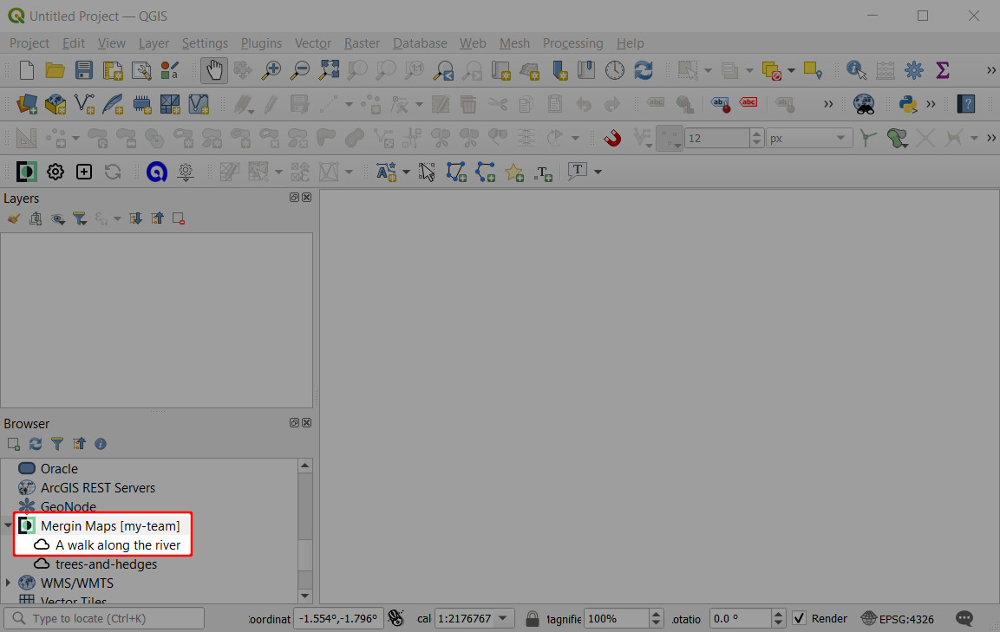
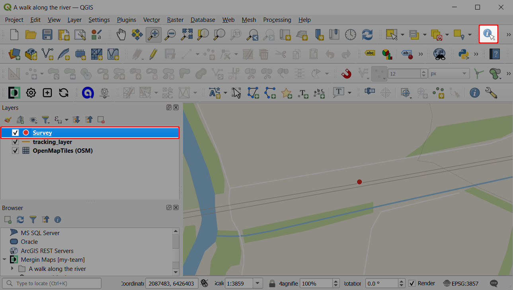

# Opening Surveyed Data on Your Computer

[[toc]]

:::warning
This tutorial may differ from what you encounter when working with <MainPlatformNameLink />. It will be updated soon to include recent changes in <MainPlatformNameLink />, <MobileAppName /> and <QGISPluginName />.
:::

In the last tutorial you learnt how to capture field data using <MobileAppName />.

In this tutorial you'll learn how to transfer data from mobile device to computer in seconds using QGIS, a free and open source desktop GIS package. <MobileAppName /> is based on QGIS, which means it's able to visualise and edit data in the same way QGIS can. This offers us great flexibility which we'll start to see in a moment.

## Before we start
Please ensure you have already:
* [Installed QGIS](../../setup/install-qgis/index.md)

## Putting your project in the cloud
1. Press the **Upload** button
   
   
   You may now be asked to log in to <MainPlatformName /> or create a new account. If you're already logged in, skip to **step 4**.
   
2. Log in to <MainPlatformName />
   
   
   [How to Sign Up to <MainPlatformName />](../../setup/sign-up-to-mergin-maps/index.md) describes several methods of registering.

3. Now that you are logged in to <MainPlatformName />, pressing the **Upload** button should start sending your project up to the cloud. Initiate the upload once again:  
   
   
4. Wait for the project upload to complete.

Now that your project is in the cloud, it can easily be shared with colleagues or downloaded to your computer.

## Locating and opening your project
1. Open QGIS on your computer
2. [Install the <QGISPluginName />](../../setup/install-mergin-maps-plugin-for-qgis/index.md). 
   You will use your <MainPlatformNameLink /> credentials to configure the <QGISPluginName />.
3. Find the <MainPlatformName /> entry in the QGIS **Browser** panel:

   
   
   ::: tip
   If you cannot see the Browser panel in QGIS, ensure it's enabled under **View (top-level menu) > Toolbars**.
   :::
   
4. Expand the <MainPlatformName /> entry and find your project under **My projects**
   

5. Right-click on the project and select **Download**
   

6. Select a folder under which your project will be stored locally.

   For example, create a folder called **Mergin Projects** under **My Documents** or select this folder if it already exists.
   
   
   The <QGISPluginName /> will automatically create a subfolder based on the project's name.
   
   The project will now be downloaded.
   

7. Open the project when prompted:
   
   
   Your survey project is now open in QGIS:
   

## Extracting data from QGIS
Users who are not already familiar with GIS may be wondering how they can extract their data into familiar tools like MS Office and how to access their photographs.

There are so many ways you could extract the data but here we'll just cover the basics.

1. Locate the **Survey** layer in the **Layers** panel:
   
   
2. Right-click n the **Survey** layer and select **Save Features As...**:
   

3. Export the features
   * Set **Format** to ***Comma Separated Value [CSV]***
   * Specify an output file name
   * Uncheck **Add saved file to map**
   * Click **OK**
   
   
   
   You should be able to open the resulting file in Excel.

4. Locate the photos

   The photos can be found under the project folder. Assuming you followed the suggestions above, these should be located somewhere under `Documents\Mergin Projects`:
   
   
   
If you're new to QGIS we really recommend getting some basic familiarity with the software. QGIS is a powerful tool with a great community that can help you achieve a lot.

:::tip
<QGISHelp ver="3.22" link="user_manual/index.html" text="QGIS User Guide" /> and <QGISHelp ver="3.22" link="training_manual/index.html" text="QGIS Training Manual" /> are great resources to get familiar with QGIS and its functionality.
:::

## Identify features tool
You can also use QGIS to view the data you surveyed in the field.
1. Select the Survey layer in the **Layers** panel
2. Select the **Identify Features** tool:
   

3. Click on your survey point. The feature's attributes should be shown:
   

## Summary
In this tutorial you learnt how to view a survey project you created on your mobile device on your desktop computer. 

You also learnt how to export captured data for use in spreadsheets and how to access photos you captured in the field.
