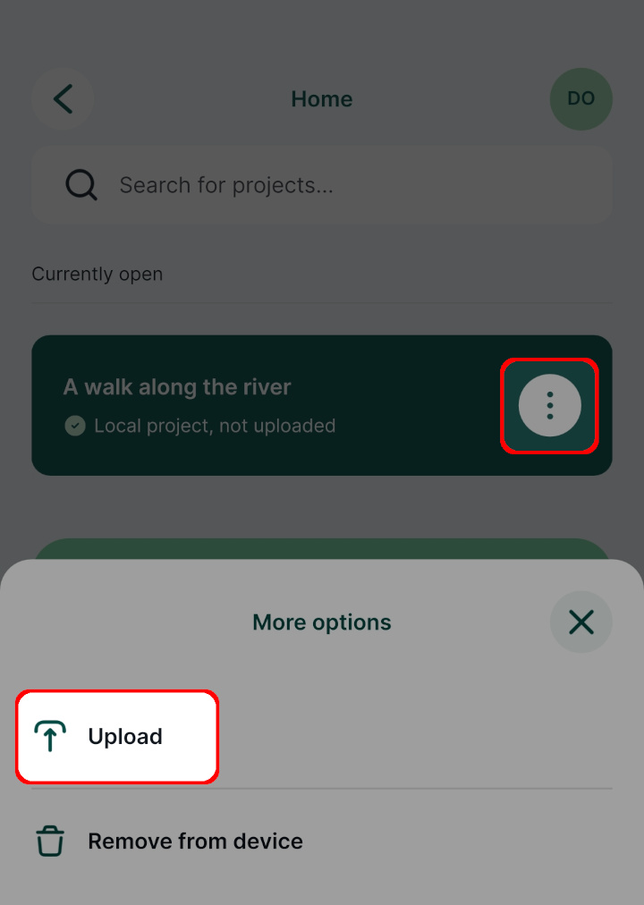
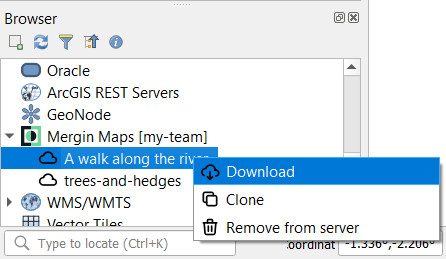
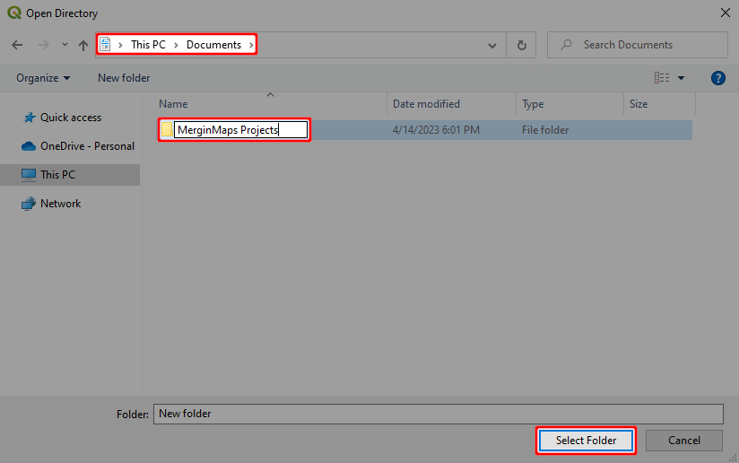
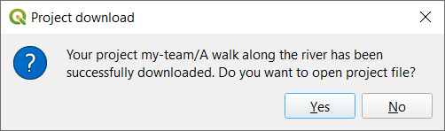

# Opening Surveyed Data on Your Computer

[[toc]]

In the last tutorial you learnt how to FIXME.

In this tutorial you'll learn how to:

* Transfer data from mobile device to computer in seconds

## Putting your project in the cloud

1. Press the ***Upload*** button

   
   
   You may now be asked to log in to <MainPlatformName /> or create a new account.
   
   If you're already logged in to <MainPlatformName />, then skip to step 4.
   
2. Log in to <MainPlatformName />

   
   
   [Signing up with <MainPlatformName />](../../howto/sign-up-to-mergin-maps/index.md) describes several methods of registering.

3. Initiate the upload once again

   Now that you are logged in to <MainPlatformName />, pressing ***Upload*** should start sending your project up to the cloud:
   
   
   
4. Wait for the project upload to complete

   

   Now that your project is in the cloud, it can easily be shared with colleagues or downloaded to your computer.

## Locating and opening your project

1. Open QGIS on your computer

2. Find the Mergin entry in the QGIS browser panel:

   
   
   ::: tip
   If you cannot see the browser panel in QGIS, ensure it's enabled under ***View (top-level menu) > Toolbars***.
   :::
   
3. Expand the Mergin entry and find your project under ***My projects***

   

4. Right-click on the project and select ***Download***

   

5. Select a folder under which your project will be stored locally

   Select a folder called ***Mergin Projects*** under ***My Documents***, creating it if it doesn't already exist.

   
   
   The <QGISPluginName /> will automatically create a subfolder based on the project's name.
   
   The project will now be downloaded.
   
   

6. Open the project when prompted:

   
   
   Your first survey project is now open in QGIS:
   
   

## Extracting data from QGIS

Users who are not already familiar with GIS may be wondering how they can extract their data into familiar tools like MS Office and how to access their photographs.

There are so many ways you could extract the data but here we'll just cover the basics.

1. Locate the ***Survey*** layer in the ***Layers panel***:

   
   
2. Right-click n the ***Survey*** layer and select ***Save Features As...***:

   

3. Export the features

   * Set ***Format*** to *Comma Separated Value [CSV]*
   * Specify an output file name
   * Uncheck ***Add saved file to map***
   * Click ***OK***
   
   
   
   You should be able to open the resulting file in Excel.

4. Locate the photos

   The photos can be found under the project folder. Assuming you followed the suggestions above, these should be located somewhere under ***Documents\Mergin Projects***:
   
   
   
If you're new to QGIS we really recommend getting some basic familiarity with the software. It's a powerful tool with a great community that can help you achieve a lot.

## Identify features tool

You can also use QGIS to interrogate the data you surveyed in the field. You can do this by:

1. ***Selecting the Survey layer*** in the layers panel
2. Selecting the ***Identify Features*** tool:

	

3. Clicking on your survey points

	The feature's attributes should then be shown:

	

## Summary

In this tutorial you learnt how view a survey project you created on your mobile device on your desktop computer. You also learnt how to export captured data for use in spreadsheets and how to access photos you captured in the field.
