# Get Started With Mergin Maps

New to <MainPlatformNameLink />? Here is a quick start for downloading, installing and setting up: 
[[toc]]

**Mergin Maps** is an open-source platform that will help you collect, share and store spatial data as well as track changes across your team and devices. <MainPlatformName /> is based on <QGIS link="" text="QGIS" />, a free and open source geographic information system.

With a mobile app and a cloud service for storing and synchronising data, <MainPlatformName /> brings the power of QGIS out to field and makes collaboration easy and effective.

:::tip How does it work?
1. Create a project in QGIS
2. Save it to <MainPlatformName /> cloud
3. Use it!

  Survey features in the field with the mobile app or make edits in QGIS. It doesn't matter whether you work alone or in a team, as long as you synchronise your project using the mobile app or QGIS plugin, all changes will be tracked and your project will be up to date.
:::

## Signing up to Mergin Maps
At first, we will create a <MainPlatformName /> ***account*** that will be used to sign in to the cloud, mobile app and QGIS plugin. During the registration process, we will also create a ***workspace*** to manage your projects, subscriptions and other settings.

1. Navigate to <MainDomainNameLink /> and click on **Sign Up** to reach the [registration page](https://app.merginmaps.com/register)
   
2. Create your account by filling up the form and click on **Sign Up**. You will receive a confirmation email with a link to verify your email.

   Check your spam folder if you don't receive the confirmation email after few minutes.
   
   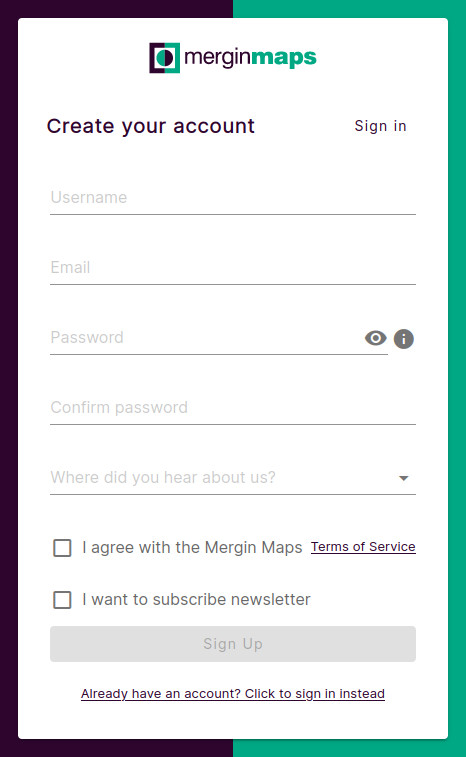
   
3. Now you need a ***workspace*** to store your projects. Create your workspace by choosing an appropriate name and click on **Create workspace**
   
   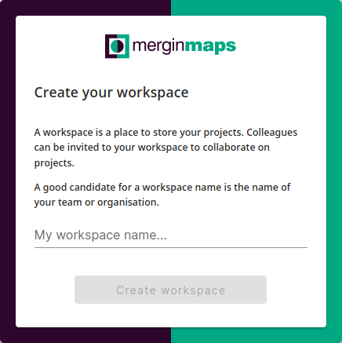

   :::tip
   Projects, collaborations and subscriptions in <MainPlatformNameLink /> are tied to [workspaces](../../manage/workspaces/). When you create your own workspace, it will automatically start with a free trial. To upgrade your subscription, see our <MainDomainNameLink id="pricing" desc="Subscription plans" />.
   :::

## Installing QGIS and QGIS plugin
Now that you have a <MainPlatformName /> account created, we will continue by installing <QGIS link="" text="QGIS" /> and <QGISPluginName />:
- QGIS will be used to create and prepare your projects. You can use it to display, edit and analyze your data, create map outputs and much more.

- QGIS plugin makes it possible to synchronise changes you make in your project in QGIS to <MainPlatformName /> cloud.

:::tip
QGIS is a powerful tool with a great community that can help you achieve a lot.

We recommend using <QGISHelp ver="latest" link="user_manual/index.html" text="QGIS User Guide" /> and <QGISHelp ver="latest" link="training_manual/index.html" text="QGIS Training Manual" /> to get familiar with QGIS and its functionality.
:::

### Install QGIS
1. Navigate to the <QGIS link="en/site/forusers/download.html" text="QGIS download page" /> 
2. Find the appropriate installer for your operating system. We recommend downloading a **long-term** release (LTR)
   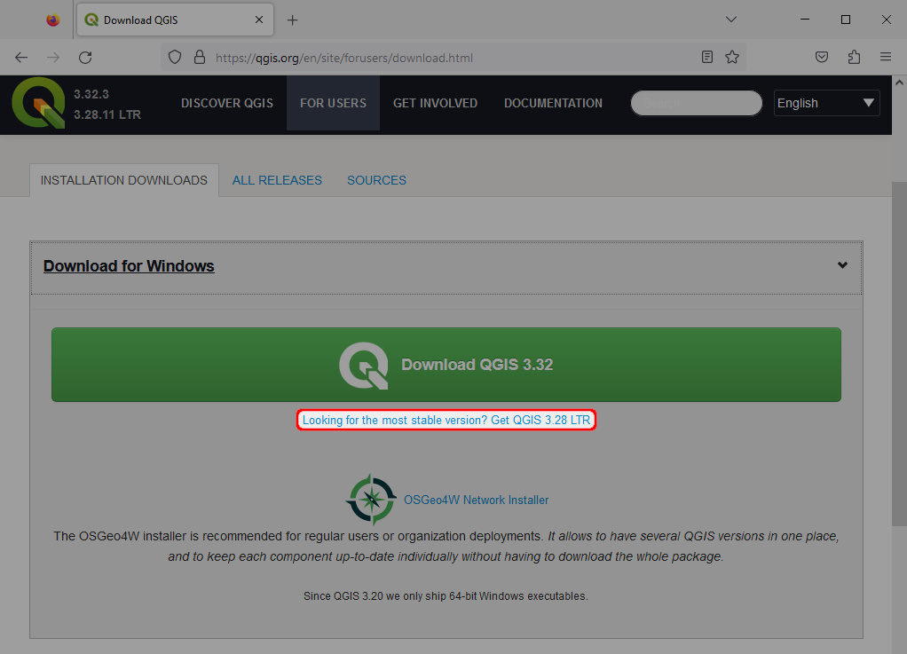

3. Run the installer using the default installation options. QGIS should now be installed on your computer.

### Install and configure QGIS plugin
1. Open QGIS
2. Select **Manage and Install Plugins...** in the **Plugins** tab:
   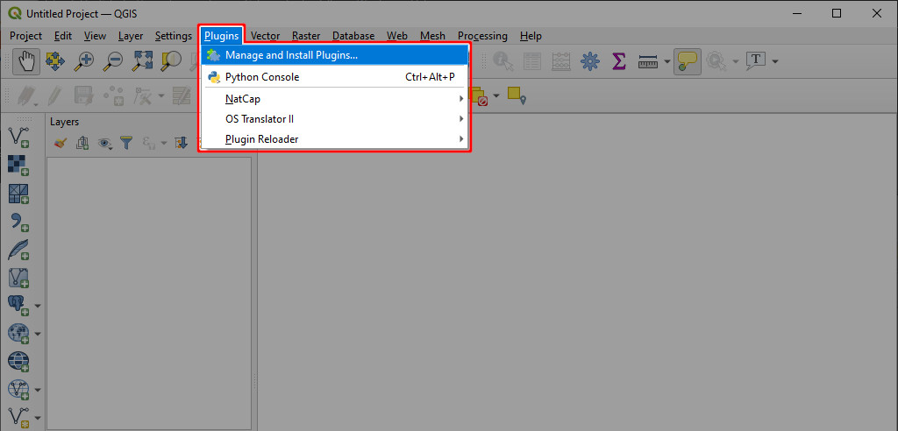

3. Find the **<MainPlatformName />** plugin and click **Install Plugin**:
   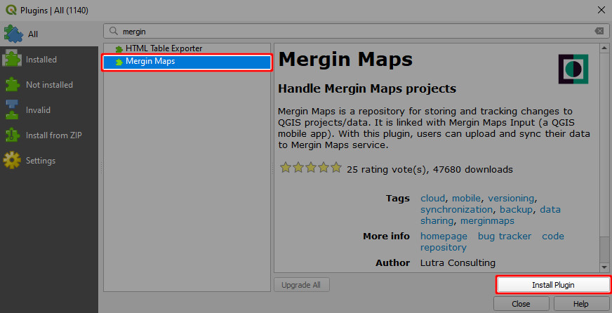

4. Close the Plugins dialog. The <MainPlatformName /> plugin toolbar should appear in QGIS:
   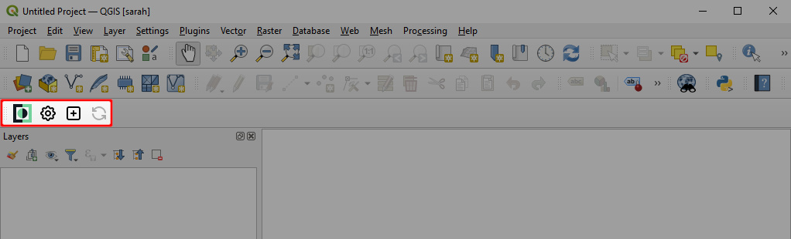
   
5. Now you can use your <MainPlatformName /> credentials to connect QGIS plugin with your account. 

   Click on the **Configure <MainPlatformName /> Plugin** icon in the **<MainPlatformName /> Toolbar**:
   

2. Enter your username and password. You can use **Test Connection** to verify that everything works correctly. If this is the case, click **OK**.
   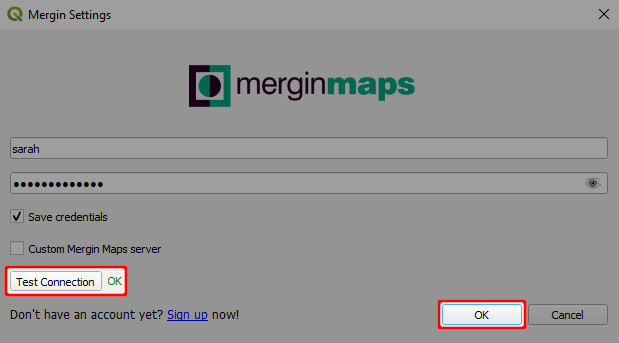

You are now ready to create your first <MainPlatformName /> project in QGIS!

### Creating a Mergin Maps project in QGIS
1. Click on **Create Mergin Maps Project** from the toolbar
   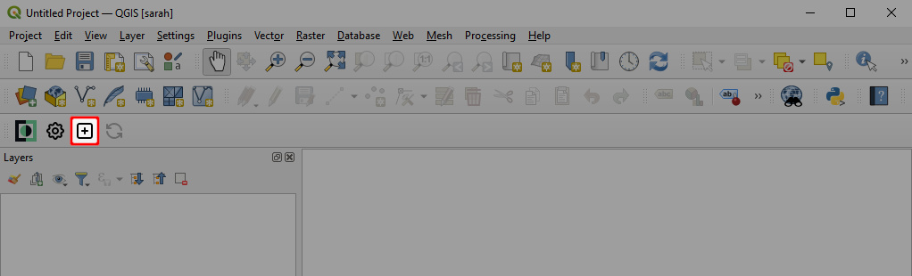

3. Choose the **New basic QGIS project** option
   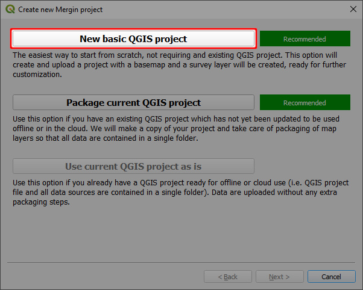

4. Enter the **Project Name** and a local folder on your computer where the project and associated files will be created
   
   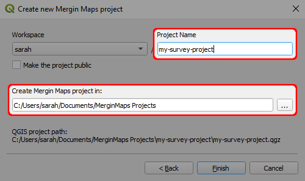

5. Your new <MainPlatformName /> project will be opened in QGIS.

   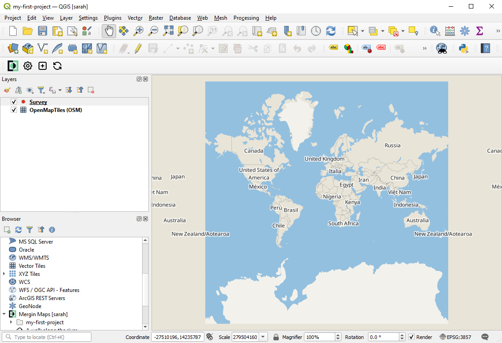

It is saved on your computer in the folder you have specified as well as in <MainPlatformName /> cloud.

If you wish, you could modify the project in QGIS, such as add new layers or background maps, setting up forms, changing the symbology and much more - some of it will be explained in other tutorials. 

Keep in mind that after making changes in QGIS, the project should be saved and synchronised to the cloud using the **sync** button.

However, we will use the project as it is right now and look into how to use it in <MainPlatformName /> mobile app.

## Using Mergin Maps mobile app
1. Download <MobileAppName /> to your Android device, iPhone or iPad. You can find it in the app store of your platform:
   <AppDownload></AppDownload>

2. Open <MobileAppName />. Tap the account icon in the upper right corner to go to the login page.
   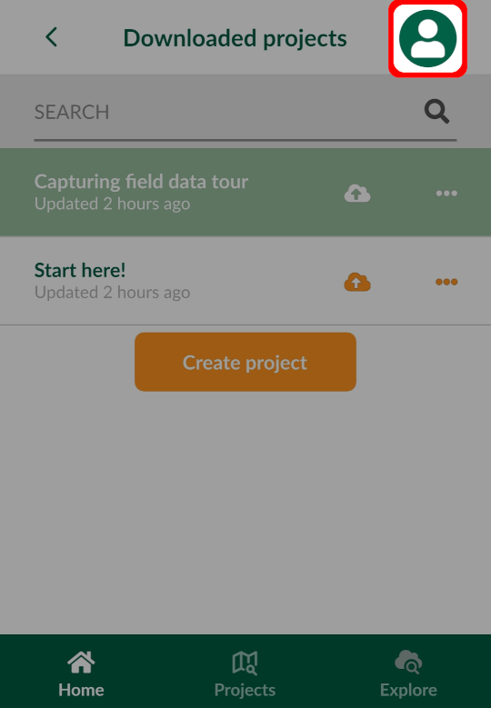
   
3. Enter your <MainPlatformName /> username and password and **Sign in**
   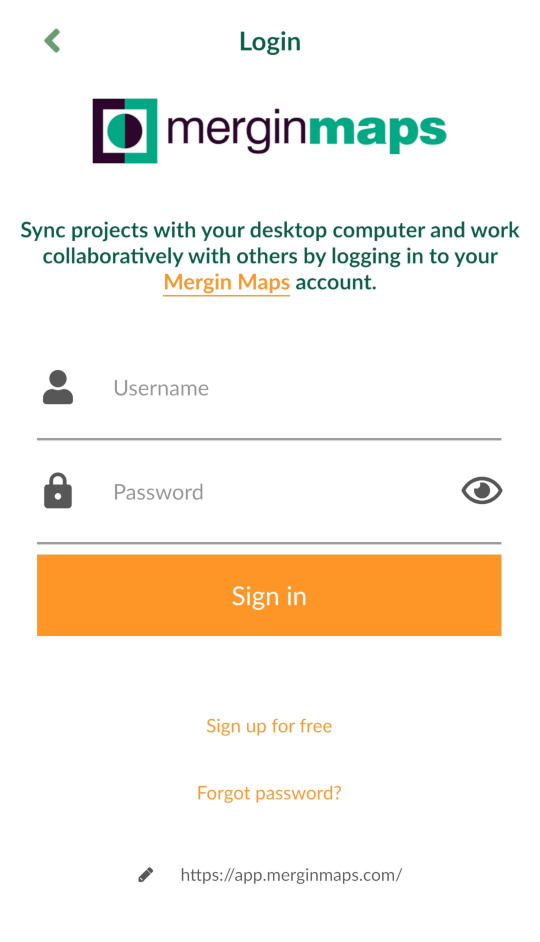

4. 

## Next steps
Do you want to learn more about the basics? We recommend going through our detailed tutorials.

