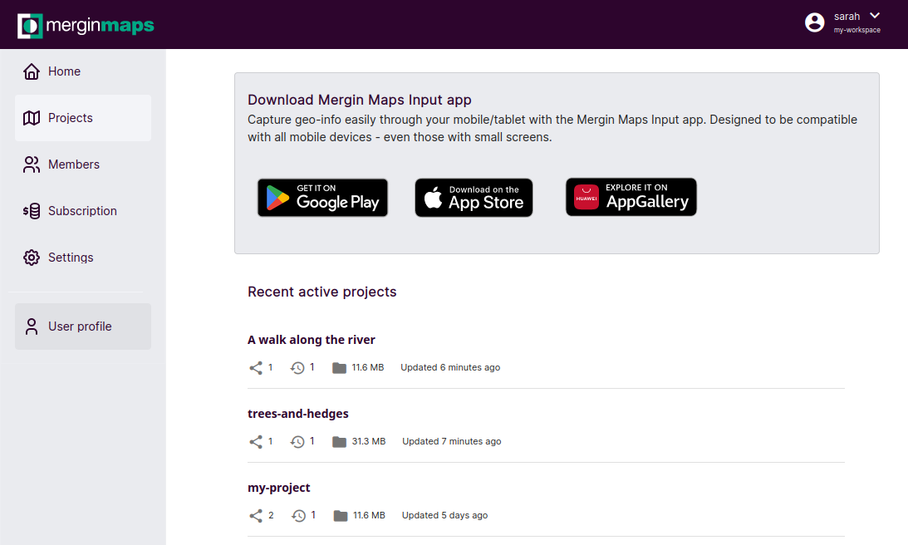
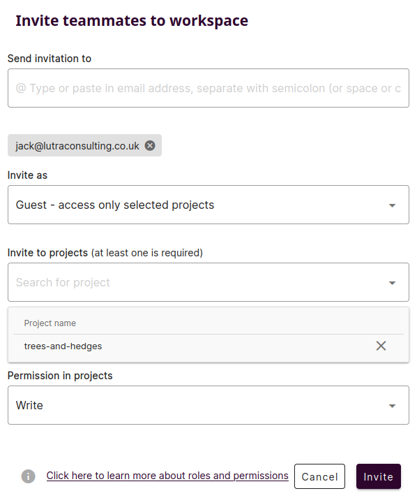
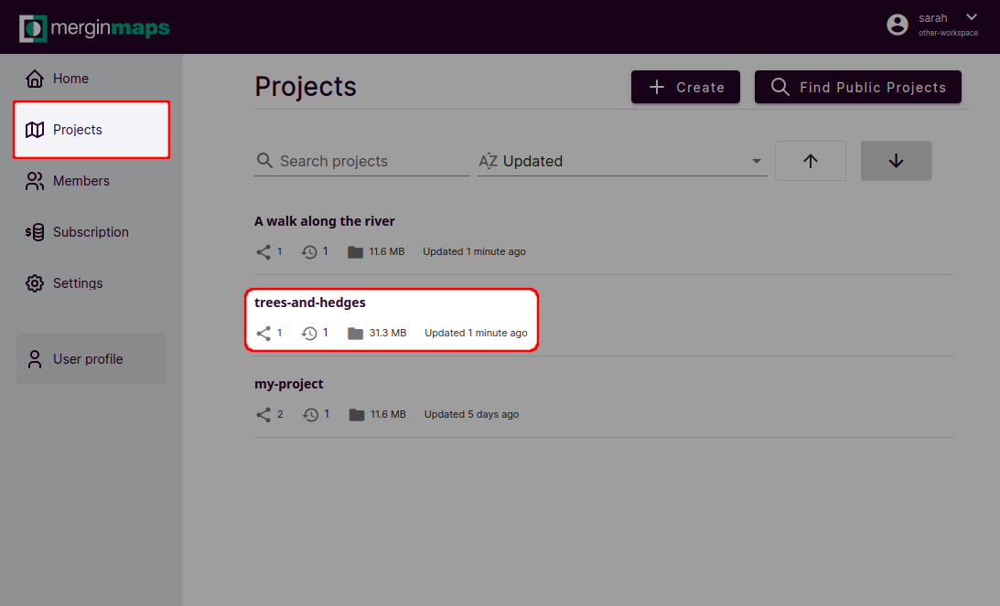
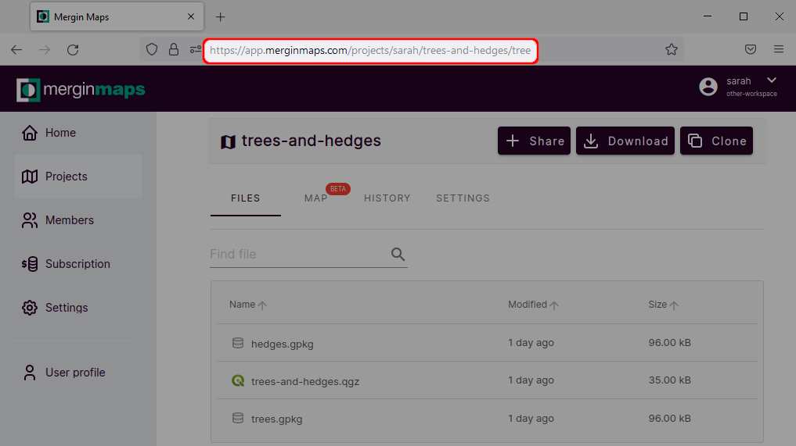
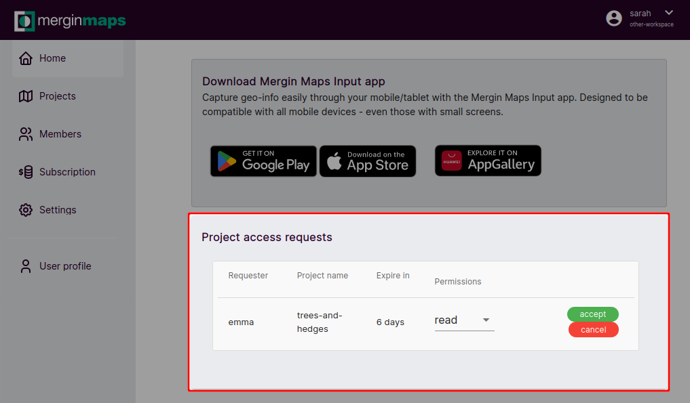

# Working Collaboratively

<MainPlatformNameLink /> makes working collaboratively safe and easy. 

In this tutorial you'll learn a few different ways of sharing your project with your colleagues:
[[toc]]

## Share a project with a specific Mergin Maps user
Your projects are stored in your [workspace](../../manage/workspaces/). If you want to share a project with someone else, they need to be invited to your workspace.

Here, we will invite Jack to the *trees-and-hedges* project.

1. Navigate to <MainDomainNameLink />.
2. Click on **Go to my account** to sign in.

   If you are new to <MainPlatformNameLink />, click on **Start for free** and [sign up to <MainPlatformName />](../../setup/sign-up-to-mergin-maps/).

   

3. Sign in to <MainPlatformName />. Now, you should see the <MainPlatformName /> dashboard.
   

2. Select **Members** from the left panel and click on **Add People**
   
   
3. Now you will see the invite form:
  
   - Enter the emails of people you want to invite to the workspace
   - Choose if they should be **invited as** *members* or *guests*. *Members* have access to all projects in the workspace, while *guests* may access only selected projects.
   - Specify the projects that will be shared with the guests by selecting the project's name in **Invite to projects**
   - Set the **Permission in projects**

4. Click on **Invite** to send an invitation. 

An email with a link will be sent to the recipients. After they accept the invitation, they will become members or guests of your workspace. 

In this case, we invited Jack as a guest to the *trees-and-hedges* project. Since he has the *write* permission, he can now add or edit features in this project through <MainPlatformNameLink />, <MobileAppName /> and QGIS.

:::tip
It is possible to have access to multiple workspaces. You may need to [navigate to the appropriate workspace](../..manage/workspaces/#how-to-switch-between-workspaces) to see a project that is shared with you.
:::

## Share a project with many users
If you wish to share a project with more than a handful of users, this method may save you some time.

These steps should be carried out from the <AppDomainNameLink desc="Mergin Maps" /> dashboard.

1. Click **My projects** then click *trees-and-hedges*
   

2. Click in the location bar of the browser:
   

3. Copy the location:
   

4. Send this link to the people you wish to share the project with.
   
   When they click the link, they will initially be prompted to sign in or register with <MainPlatformName />. Once logged in, they will have the option to **Request access**:
   

5. Check your dashboard for project access requests. Accept or deny requests accordingly.
   

   ::: warning
   We always recommend verifying the requester's <MainPlatformName /> username before accepting access requests.
   :::

## Learning more about collaboration
This tutorial introduced basic ways of sharing your project. Whether you use <MainPlatformNameLink /> to share project with a few friends or collaborate on it with a larger group of coworkers, we recommend to get familiar with the basics about permissions, synchronisation and project management:
- in [Permissions](../../manage/permissions/) you can learn more about the level of access you can provide to other users
- [Behind Data Synchronisation](../../manage/synchronisation/) explains the synchronisation process and what happens when multiple users do the field survey in the same time. There is also an option to exclude some files from syncing by using [Selective Synchronisation](../../manage/selective_sync/).
- [Project History and Versions](../../manage/project-details/) can help you see what was changed, by whom and when
- useful guides:
   - [How to Share, Transfer or Delete Projects](../../manage/project-advanced/#how-to-share-transfer-or-delete-projects) 
   - [How to Deploy Revised Projects](../../manage/deploy-new-project/)
   - [How to Recover Missing Data](../../manage/missing-data/)

