# Working Collaboratively

<MainPlatformName /> makes working collaboratively safe and easy.

In this tutorial you'll learn a few different ways of sharing your project with your colleagues.

## Share a project with a specific <MainPlatformName /> user

1. Navigate to <MainDomainNameLink />

	If you are already logged in and can see your dashboard, skip to step 4.

2. Click on *Sign in* in the top-right of the page:

	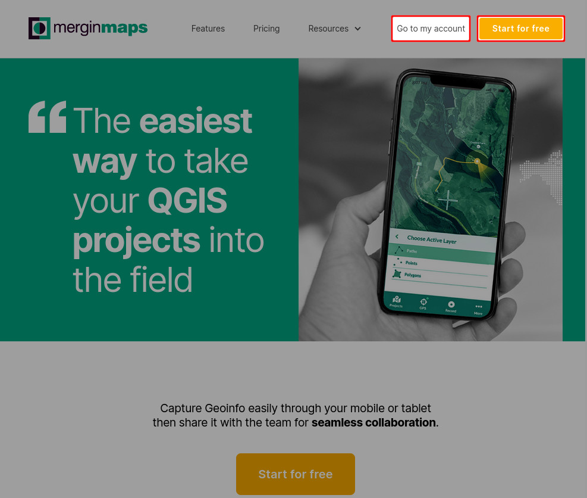

3. Sign in to <MainPlatformName />

	After signing in you should see the <MainPlatformName /> dashboard:

	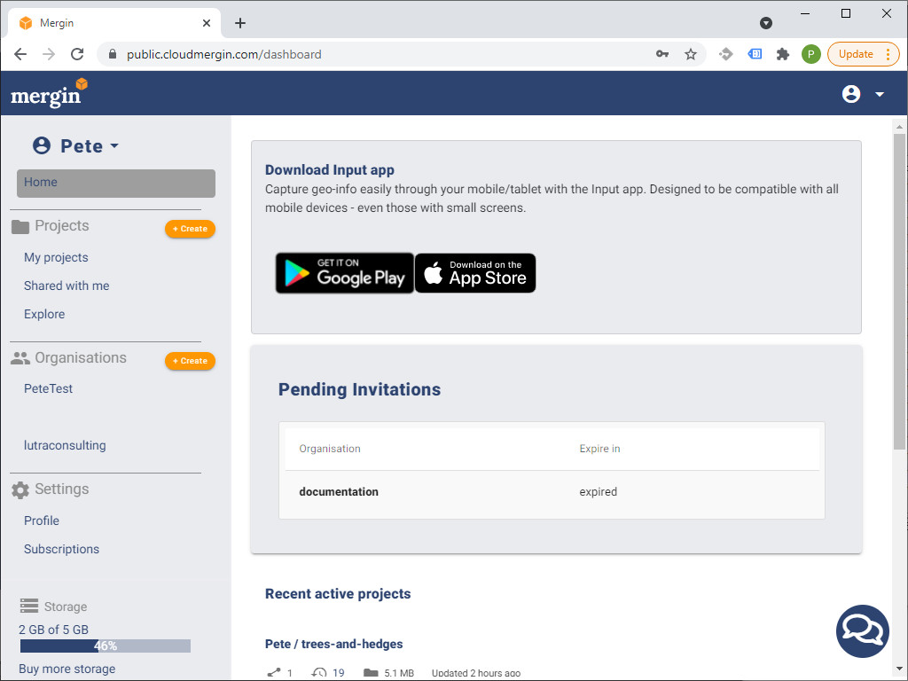

4. Click ***My projects*** then click ***trees-and-hedges***

	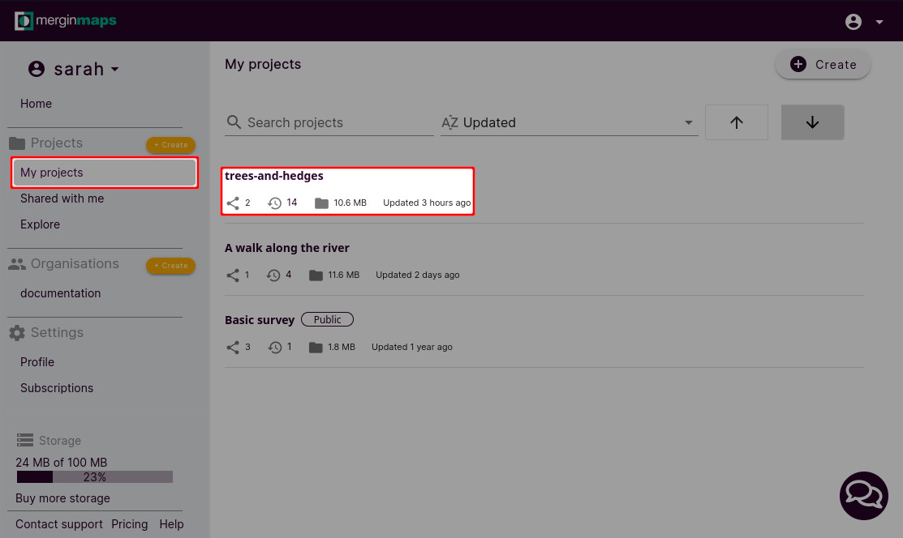

5. Click ***SETTINGS***:

	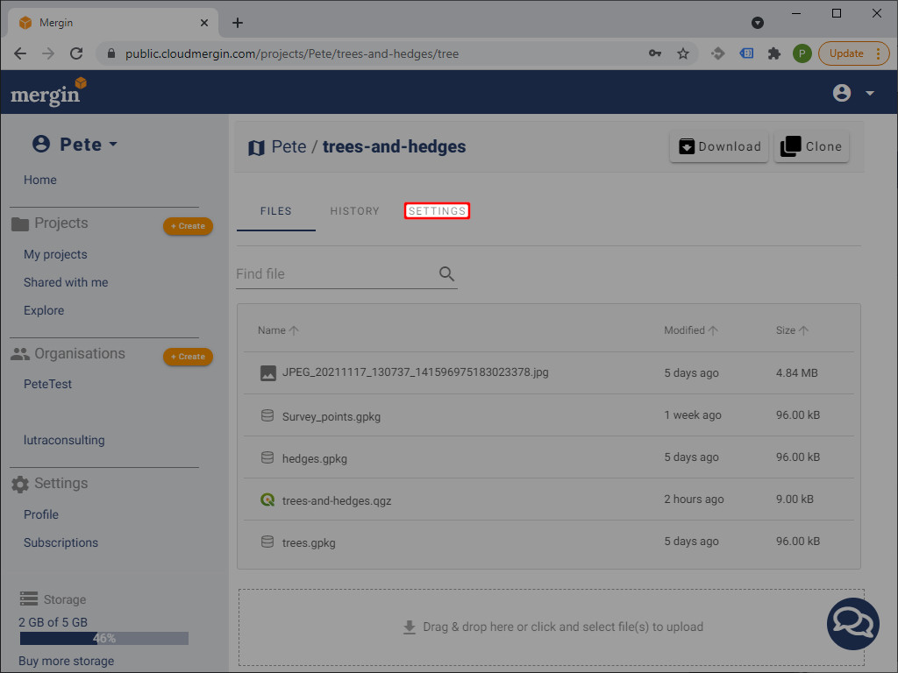

6. Enter the <MainPlatformName /> username of the person you wish to invite to collaborate:

	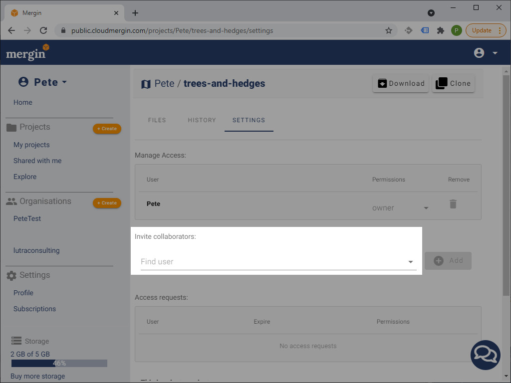

	In this example I will invite my colleague, Charlie - their username is *CharlieColleague*

	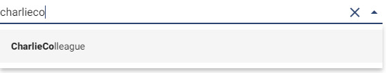

	::: warning
	We recommend that you always ask your collaborators to confirm their <MainPlatformName /> username rather than just guessing it and risking sharing your project with the wrong person.
	:::

	::: tip
	If you enter your first and last name in your <MainPlatformName /> profile, these are displayed when ... FIXME complete and also update image above to demonstrate this for Charlie's account.
	:::

	

7. When you have selected their username, click ***Add***:

	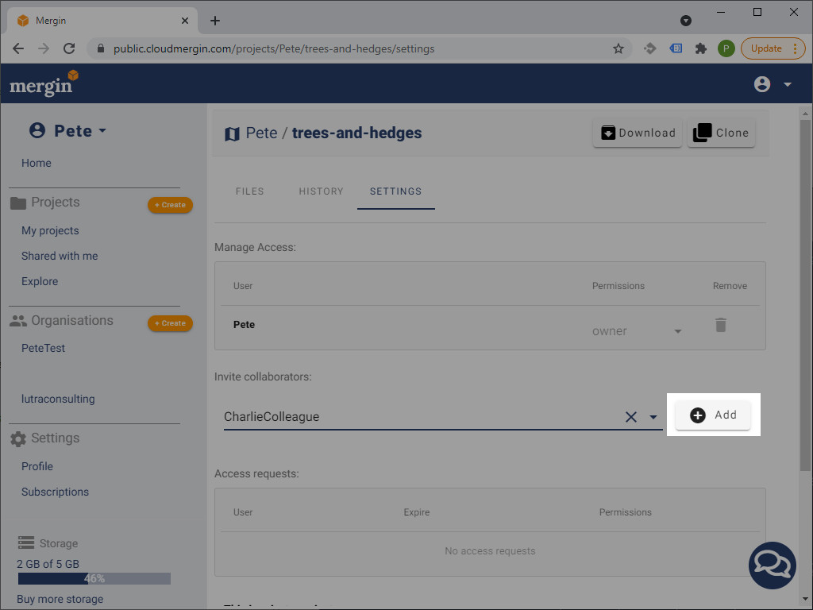

	You shoud now see them included in the list of users with access:

	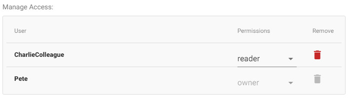

8. If the user needs write access to the project, change their ***permission*** from reader to ***writer***

Charlie should now have access to the project. This means they will be able to find the *trees-and-hedges* project under the *Shared with me* tab of their projects views in both <MobileAppName /> and QGIS.

## Share a project with many users

If you wish to share a project with more than a handful of users, this method may save you some time.

These steps should be carried out from the <MainPlatformName /> dashboard. Refer to the previous section for details of how to log in to <MainPlatformName />.

1. Click ***My projects*** then click ***trees-and-hedges***

	

2. Click in the ***location bar*** of the browser:

	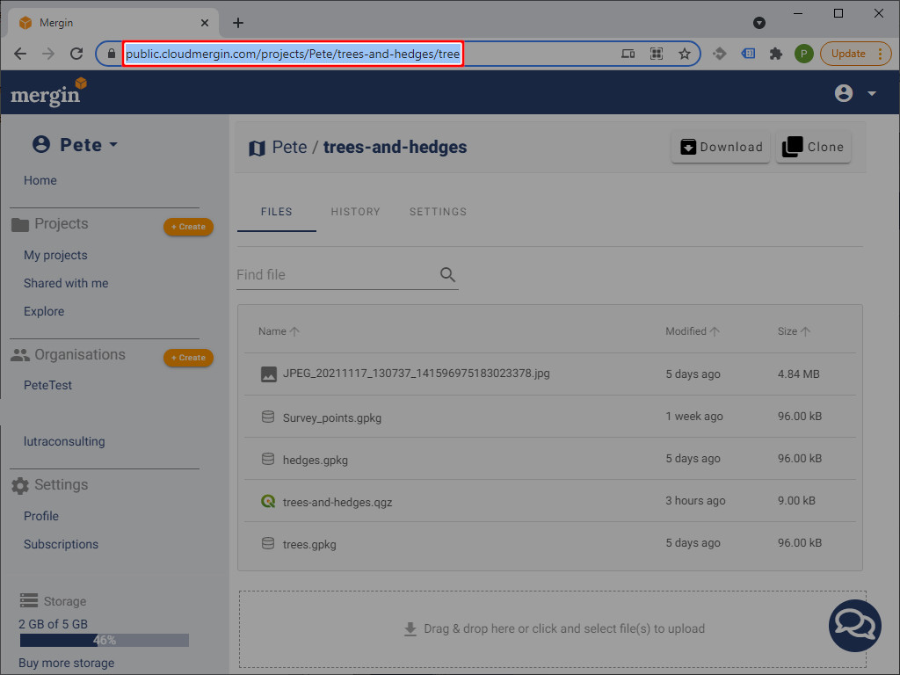

3. ***Copy*** the location:

	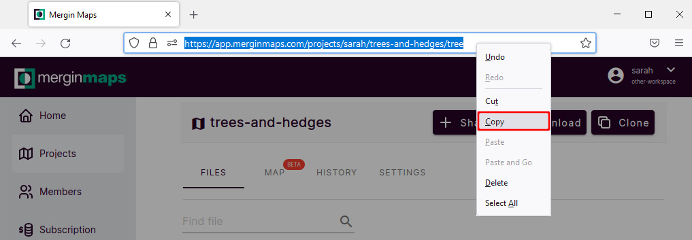

4. ***Email*** this link to the people you wish to share the project with

	When they click the link, they will initially be prompted to sign in or register with <MainPlatformName />. Once logged in, they will see something like this:

	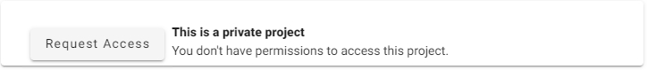

	They should use the button to request access. 

5. Check your dashboard for project access requests

	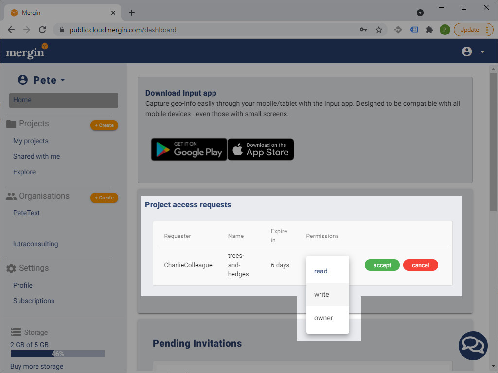

6. Accept or deny requests accordingly

	::: warning
	We always recommend verifying the requester's <MainPlatformName /> username before accepting access requests.
	:::
