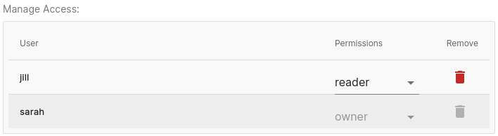
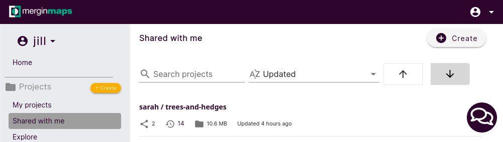

# Working Collaboratively

[[toc]]

<MainPlatformName /> makes working collaboratively safe and easy.

In this tutorial you'll learn a few different ways of sharing your project with your colleagues.

## Share a project with a specific Mergin Maps user
1. Navigate to <MainDomainNameLink />.
2. Click on **Go to my account** to sign in.

   If you are new to <MainPlatformName />, click on **Start for free** and [sign up to <MainPlatformName />](../../setup/sign-up-to-mergin-maps/).

   

3. Sign in to <MainPlatformName />. Now, you should see the <MainPlatformName /> dashboard:
   

4. Click **My projects** and then select the ***trees-and-hedges*** project:
   

5. Go to **SETTINGS**:
   

6. Enter the <MainPlatformName /> username of the person you wish to invite to collaborate:
   

::: warning
We recommend that you always ask your collaborators to confirm their <MainPlatformName /> username rather than just guessing it and risking sharing your project with the wrong person.
:::

7. When you have selected their username, click **Add**:
   

   You should now see them included in the list of users with access:
   

8. If the user needs write access to the project, change their [**Permissions**](../../manage/permissions/) from *reader* to *writer*.

Jill should now have access to the project. This means they will be able to find the ***trees-and-hedges*** project under the **Shared with me** tab when logged in <MainDomainNameLink />, <MobileAppName /> and QGIS.
 

## Share a project with many users
If you wish to share a project with more than a handful of users, this method may save you some time.

These steps should be carried out from the <MainPlatformName /> dashboard.

1. Click **My projects** then click ***trees-and-hedges***
   

2. Click in the location bar of the browser:
   

3. Copy the location:
   

4. Send this link to the people you wish to share the project with.
   
   When they click the link, they will initially be prompted to sign in or register with <MainPlatformName />. Once logged in, they will see something like this:
   

   They should use the button to request access. 

5. Check your dashboard for project access requests. Accept or deny requests accordingly.
   

   ::: warning
   We always recommend verifying the requester's <MainPlatformName /> username before accepting access requests.
   :::
