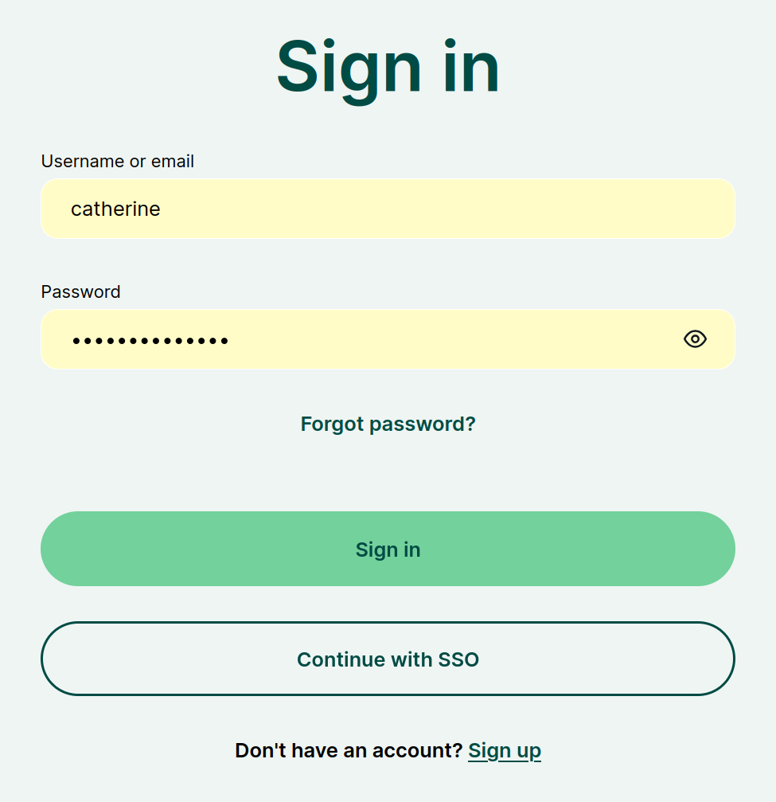
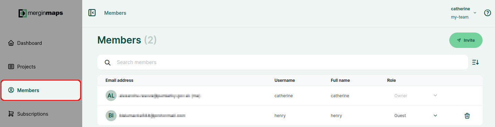
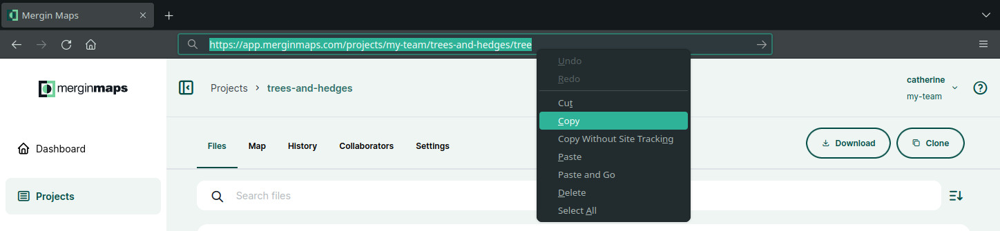
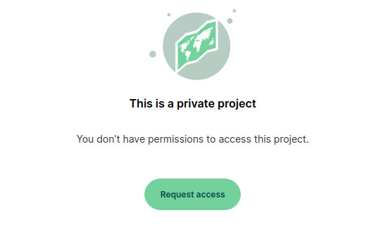
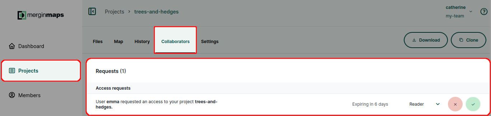

# Working Collaboratively

<MainPlatformNameLink /> makes working collaboratively safe and easy. 

In this tutorial you'll learn a few different ways of sharing your project with your colleagues:
[[toc]]

## Share a project with a specific Mergin Maps user
Your projects are stored in your [workspace](../../manage/workspaces/). If you want to share a project with someone else, they need to be invited to your workspace. There are different levels of access you can guarantee to other users. They are described in detail in [Member Roles and Permissions](../../manage/permissions/).

Here, we will share the `trees-and-hedges` project with Henry.

1. Navigate to <AppDomainNameLink /> and **sign in** 
   

2. Now, you should see the <MainPlatformName /> dashboard.
   

3. Navigate to the **Projects** tab in the left panel and select a project from the list of projects. Here we selected *trees-and-hedges*.
   
   
4. Go to the **Collaborators** tab and click on the **Share** button
   

5. Now you will see the invitation form.

   Enter the emails of people you want to share the project with and define their **Project permission**.
  

6. Click on **Share** to send the invitation. 

An email with a link will be sent to the recipients. After they accept the invitation, they will be able to access this project. 

If they already have a account, they will also be notified through the <DashboardShortLink />.

In this case, we invited Henry as a writer to the `trees-and-hedges` project. By doing so, Henry became a *guest* in our workspace. He can now add or edit features in the `trees-and-hedges` project, but cannot access other projects.

## Share a project with many users
If you wish to share a project with more than a handful of users, this method may save you some time.

1. Go to <AppDomainNameLink /> and **sign in** 

2. Navigate to the **Projects** tab in the left panel and select a project from the list of projects. Here we selected *trees-and-hedges*.
   

3. Select the URL in the browser and copy it. 
   

4. Send this link to the people you wish to share the project with.
   
   When they click the link, they will initially be prompted to sign in or register with <MainPlatformName />. Once logged in, they will have the option to **Request access**:
   

5. Project access requests will be displayed in the **Collaborators** tab of the project. 

   Accept or deny requests as needed.
   

   ::: warning
   We always recommend verifying the requester's <MainPlatformName /> username before accepting access requests.
   :::

## Learning more about collaboration
This tutorial introduced basic ways of sharing your project. Whether you use <MainPlatformNameLink /> to share project with a few friends or collaborate on it with a larger group of coworkers, we recommend to get familiar with the basics about permissions, synchronisation and project management:
- in [Permissions](../../manage/permissions/) you can learn more about the level of access you can provide to other users
- [Behind Data Synchronisation](../../manage/synchronisation/) explains the synchronisation process and what happens when multiple users do the field survey in the same time. There is also an option to exclude some files from syncing by using [Selective Synchronisation](../../manage/selective_sync/).
- [Project History and Versions](../../manage/project-details/) can help you see what was changed, by whom and when
- useful guides:
   - [How to Share, Transfer or Delete Projects](../../manage/project-advanced/#how-to-share-transfer-or-delete-projects) 
   - [How to Deploy Revised Projects](../../manage/deploy-new-project/)
   - [How to Recover Missing Data](../../manage/missing-data/)

